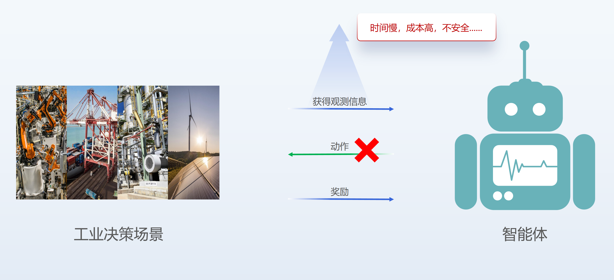

深度强化学习作为一种智能决策技术，在过去几年取得了令人瞩目的进展。它结合了深度学习和强化学习的方法，使得智能系统能够通过与环境的交互来学习和改进策略，最终在某些任务上超过人类专家。

围棋是深度强化学习取得突破性成果的一个典型例子。2016年，AlphaGo战胜了世界围棋冠军李世石，引起了广泛的关注。AlphaGo使用了深度神经网络和强化学习算法，通过大量的自我对弈来提升自身的水平，并最终击败了顶尖的人类选手。随后，AlphaGo Zero和AlphaZero进一步改进了这一技术，不仅能够学习围棋，还可以在其他棋类和游戏中表现出色，如国际象棋和扑克等。除了棋类和游戏，深度强化学习还在其他领域展现出了潜力。例如，在机器人控制和自动驾驶等领域，深度强化学习被用于训练智能代理来完成复杂的任务。它能够通过与环境的交互来学习最佳的决策策略，从而实现高效的控制和决策。

尽管深度强化学习在某些任务上能够超越人类专家，但它仍然面临以下挑战和限制： **1. 时间问题** 首先，时间慢是一个主要的问题。强化学习算法通常需要大量的交互和试错来学习最佳策略。在工业领域，这可能需要长时间的训练，与实际工业生产的需求不符。在工业环境中，决策需要快速做出，不能耗费过多时间寻找最优策略。因此，对于工业决策问题，需要考虑如何加速强化学习算法的训练过程，提高决策速度和效率。 **2. 成本问题** 另外，成本高也是一个需要注意的问题。强化学习算法在训练过程中通常需要大量的计算资源和数据。在工业环境中，收集大规模数据的成本非常高。此外，为了训练一个有效的强化学习模型，通常需要进行大量的试错和实验，这也需要投入大量的资源和时间。在工业场景中，成本效益是一个重要的考虑因素，因此需要寻找降低强化学习算法成本的方法，如优化算法、数据采样和并行计算等。 **3. 安全性问题** 安全性问题是工业环境中应用强化学习算法时必须关注的重要因素。在试错学习的过程中，强化学习算法可能会尝试一些不安全的行为，这可能对人员、设备或环境造成风险。在工业领域，安全性是至关重要的考虑因素，任何决策算法都必须遵循安全规范并保证操作的可控性。因此，在应用强化学习算法时，需要设计合适的安全机制和限制，确保在学习过程中不会产生危险的行为，并保障工业环境的安全。

总的来说，尽管深度强化学习在某些任务上展示了巨大的潜力，但其在工业应用中仍然面临着时间、成本和安全性这三大主要挑战。通过加速算法训练、优化资源使用以及设计安全机制，可以在一定程度上克服这些挑战，使强化学习在工业领域得到更广泛和安全的应用。

