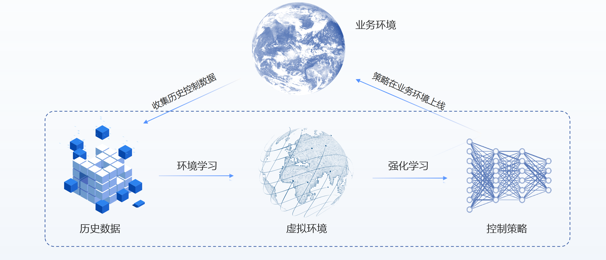

为了解决工业场景中的决策存在时间慢、成本高和不安全等一系列问题，Polixir 开发了一款基于数据驱动的强化学习工具包——REVIVE。REVIVE 专为工业场景中的决策任务量身定制，核心目标是帮助企业提升工业生产效率，减少错误，降低成本，并推动工业向智能化和可持续发展的新时代迈进。

#### 1.3.1  REVIVE 的建模流程

REVIVE 的学习流程是一个闭环系统，旨在通过数据驱动的强化学习来优化工业决策。以下是这一过程的详细介绍： **1. 收集历史控制数据** 在初始阶段，REVIVE需要从工业系统中收集相关的历史数据。这些数据可能包括但不限于：

- 传感器数据：实时监测机器性能和环境条件的数据。
- 操作日志：记录操作员在生产过程中的决策和行动。
- 能耗记录：追踪能源消耗模式，以识别效率低下的环节。
- 生产记录：包含生产量、缺陷率、停机时间等信息。

这些数据构成了学习和优化策略的基础。

**2. 进行虚拟环境学习** 利用收集到的数据，构建一个虚拟环境（Venv），这个环境能够模拟实际工业场景的状态和行为，它通过历史数据驱动神经网络来完成。

**3. 在虚拟环境上进行控制策略学习** 在虚拟环境中，REVIVE通过强化学习方法来训练和优化控制策略。通过在虚拟环境上进行模拟实验，智能体尝试不同的策略，并根据获得的奖励信号进行学习，不断调整和改进策略，以最大化累积奖励。

**4. 策略在业务环境上线** 经过虚拟环境中的充分训练和验证后，REVIVE的策略将部署到实际的业务环境中。

**5. 持续优化** 即使策略已经在业务环境中上线，REVIVE可以收集新的数据，根据新数据和持续的反馈，定期更新和优化策略，以保持其效果和适应性。通过这个循环迭代的学习过程，REVIVE能够不断从经验中学习，逐步提升决策质量，实现迭代更新。

#### 1.3.2  REVIVE中的核心概念
**虚拟环境（Venv）** 虚拟环境是对真实业务场景进行建模的过程，它通过历史数据驱动神经网络来完成。在机器人任务中，它可以模拟机器人关节受力之后的状态变化。 **策略（Policy）** 策略是智能体根据观测到的状态进行决策的过程。智能体在不同情况下应做出不同决策以最大化预定义的奖励。 **奖励（Reward）** 奖励用于衡量策略的好坏，好的策略可以获得更高的奖励。例如，在机械系统中，低能耗完成任务的控制策略会获得更高的奖励。

#### 1.3.3  应用场景
REVIVE 的应用场景广泛，以下是一些具体的案例：

- 机械系统控制：REVIVE 利用历史数据学习最优策略，实现机械系统的自动化控制。在机器人领域，它可以训练机器人在不同环境下进行运动和避障。
- 能源效率改进：REVIVE 将历史能耗数据与环境变量关联分析，提出最优的能源使用策略。在建筑领域，它可以协助设计师提高能源效率。
- 医疗诊断：REVIVE 根据历史医疗数据建立虚拟人体模型，协助医生进行疾病诊断和制定治疗计划。在癌症诊断中，它可以训练模型以更准确地检测肿瘤。
- 物流管理：REVIVE 通过历史运输数据学习最优调度策略，优化物流过程。在航空货运领域，它可以提高货运效率和降低成本。

通过这些应用案例，我们可以看到 REVIVE 不仅是一款强大的工具，更是推动工业智能化和可持续发展的重要力量。它通过创新的数据驱动方法，为企业提供了一种全新的决策优化途径，开启了工业决策的新篇章。
