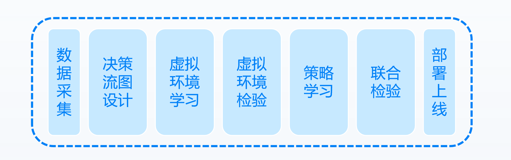
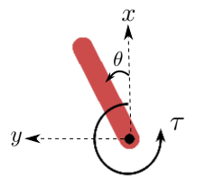
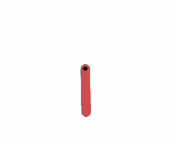

#### 3.0.1  REVIVE使用介绍
REVIVE是一款基于数据驱动的强化学习工具包。与现有的强化学习工具不同，REVIVE不需要与环境进行交互，能够从有限的历史数据中学习更好的控制策略。REVIVE建模的整个过程可以简要的概括为：采集历史数据并构建了虚拟环境，然后在虚拟环境中使用强化学习方法训练控制策略，最终进行策略的部署上线。REVIVE的这种方法不仅能获得优秀的控制策略，还可以避免在线训练所带来的各种风险和代价。

如上图所示，整个REVIVE的使用流程包括以下步骤：

1. **数据采集**：首先需要采集与业务相关的历史日志数据。这些数据可以包含各种业务指标、操作记录、状态信息等。采集到的数据将用于后续的决策流图设计和模型训练。
2. **决策流图设计**：根据专家知识对任务和数据进行分析，设计决策流图。决策流图描述了业务数据之间的关系和决策流程。它将现实任务场景的业务逻辑数字化，并为后续的虚拟环境学习和策略学习提供指导。
3. **虚拟环境学习**：利用采集到的数据和定义的决策流图构建虚拟环境模型。虚拟环境模型是对实际业务环境的数字化表示，它基于历史数据构建，并遵循决策流图所定义的业务数据之间的逻辑。
4. **虚拟环境检验**：在构建好虚拟环境模型后，需要对其进行验证和检验。通过检验确保虚拟环境模型能够准确地反映真实业务环境的特性和行为。
5. **策略学习**：使用强化学习方法在虚拟环境中训练控制策略。通过与虚拟环境交互，优化奖励函数和策略，以获得最优的控制策略。这一步骤的核心是利用强化学习算法不断迭代和优化策略，以实现业务优化的目标。
6. **联合检验**：使用强化学习方法在虚拟环境中训练控制策略。通过与虚拟环境交互，优化奖励函数和策略，以获得最优的控制策略。这一步骤是REVIVE的核心，它利用强化学习算法不断迭代和优化策略，以实现业务优化的目标。
7. **部署上线**：最后，将经过验证和检验的虚拟环境模型和控制策略部署到实际业务中。这样，就可以在实际环境中应用优化后的策略，并实现业务模拟和优化的目标。

相比于传统的强化学习方法，REVIVE的优势在于利用离线数据进行学习，无需和真实环境进行交互，提高了效率和安全性。这使得REVIVE成为一种强有力的工具，可在实际应用中用于优化控制策略的设计和改进。

#### 3.0.2 倒立摆控制任务示例
为了更清楚地展示REVIVE的使用方法，本章接下来的内容我们会详细讲解上述每一步的使用方法，并使用一个倒立摆(Pendulum)控制的任务示例来进行展示。 

倒立摆摆动问题是控制理论中的经典问题之一。该系统由一个摆锤组成，其中一端连接到一个固定点，另一端则自由悬挂。摆锤的初始位置可以是随机的，而目标是通过施加扭矩使得摆锤摆动到直立位置，即重心位于固定点的正上方。这个问题在控制理论中被广泛研究，因为它具有一些挑战性的特点。首先，倒立摆是一个非线性系统，其运动方程涉及到摆锤的角度、角速度和施加的扭矩等因素。其次，由于摆锤的不稳定性，需要精确而迅速地控制扭矩以保持平衡。这使得倒立摆成为控制理论和控制工程的重要研究对象。 在解决倒立摆摆动问题时，常常采用强化学习等控制方法。强化学习是一种通过与环境交互学习最优行为的机器学习方法。在倒立摆问题中，可以通过与摆动系统进行交互，观察系统的状态和反馈，然后通过强化学习算法来推导出最优的控制策略，以实现倒立摆的稳定控制。倒立摆问题不仅在理论研究中具有重要意义，而且在实际应用中也有广泛的应用。例如，倒立摆控制技术在机器人控制、平衡车设计以及控制系统的稳定性分析等领域都有重要的应用价值。通过解决倒立摆问题，我们可以深入理解控制理论的基本原理，并将其应用于更复杂的控制系统中。

该任务的状态空间包括摆杆的坐标（摆末端的笛卡尔坐标）和角速度（以弧度表示的角度）。动作空间是连续的，智能体可以在每个时间步选择一个扭矩值施加到摆。

| **特征名称** | **特征类别** | **特征描述** | **特征范围** |
| --- | --- | --- | --- |
| x | 摆的状态信息(Pendulum State) | 摆末端的X轴坐标 | [-1,1] |
| y | 摆的状态信息(Pendulum State) | 摆末端的Y轴坐标 | [-1,1] |
| theta_dt | 摆的状态信息(Pendulum State) | 摆末端的角速度 | [-8,8] |
| torque | 智能体动作信息(Agent action) | 扭矩(逆时针正方向) | [-2,2] |

任务的奖励函数根据摆杆的角度和角速度计算得出。较小的摆杆角度和角速度会获得更高的奖励，而较大的摆杆摆动幅度和速度会获得较低的奖励。任务的目标是通过优化策略，最大化累积奖励。奖励函数的具体定义如下: 
倒立摆任务要求智能体控制摆杆尽量保持垂直向上，并减小其摆动的幅度和速度,要求智能体在连续时间上进行精细调节和控制，以实现任务的最佳表现。通过与环境的交互和尝试不同的控制策略，常见的强化学习算法可以逐渐提高其在Pendulum任务上的性能，使得摆杆长时间保持在目标点。 假设在我们有一个控制策略效果一般的策略，无法很好地完成所设定的目标任务, 具体表现如下图所示。从图中可以观察到，摆不能被稳定有效地控制到目标点上，无法达到预期的任务目标。因此，我们需要进行控制策略的优化，以便更好地完成任务目标。

接下来我们需要收集已有控制策略的历史数据来使用REVIVE进行策略优化。

