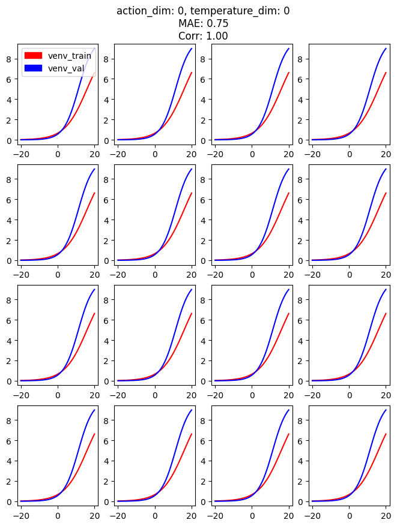
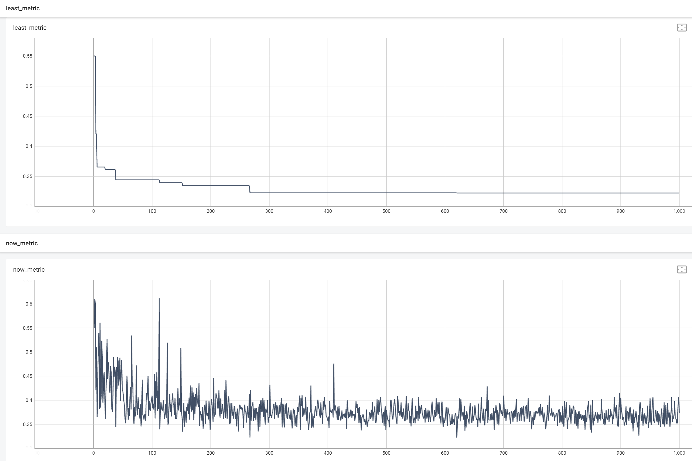
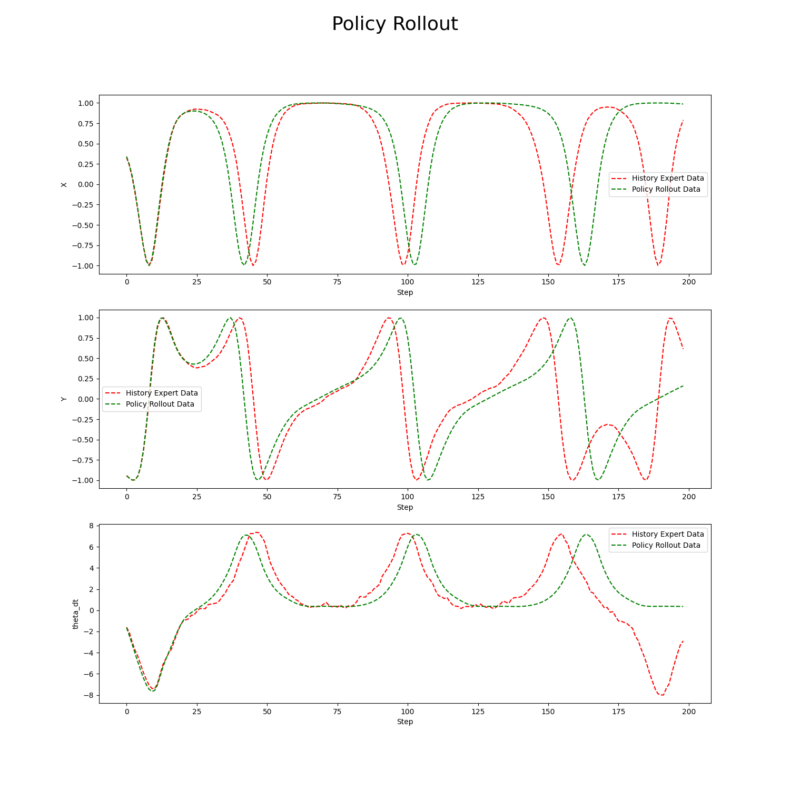

#### 3.4.1  虚拟环境有效性验证
REVIVE支持多种方式进行虚拟环境有效性检验，其中最常用的有3种方法：验证指标，Rollout曲线图和响应曲线图，这3种方法分别是从不同的角度下去检验虚拟环境模型的准确度。

**验证指标**<br />虚拟环境检验是指使用一些量化指标来评估虚拟环境模型的准确性和性能，这些指标可以帮助我们了解虚拟环境模型在模拟环境中的表现。REVIVE中内置了4种指标来度量虚拟环境模型：

1. NLL（负对数似然损失函数）：用于衡量模型预测类别的不确定性和实际类别之间的差距。该指标可以帮助评估虚拟环境模型在预测类别时的准确性和置信度。


2. MAE（平均绝对误差）：衡量虚拟环境模型预测值与真实历史数据之间的绝对差异。通过计算平均绝对误差，我们可以了解模型的平均预测偏差。


3. MSE（均方误差）：衡量虚拟环境模型预测值与真实值之间的平方差异。均方误差提供了模型预测的整体误差大小的度量，较大的均方误差表示模型的预测与真实值之间存在较大的差异。


4. Wdist（Wasserstein距离）：衡量两个概率分布之间的距离，即将一个分布变成另一个分布所需的最小成本。Wasserstein距离可用于度量虚拟环境模型的分布与真实历史数据的分布之间的差异。


上述这些指标用于衡量REVIVE在虚拟环境中进行自回归调用时记录的数据与真实环境的历史数据之间的对比结果。具体来说，REVIVE使用训练数据集生成的虚拟环境模型与验证数据集的历史数据进行比较，从而从泛化性的角度度量虚拟环境模型的质量。默认情况下，venv_metric被设置为MAE（平均绝对误差）。这意味着REVIVE会计算虚拟环境模型生成的数据与实际历史数据之间的平均绝对差异。这个指标可以帮助评估虚拟环境模型的准确性和可靠性。

用户可以通过使用Tensorboard来查看日志中对应指标的变化情况。可以在终端中输入相应的命令来打开Tensorboard，并观察venv_metric的变化趋势。通过监测这个指标，用户可以了解虚拟环境模型在不同训练和验证数据集上的表现，并对模型进行优化和调整。日志查看命令如下：
```bash
tensorboard --logdir .../logs/<run_id>
```

**Rollout曲线图**<br />Rollout曲线图是用于可视化和解释强化学习中的工具之一。它提供了对智能体在环境中交互的轨迹和结果的可视化表示。虚拟环境模型是一个模拟环境，可以模拟智能体在不同状态和动作下和环境交互的结果。Rollout图是通过对虚拟环境模型进行多次模拟运行来生成不同的Rollout曲线图的。Rollout图通常以时间步作为横轴，从初始状态开始，逐步展示智能体在每个时间步选择的动作和环境的响应。在每个时间步上，可以显示智能体选择的动作、环境给出的反馈。通过观察Rollout图，可以了解虚拟环境模型在不同状态下选择的动作以及环境对其动作的响应，这有助于评估虚拟环境模型在不同情况下的长期推演能力。REVIVE中的Rollout图通常存放在./logs/<run_id>/venv_train/rollout_images/文件夹下。

REVIVE在绘制Rollout图的过程中会从数据集中随机采集10条轨迹，进行虚拟环境模型和真实历史数据的对比。（REVIVE会根据训练数据集的最短轨迹长度进行裁剪，使得这一批随机采集的10条轨迹长度完全相同）。REVIVE会根据决策流图 graph 中节点的名称来循环调用数据（参考 决策流图和数组数据 ）。 在绘制rollout图时，采用此自回归方法完成。因此rollout结果是完全基于虚拟环境模型进行绘制的。


- History Expert Data 代表的红色虚线为训练虚拟环境时使用的历史数据。
- Policy Expert Data 代表的红色虚线为训练虚拟环境时使用的历史数据。

如上图所示，通过比较Rollout图中两条曲线的拟合程度，我们可以来判断虚拟环境模型的长期模拟精度，这有助于我们正确的选择和使用虚拟环境模型。

**响应曲线**<br />响应曲线是描述系统或过程中输入与输出关系的图形表现。通常，它是在二维图上绘制的，其中输入变量位于横轴（x轴），输出变量位于纵轴（y轴）。输入变量可以是任何可测量的参数，例如频率、时间、电压或温度等。输出变量则是受输入影响的参数，例如幅度、相位、功率或电阻等。

在许多领域，响应曲线被广泛用于分析和优化系统或过程的性能。举个例子，在音频工程中，扬声器的频率响应曲线显示了其对不同频率声音的输出水平变化。通过分析这条曲线，工程师可以确定扬声器的频率范围、灵敏度和失真特性，并根据需要进行设计调整。同样，在电子学中，响应曲线可用于分析电路或设备的性能。例如，晶体管的电流电压（I-V）曲线显示了其输出电流随输入电压变化的情况。通过分析这条曲线，工程师可以确定晶体管的工作区域、增益和线性度，并为不同应用优化其性能。<br />

**3.4.2  倒立摆控制任务示例**

**查看倒立摆任务验证指标**<br />使用下面的命令使用tensorboard查看revive的训练日志，tensorboard会返回一个url，复制url在浏览器打开即可看到整个训练过程中记录的所有日志数据，其中least_metric和now_metric是我们最关注的。
```bash
tensorboard --logdir .../logs/revive
```

上图展示了倒立摆任务的验证指标（默认选择MAE作为验证指标），我们可以看到，当训练轮次达到 200 轮之后， least_metric 更新了更低的数值，此时REVIVE保存当前轮次的网络模型。 由于 least_metric 没有进一步变小，说明模型已经收敛。

**Rollout曲线图**<br />倒立摆任务的Rollout曲线图存储在./logs/revive/venv_train/rollout_images/文件夹下，下面是一个示例图片。

上图展示了倒立摆任务的Rollout曲线图，从图中可以看出，在小于100步时，虚拟环境模型的自回归结果与真实数据的误差较小。 但在超过100步之后，虚拟环境模型虽然能够生成与数据相似的数值变化趋势，但仍会与真实数据产生较大的差异。 所以基于此虚拟环境进行策略模型训练时，我们不应该将模型使用过长，因为这回引入较大的模型误差。
