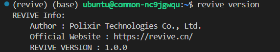
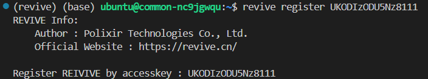

#### 安装前提
- 操作系统：Linux x86_64
- Python: v3.8.0+ / v3.9.0+ / v3.10.0+ /
- CUDA Toolkit （NVIDIA GPU设备可用的情况下）

#### 安装
你可以通过以下命令从代码仓库中克隆最新版本的 REVIVE SDK 进行安装：
```bash
$ git https://jg.gitlab.polixir.site/polixir/revive.git
$ cd revive
$ pip install -e .
```

你还可以从Docker Hub获取包含REVIVE SDK及其运行时环境的最新Docker镜像:
```bash
$ docker pull polixir/revive-sdk
```

安装完成后可以使用revive version命令查看当前的revive版本：

#### 获得完整授权
Polixir 研发了 REVIVE SDK，并对其中部分模块拥有完全知识产权，因此这部分模块已经通过加密进行了保护， 但这并不影响用户的正常使用。你可以在 REVIVE 官网注册免费帐户并获得授权后使用完整算法包内的所有功能。
获得授权的步骤分为以下两步:

**步骤 1. **访问REVIVE官网，注册账户，获得授权密钥Key。
REVIVE 官网 : 进入REVIVE官网 [https://www.revive.cn](https://www.revive.cn) 注册账户，在 用户中心 复制授权密钥Key。

**步骤 2.** 安装REVIVE SDK，并进行密钥Key的配置，revive支持两种方式进行key配置。

- 方式1：使用命令行进行key自动配置(推荐)。在命令行中使用如下命令
```yaml
revive register your_key
```


- 方式2：手动打开配置文件进行key配置。完成REVIVE SDK安装后，会自动生成配置文件（配置文件路径：/home/<user-name>/.revive/config.yaml ）， 打开配置文件并将之前的密钥Key填入其中。
```python
accesskey: your_key
```
