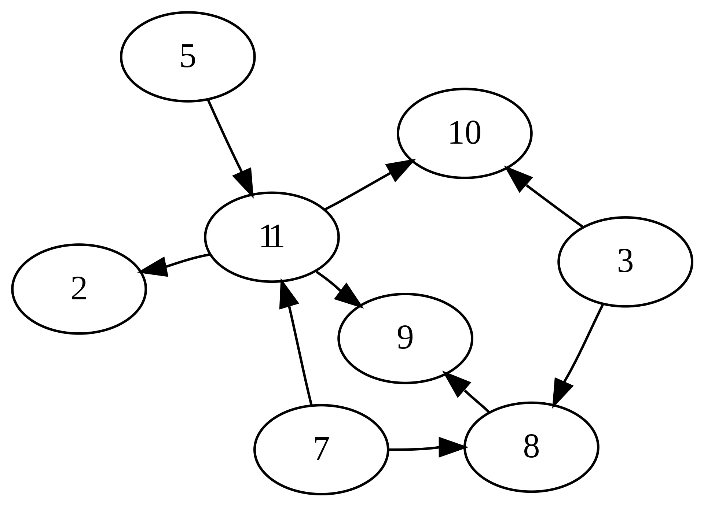

有向无环图是图论中的一个重要概念，它是一种由边和顶点组成的图，其中的边具有方向性，并且从任一顶点出发顺着边的方向走，都不会形成一个环。这种特性使得DAG有着广泛的应用，可以描述和解决复杂的依赖关系问题。
#### 定义
有向无环图是由一系列有序的顶点对（u, v）组成的图，其中u是起始顶点，v是终止顶点，这样的有序对被称为图中的一条边。在DAG中，不存在一个顶点集合，使得从集合中的某个顶点出发，经过若干条边后，又回到了原始的顶点，这样的路径称为环。

#### 特性

- 无环性：DAG最显著的特性就是无环。这意味着在图中不存在闭合的路径，即从某个顶点出发，经过若干顶点后，不能回到这个顶点。
- 有向性：DAG中的边具有方向性，即每条边都有一个明确的起点和一个终点。这与无向图不同，在无向图中，边没有方向。
- 拓扑排序：由于无环的特性，DAG可以进行拓扑排序。拓扑排序是将图中的顶点排成一个线性序列，且对于图中的每一条边(u, v)，顶点u都排在顶点v的前面。
- 依赖关系：在DAG中，顶点之间的边可以表示一种依赖关系。例如，在任务调度中，一个任务的开始可能依赖于其他任务的完成。

#### 应该场景

1. **任务调度和工作流管理**

DAG在任务调度和工作流管理中起到关键作用。它可以帮助确定任务之间的依赖关系和执行顺序，实现高效的任务调度和工作流程管理。例如，在汽车制造工厂中，DAG被用来详细规划从发动机组装到最终检验的整个生产流程。每个生产阶段都对应DAG中的一个节点，而节点之间的边表示阶段的先后依赖关系。通过这种图形化的表示，管理者可以利用拓扑排序来优化设备使用和任务分配，确保每个阶段在前一阶段完成后及时开始，从而提高生产效率和减少等待时间，最终实现高效顺畅的生产流水线运作。

2. **数据流和计算图**

DAG在数据流和计算图中广泛应用于描述数据流动和计算过程中的依赖关系。例如，在机器学习中，使用计算图来表示神经网络的计算过程。每个节点代表一个计算操作，而边表示操作之间的依赖关系。通过构建计算图，可以实现高效的并行计算和自动微分。另一个例子是数据处理管道，其中每个节点代表一个数据处理操作，而边表示数据流的流向和依赖关系。通过构建数据流图，可以清晰地了解数据的流动路径和处理步骤，优化数据处理过程。

3. **因果关系建模**

DAG在因果关系建模中被广泛应用。它可以帮助我们理解和分析事件之间的因果关系和因果链。例如，在流行病学研究中，研究人员可能想要了解吸烟（A）和肺癌（B）之间的关系是否受到其他因素如遗传（C）和职业暴露（D）的影响。通过构建一个因果DAG，研究人员可以识别出潜在的混杂因素，并使用诸如Granger因果检验等统计方法来评估变量之间的因果效应。这种DAG模型有助于揭示变量之间的因果机制，从而为预防措施和政策制定提供依据。

4. **依赖关系管理**

DAG在依赖关系管理中扮演重要角色。它可以用于管理软件开发、项目管理和构建系统中的依赖关系。例如，在软件开发中，不同的模块、函数或组件之间存在依赖关系。通过构建DAG，可以清晰地了解各个模块之间的依赖关系，并确保正确的构建顺序。这样可以避免循环依赖和不必要的构建，提高项目开发的效率和可靠性。类似地，构建系统可以使用DAG来管理各个构建任务之间的依赖关系，确保正确的构建顺序和可靠的构建过程。

**参考文献**
[有向无环图](https://zh.wikipedia.org/zh-cn/%E6%9C%89%E5%90%91%E6%97%A0%E7%8E%AF%E5%9B%BE)
