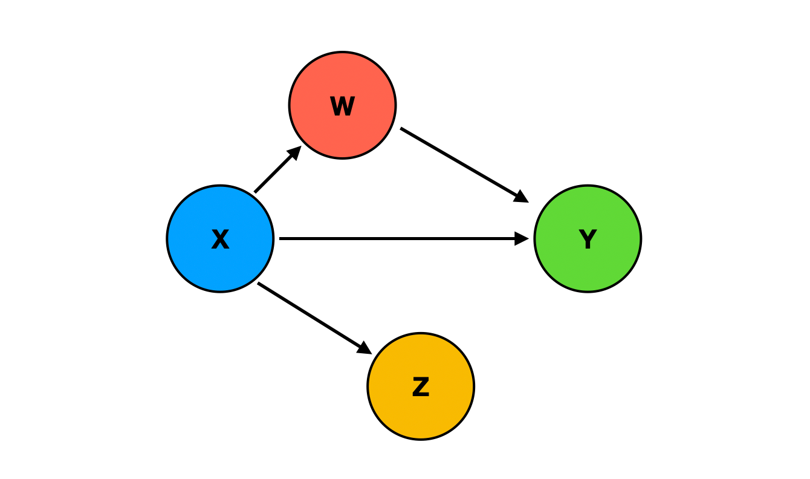
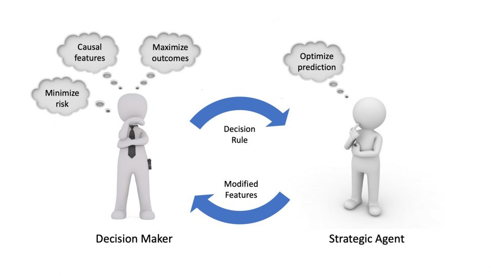

#### 因果关系
在探索复杂现象的内在机制时，因果关系建模成为一种不可或缺的工具。简单的相关性分析只能告诉我们变量之间的关联程度，而无法揭示事件之间的因果关系。因果关系建模的优势在于它提供了一种框架，通过建立模型来描述和量化变量之间的因果关系，从而深入挖掘事件的因果链条。通过构建因果模型，我们能够更好地理解一个变量是如何影响另一个变量的。模型中的因果路径和参数估计提供了关于变量之间因果关系的定量描述。这种定量描述可以告诉我们特定变量的变化如何引起其他变量的变化，以及这种影响的程度和方向。例如，一个因果模型可能揭示了教育水平对收入的影响，通过估计相关参数，我们可以确定每增加一个学历等级，平均收入增加的数量。
因果关系建模的核心在于理解变量之间的因果效应。这种效应意味着一个变量（原因）的变化会导致另一个变量（结果）的变化。然而，在现实世界中，这种关系往往受到多种因素的影响，包括混杂变量、中介变量和调节变量等。因此，因果关系建模不仅要识别这些变量，还要评估它们对因果效应的潜在影响。
因果关系建模的基本概念包括以下几个要点：

- **因果关系**：因果关系是指一个事件、变量或因素对另一个事件、变量或因素产生的直接或间接影响。因果关系表明一个事件的发生或一个变量的变化会引起另一个事件或变量的相应变化。
- **因果图**：因果图是因果关系建模的主要工具之一，通常使用有向无环图（DAG）来表示。在因果图中，节点表示事件、变量或因素，有向边表示因果关系的方向。因果图能够可视化和描述变量之间的因果关系结构。
- **介入和反事实推理**：因果关系建模强调对因果效应的研究，包括介入和反事实推理。介入是指主动改变一个或多个变量，以观察它对其他变量的影响。反事实推理是指在观察到的数据基础上，通过模型进行推断，研究如果某个变量的值发生变化，其他变量的结果会是什么样。
- **参数估计**：参数估计是因果关系建模中的一个关键步骤，用于确定模型中的参数值。参数估计可以通过最大似然估计、贝叶斯推断或结构方程模型拟合等方法来进行。估计的参数值可以帮助量化不同变量之间的因果效应。
- **模型验证和评估**：模型验证是对建立的因果模型进行验证和评估的过程。验证模型的准确性和拟合度，评估模型的预测能力和模型假设的合理性。模型验证可以使用数据拟合度、交叉验证、信息准则（如AIC和BIC）等方法进行。
- **敏感性分析和干预**：敏感性分析是评估因果模型对不确定性和假设变化的响应。它可以帮助我们理解模型的稳定性和结果的可靠性范围。基于因果模型的结果，我们可以设计可能的干预措施或政策推荐，以影响事件或变量的发展和结果。

因果关系建模是一种强大的工具，它在多个领域中都有广泛的应用。通过构建和分析因果模型，研究者能够揭示变量之间的因果机制，为决策提供依据。以下是因果关系建模的一些关键应用领域：

- 医学研究：在医学领域，因果关系建模可以帮助研究者理解药物、生活方式改变或疾病状态如何影响患者的健康结果。例如，通过因果模型，可以评估某种药物对疾病恢复的影响，或者分析不良生活习惯如何增加患病风险。
- 社会科学：社会科学研究中，因果关系建模被用来评估政策变化、经济波动或社会行为如何影响社会指标，如就业率、犯罪率和教育成就等。通过构建因果图和应用因果推断技术，研究者可以更好地理解社会现象背后的因果链。
- 商业分析：在商业领域，因果关系建模可以用于市场分析、用户行为研究和产品开发。企业可以通过因果分析了解营销策略对销售的影响，或者分析客户满意度与客户留存率之间的关系。
- 环境科学：因果关系建模在环境科学中用于评估人类活动对生态系统的影响，以及气候变化对环境和社会经济的影响。通过因果模型，研究者可以预测环境变化对生物多样性和自然资源的潜在影响。
- 机器学习和人工智能：在机器学习领域，因果推断技术被用于改善算法的性能和可解释性。通过理解特征之间的因果关系，可以设计出更准确的预测模型，并提高模型对新数据的泛化能力。
- 政策评估：政策制定者可以利用因果关系建模来评估新政策或干预措施的效果。通过模拟不同政策对经济、教育或健康等指标的影响，政策制定者可以做出更加明智的决策。
#### 因果关系和决策之间的关系

因果关系建模与决策密不可分。因果关系建模通过揭示事件、变量或因素之间的因果关系，为决策提供了理解和量化的基础。它在决策过程中发挥下面重要作用：

- 决策依据：因果关系建模提供科学依据，帮助决策者了解不同变量之间的因果关系。这种定量描述为决策提供了依据，使决策者能够预测和评估决策结果。
- 效果评估：因果关系建模用于评估决策的效果。通过模拟和预测特定决策对各个变量的影响，决策者可以比较不同决策方案的潜在结果，选择最佳方案。
- 干预设计：因果关系建模指导干预措施的设计。通过模型分析不同干预策略的效果，决策者可以选择最具潜力和成本效益的干预措施，实现预期结果。
- 不确定性管理：因果关系建模帮助管理不确定性。通过敏感性分析和场景模拟，决策者可以评估不同因素和假设对结果的影响，从而更好地理解决策的风险和不确定性。
- 优化决策：因果关系建用于优化决策过程。通过建立复杂的因果模型，决策者可以进行决策分析和优化，以寻求最佳决策方案。

因果关系建模提供了对因果关系的理解和量化描述，为决策提供科学支持。同时，决策的需求和目标也指导着因果关系建模的选择和建立，以满足决策的要求。因此，这两者之间的紧密结合可以提高决策的有效性和决策结果的质量。假设一个公司正在考虑推出一个新产品，并且需要进行市场推广决策。在这种情况下，因果关系建模和决策之间的关系可以通过以下例子来说明：

1. 数据收集：首先，公司需要收集相关数据，包括市场调研、竞争对手分析、消费者洞察和产品特征等。这些数据将被用来建立因果关系模型的基础。
2. 因果关系建模：基于收集到的数据，公司可以建立一个因果关系模型，揭示不同因素之间的因果关系。例如，模型可以分析市场推广活动对销售量、品牌知名度和利润的影响。这样的模型可以使用统计方法、机器学习或因果推理等技术来构建。
3. 决策依据：建立完因果关系模型后，公司可以利用模型的结果作为决策的依据。模型可以提供关于不同市场推广策略的预测效果，帮助决策者评估不同方案的潜在结果。例如，模型可能显示一种特定的市场推广活动可以显著提高销售量和利润。
4. 效果评估：在决策过程中，公司可以使用因果关系模型来评估决策的效果。通过模拟不同决策方案对各个因素的影响，公司可以比较不同策略的潜在结果，并选择最佳的决策方案。例如，模型可以预测不同市场推广策略对市场份额的影响，从而帮助公司选择最具潜力的推广策略。
5. 干预设计：基于因果关系模型的结果，公司可以设计具体的干预措施。例如，如果模型表明某一特定因素对销售量的影响最大，公司可以制定相应的市场推广计划，以增加该因素的影响力。

综上所述，因果关系建模为决策提供了科学依据和支持。它帮助公司了解不同因素之间的因果关系，预测决策的潜在结果，并指导具体的干预措施的设计。因此，因果关系建模与决策密切相关，并在决策过程中发挥重要作用。
