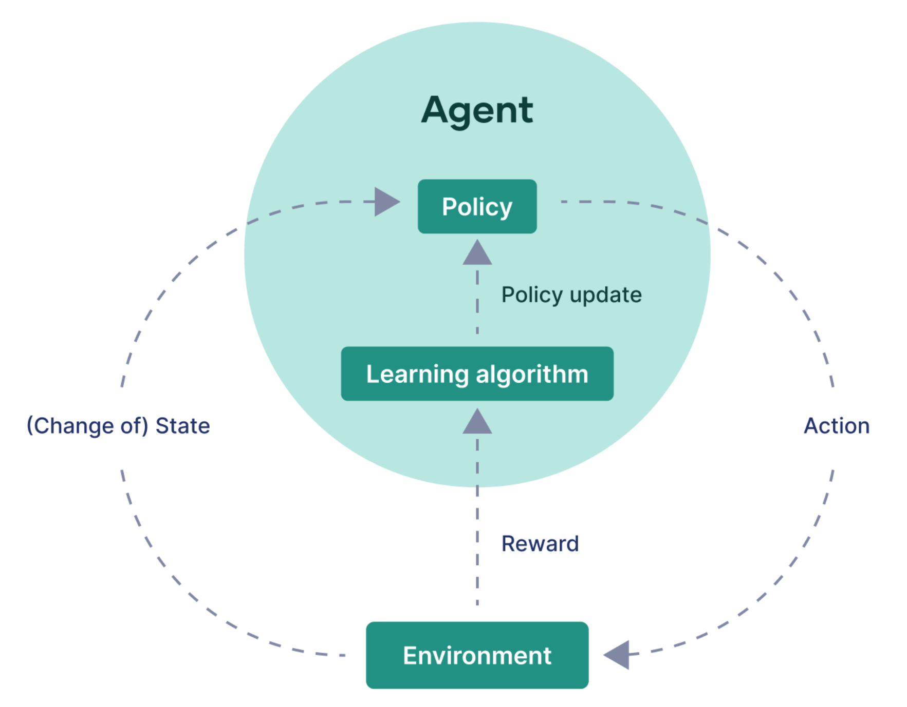
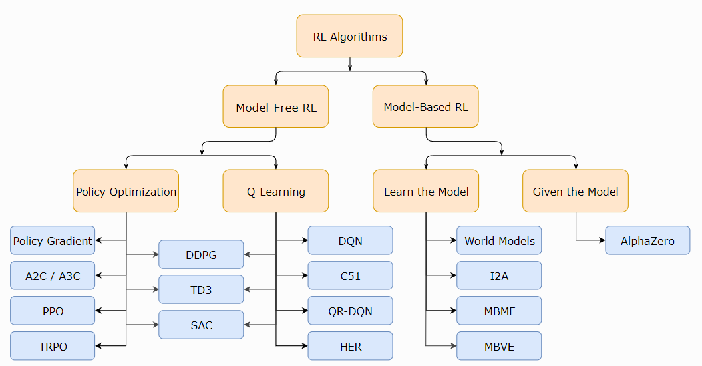

#### 强化学习
强化学习是机器学习的一个分支，旨在让智能体通过与环境的交互学习最优行为策略。与监督学习不同，强化学习的训练数据不需要人工标注的输入输出对，而是通过智能体与环境的互动来获得奖励信号。
在强化学习中，智能体通过观察环境的状态，采取特定的动作，与环境进行交互。环境根据智能体的动作给予奖励或惩罚，智能体的目标是通过学习最优策略来最大化累积奖励。强化学习的核心思想是通过尝试不同的动作，并根据环境的反馈调整策略，以获得更高的奖励。

**强化学习的关键概念**
环境：环境是智能体所处的外部世界或任务域，它是智能体与外部交互的对象。环境可以是真实世界的物理环境，也可以是虚拟环境或模拟器。
智能体（Agent）：智能体是指参与学习和决策的主体，它是基于强化学习算法进行自主学习和决策的实体。智能体通过与环境的交互获取信息、学习策略，并根据所学到的知识做出决策来实现特定的目标。
状态（State）：智能体对环境的当前观察或描述，用于描述智能体所处的情境。
动作（Action）：智能体在给定状态下可以执行的操作或决策。
奖励（Reward）：环境根据智能体采取的动作给予的反馈信号，用于评估动作的好坏和指导学习过程。
策略（Policy）：智能体根据当前状态选择动作的策略，可以是确定性策略或概率分布。
值函数（Value Function）：用于评估状态或状态-动作对的价值，表示预期获得的长期累积奖励。
模型（Model）：智能体对环境动态的理解，可以用来模拟环境的行为，包括状态转换和奖励的预测。

根据强化学习算法是否依赖环境模型可以把强化学习算法分为基于模型的方法（Model-based Methods）和无模型方法（Model-free Methods）两类。

**基于模型的方法（Model-based Methods）：**
基于模型的强化学习算法建立了对环境的内部模型，该模型可以模拟环境的行为，包括状态转换和奖励的预测。智能体可以使用这个模型来进行规划和学习，从而改善其策略和值函数。基于模型的方法的优点是可以通过模型进行规划，可以在内部进行模拟和试验，从而提高学习的效率。然而，构建准确的环境模型可能会面临困难，并且模型的不准确性可能会对学习和规划产生负面影响。
**无模型方法（Model-free Methods）：**
无模型的强化学习算法直接通过与环境的交互来学习策略，而不依赖于显式的环境模型。智能体通过观察环境的状态、执行动作和接收奖励，来调整自己的策略和值函数。无模型方法的优点是简单而直接，可以适用于实际环境中的复杂任务，而不需要事先对环境进行建模。然而，由于无模型方法直接依赖于样本数据，可能需要更多的交互和采样次数才能获得良好的学习效果。

#### 离线强化学习
离线强化学习（Offline Reinforcement Learning）是强化学习领域的一个研究方向，它关注的是如何利用先前收集的数据集来训练强化学习算法，而不是依赖实时的在线数据收集。这种方法的核心优势在于能够将大量的历史数据转换为强大的决策引擎，从而在不需要与环境实时交互的情况下，自动获取或优化策略（policy）。
在传统的在线强化学习中，算法通过与环境的交互来收集经验，并基于这些经验来改进策略。这种方法在某些场景下是不切实际的，比如在机器人控制、自动驾驶或医疗决策等领域，因为数据收集可能代价昂贵、存在危险性或不可行。此外，即使在可以进行在线交互的领域，我们也可能更倾向于利用已有的大量数据集，尤其是当这些数据集能够提供复杂任务的有效泛化能力时。
离线强化学习的应用前景非常广泛，它可以用于医疗决策支持、自动驾驶、机器人控制以及推荐系统等领域。通过将离线数据有效地转换为优化的策略，离线强化学习有潜力在这些领域带来革命性的进步。

离线强化学习的主要特点是，智能体可以利用历史数据进行学习，而无需实时与环境进行交互。这样的数据可以来自多种来源，包括以前的实验、模拟、专家演示或其他形式的数据收集方式。
离线强化学习的优点包括：

- 数据高效利用：离线数据可以被多次使用，从而提高数据利用率和学习效率。
- 安全性：由于不需要实时交互，离线强化学习可以在没有风险的情况下进行学习，避免了在真实环境中可能导致的错误和损失。
- 资源节约：由于不需要实时交互，离线强化学习可以在计算资源和时间上更加高效。

然而，离线强化学习也面临一些挑战和限制：

- 偏差和分布偏移：离线数据可能会受到多种因素的影响，例如数据收集方法、环境变化等，导致数据的偏差和分布偏移。这可能会对学习算法的性能和泛化能力产生负面影响。
- 采样效率：离线数据的质量和多样性对学习的效果至关重要。如果离线数据不具有足够的覆盖范围和多样性，可能会限制学习的能力。
- 评估问题：在离线强化学习中，评估学习算法的性能和效果也是一个挑战。由于没有实时交互，无法进行即时的奖励反馈和探索，因此评估学习算法的准确性和鲁棒性变得更加困难。
