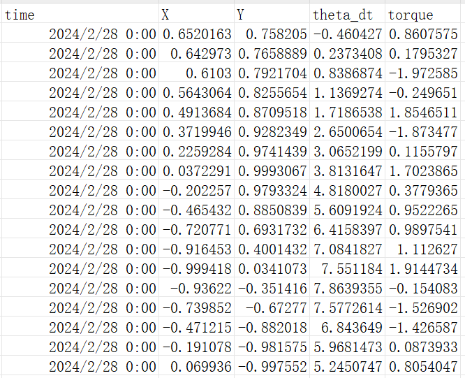

### 3.1.1 数据采集介绍
REVIVE是一款基于数据驱动的软件。为了解决特定的业务问题，第一步是要采集与业务相关的历史数据，这些数据可以来自多个数据源，例如系统日志、人工记录等。采集到的历史数据需要包含业务相关的指标、操作记录和状态信息。
在机器人控制的任务为例，我们可以通过提取系统日志记录的机器人传感器数据、执行动作的记录以及与环境交互的状态信息。历史信息可以包含以下信息：

1. 机器人传感器数据：这些数据涵盖了机器人在任务执行过程中通过传感器获取的各种环境信息。传感器数据可以包括视觉传感器（如摄像头）、距离传感器、力传感器等。通过记录传感器数据，可以获取机器人周围环境的感知信息，例如障碍物的位置、大小和形状，目标物体的位置和特征等。
2. 执行动作记录：这些记录包括机器人在任务执行过程中采取的动作序列。动作可以涵盖机器人的移动、姿态调整、物体抓取或放置等。记录机器人的动作序列有助于了解机器人在不同任务中的行为模式和决策过程。
3. 与环境交互的状态信息：这些信息描述了机器人与环境之间的交互状态。它可以包括机器人在执行任务时的位置、速度、加速度以及其他与环境交互相关的状态变量。了解机器人的交互状态可以帮助分析机器人与环境之间的相互作用和影响，例如机器人在接近障碍物时的速度变化、机器人与目标物体的距离变化等。

通过提取系统日志记录的机器人传感器数据、执行动作的记录以及与环境交互的状态信息，可以使用REVIVE建立机器人的虚拟环境模型。这个模型基于历史数据中的信息，反映了机器人在任务执行过程中与环境的交互情况。当虚拟环境训练完成后，可以使用REVIVE进行机器人控制策略的优化，提升机器人控制策略的效果。
在商务促销的领域，可以通过收集销售数据、客户行为记录以及市场趋势等信息，利用REVIVE建立一个用户模型，这个模型可以分析销售数据的模式和趋势，预测客户行为，并根据这些信息制定个性化的促销策略，提高营销效果和客户满意度。
采集到的历史数据将用于后续的决策流图设计和模型训练。通过分析这些数据，可以发现数据之间的关联和规律，并结合业务知识设计决策流图，将业务逻辑数字化，并按照决策流图的将数据组织为REVIVE要求格式的训练数据，进行后续的虚拟环境建模和策略优化。
### 3.1.2 倒立摆控制任务示例
在上一节中，我们已经了解了倒立摆任务。在倒立摆任务中已有一个运行中的控制策略，这个控制策略运行了一段时间，系统也记录了一系列这个策略的运行历史数据。我们首先需要对这些数据进行采集和分析。
我们将倒立摆任务中的日志数据全部以CSV文件的格式导出，每次的控制轨迹导出为一个CSV文件，我们就可以获得含有多个CSV文件的数据集。下图展示了一个CSV文件中包含的部分信息:

下面是我们需要根据业务知识对数据中的每列信息进行分析记录：

| **数据名称** | **数据类别** | **数据描述** | **数据范围** |
| --- | --- | --- | --- |
| time | 时间信息 | 当前行信息的记录时间 | - |
| X | 摆的状态观察信息(Pendulum 
Observation) | 摆末端的X轴坐标 | [-1,1] |
| Y | 摆的状态观察信息(Pendulum Observation) | 摆末端的Y轴坐标 | [-1,1] |
| theta_dt | 摆的状态观察信息(Pendulum Observation) | 摆末端的角速度 | [-8,8] |
| torque | 智能体动作信息(Agent action) | 扭矩(逆时针正方向) | [-2,2] |

采集分析数据之后，根据对任务的理解，下面我们需要构建决策流图，并组织数据以便使用REVIVE进行模型训练。

