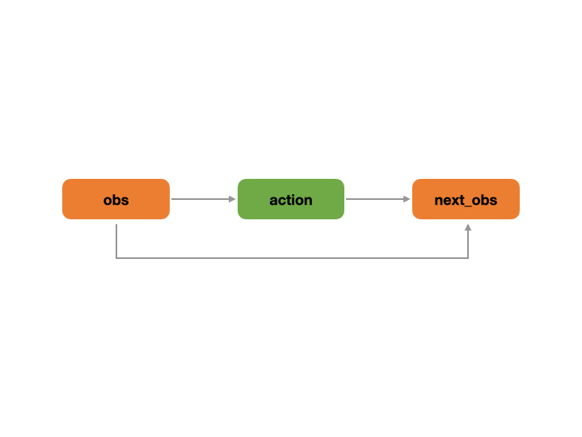

### 3.2.1 构建决策流图
上一节中我们介绍了数据采集，有了原始的业务数据之后我们需要结合业务知识进行决策流图设计，并将数据按照设计好的决策流图进行处理存储。为例将现实任务场景的业务逻辑数字化，REVIVE通过构建决策流图来描述业务数据之间的关系。
决策流图是REVIVE的核心工具，它可以通过图的方式展示了不同业务数据之间的关联和流动。这种方式使得人们能够更直观地理解和分析业务数据之间的逻辑关系。决策流图的构建基于对现实任务场景的深入研究和分析，确保了图中的每个节点和边都准确地反映了业务数据之间的关系。基于决策流图和相关的业务数据，REVIVE 可以训练虚拟环境模型。这个虚拟模型完全遵照了决策流图所定义的业务数据之间的逻辑。通过使用这个虚拟环境模型，用户可以在模拟的场景中进行各种实验和测试，以便更好地理解和优化业务流程。REVIVE中的决策流图是一个有向无环图，有向无环图（DAG）是一种由有序的顶点对（u, v）组成的图，其中u是起始顶点，v是终止顶点。这些有序对被称为图中的边。有向无环图的特点是没有循环或回路。


REVIVE使用有向无环图描述业务数据的交互逻辑。 图中的每个节点代表数据，每条边代表数据之间的映射关系，输入决定输出。决策流图可以根据需要来扩展任意多个节点， 节点之间的顺序可以是任意指定的，单个节点可以作为多个节点的输入。 我们可以使用决策流图来描述智能体在环境中的决策过程，下图展示了一个简单的强化学习任务示例的决策流图。假设环境观测被表示为obs，智能体采取的动作为action，而在智能体采取动作之后，新的环境观测为next_obs。


通过构建决策流图，我们可以清晰地展示这些节点之间的关系。在上图中，obs节点指向action节点，表示action节点的输出取决于obs节点的输入。这个关系反映了智能体在做出动作时需要基于先前的环境观测作出决策的先验知识。换句话说，obs作为因，action作为果，obs为action的输入。类似地，obs节点和action节点共同指向next_obs节点。这表示obs节点和action节点的联合决定了next_obs节点的值。也就是说，智能体的动作和当前的环境观测共同决定了下一个环境观测的状态。这样的决策流图帮助我们更好地理解和分析强化学习任务中的信息流动。它显示了智能体如何根据环境观测做出决策，并且展示了环境观测、动作和下一个环境观测之间的因果关系。通过使用决策流图，我们能够更加直观地理解智能体在强化学习任务中的行为，并且可以基于图中的关系进行进一步的分析和优化。
在REVIVE中,决策流图是一个循环调用的过程，它在多个时间步上运行。 在每个时间步中，决策流图会完整地运行一次。在这个过程中， next_* 节点会被视为转移节点， 对应的数据将作为下一个时间步的 * 节点输入使用。举例说明：t时间步的 next_obs 节点数据会作为t+1时间步的 obs 节点数据。 以下动画展示了REVIVE SDK是如何在时间步上进行决策流图的循环调用。


### 使用YAML文件存储决策流图 
在上述步骤,我们完成了决策流图的设计, 我们需要一种方法把设计出的决策流图固定下来。REVIVE使用YAML文件来存储决策流图。YAML文件主要包括两个属性 graph 和 columns, 其中 graph 描述了数据节点之间的关系, columns 描述了数据的每个节点所属数据维度的属性。

| **属性** | **描述** |
| --- | --- |
| graph | 决策流图对应的DAG描述 |
| columns | 决策流图中各个节点的特征维度描述 |

一个决策流图文件示例如下：
```bash
metadata:
   graph:
     action:
     - obs
     next_obs:
     - obs
     - action

   columns:
     - obs_1:
         type : continuous
         dim : obs
         min : 0
         max : 1
     - obs_2:
         type : discrete
         dim : obs
         max : 15
         min : 0
         num : 16
     - action1:
         type : category
         dim : action
         values : [0, 1, 3]

  ......
```
上面的YAML文件描述的决策流图中， graph 中有3个节点： obs ， action 和 next_obs。 其中 obs 节点是 action 节点的输入，而 next_obs 节点的输入是 obs 节点和 action 节点。这种决策流程符合真实的业务逻辑： 一个智能体根据观察（ obs ）做出相应的动作（ action ），环境转移根据当前状态（ obs ）和智能体的动作（ action ）做出相应的变化（即环境转移）。
一个决策流图中可以存在多个转移节点，例如下面的 yaml 决策流图中存在 next_o 和 next_s 两个转移节点。
```bash
graph:
  a:
  - o
  - s
  next_o:
  - o
  - a
  next_s:
  - o
  - s
  - a
```
注: 用户在定义非转移节点时不应该使用 next_ 作为节点名前缀, 否则会引发解析冲突。

YAML文件的第二部分是以字典列表格式来描述数据的特征维度及其属性。你应定义节点数据的每一维特征的名称和属性。 每个字典的键表示特征维度的名称（例如，obs_1）， dim 表示特征所属的节点名称（例如，obs表示特征属于 obs 节点）， type 表示特征数据的类型。
REVIVE SDK支持以下三种数据类型:

- continuous: 连续类型表明特征的值可以在连续实数空间中进行变化。例如，汽车速度就是一种连续特征值。用户还可以提供 max 和 min 参数 来指定数值范围。如果用户未提供数值范围，则将自动从训练数据中的抽取最小值和最大值进行设置。
- discrete: 离散类型表明特征值只能从一组离散的实数中选择，这些实值在给定范围内具有相等的间隔，例如，年龄可以被离散化为若干个年龄段，例如20-29岁、30-39岁等等。在这种情况下离散集合可以是{20, 30, 40}。 max 和 min 参数指定数值范围（它们将包含在离散集合中）。 如果用户未提供数值范围，则将自动从训练数据中的抽取最小值和最大值进行设置。用户需要指定 num 参数来限制离散化的数量。在上述示例中， obs 的第二维度的有效值为[0，1，2，…，15]。
- category: 类别数据表明特征的值只能取有限的整数子集，并且子集中的数字之间没有数值关系。例如，考虑一个人的职业类型，它可能属于多种职业类型之一，如 医生、教师、工程师等等。该数据类型可以视为分类。用户需要指定类似类别的参数来描述每个类别对应的值。在上面的示例中， action 的有效值为[0，1，3]。
### 3.2.2 根据决策流图处理数据
完成决策流图和YAML文件编写后，我们应该将上一节中采集到的数据构建为对应决策流图的数组数据。数据应该是一个Python字典，以节点名字作为键值（key），以Numpy数组的数据作为数值（value）。 所有值应为2D ndarray，样本数 N 为第一维度，特征数 C 为第二维度。键值（key）应该与 .yaml 文件中 graph 描述的节点名称对应。
由于数组数据中存储了多个轨迹的数据,数据中需要index字段来区分不同轨迹.index标记数据中每条轨迹的结束索引。例如，如果数据的形状为（100，F），其中包含两个轨迹，长度分别为40和60。为了设置索引字段index，可以使用NumPy库创建一个形状为[40，100]的数组。
数据以字典形式完成构建后，应该将它们存储在单个 .npz 或 .h5 文件中。（ .npz 文件可以通过 numpy.savez_compressed 函数保存，而 .h5 文件可以使用 revive.utils.common_utils.save_h5 函数保存）。
```bash
import numpy as np
from revive.utils.common_utils import save_h5

data = { "obs": obs_array, "act": act_array, "index": index_array}
# 保存npz文件
np.savez_compressed("data.npz", **data)
# 保存h5文件
save_h5("data.h5", data)
```
此外，我们可以提供另一个数据文件作为验证数据集。该数据集应具有与训练文件相同的数据结构，这意味着这两个文件可以用同一个 .yaml 文件来描述。 如果未提供此数据，REVIVE SDK将自动将训练数据按1:1的比例分成两部分，分别作为训练数据集和验证数据集。我们可以修改配置文件中的相关参数，以控制数据拆分的比例和方法。
### 3.2.3 倒立摆控制任务示例
为了构建倒立摆任务的决策流图，我们需要对任务进行详细的分析。 在倒立摆控制任务中，我们可以观察到摆杆的状态信息（包括摆末端的坐标和角速度）, 智能体需要控制施加到摆的扭矩来影响摆的状态。在时序上进行数据可视化如下:


根据我们对倒立摆任务的了解可以进行以下的分析:

1. 摆的力矩(控制信息) 应该根据当前摆的状态来调整。
2. 当摆受到力的影响之后, 摆的状态会发生变化。

根据上述分析,我们构建下面的业务逻辑关系, t_n时刻的状态信息和控制信息会共同影响到t_(n+1)时刻的状态信息。t_n时刻的控制信息应该根据t_n时刻的状态信息来确定。我们在下图中用箭头表明这些业务关系。


根据上述分析我们可以构建如下的决策流图：


构建完成决策流图之后，我们需要使用一个YAML文件来存储决策流图，其中graph来定义决策流图的结构，columns存储了途中每个节点包含的数据，上述决策流图对应的YAML文件如下：
```bash
metadata:
  graph:
    action:
    - observation
    next_observation:
    - observation
    - action
  columns:
  - X:
      dim: observation
      type: continuous
  - Y:
      dim: observation
      type: continuous
  - theta_dt:
      dim: observation
      type: continuous
  - torque:
      dim: action
      type: continuous
```

当决策流图构建完成后，接下来我们来进行数据处理。上一节中我们已经将历史数据导出为CSV文件。下面的代码展示了如何将CSV文件处理为REVIVE训练需要使用的NPZ文件。
```bash
import os
import numpy as np
import pandas as pd

observation_columns = ["X","Y","theta_dt"]
action_columns = ["torque",]

observation = []
action = []
index = []

folder_path = '../task_data/csv/'

# 获取所有CSV文件
file_list = os.listdir(folder_path)
csv_files = [file for file in file_list if file.endswith('.csv')]

pre_index = 0

# 遍历 CSV 文件并使用 Pandas 读取节点数据
for csv_file in csv_files:
    file_path = os.path.join(folder_path, csv_file)
    df = pd.read_csv(file_path)
    
    # 获得各个节点的数据
    observation.append(df[observation_columns].values)
    action.append(df[action_columns].values)
    index.append(len(df)+pre_index)
    pre_index = index[-1]

# 把节点数据转换为2维数组
observation = np.concatenate(observation)
action = np.concatenate(action)
index = np.array(index)

# 保存数据为npz文件
data = {
    "observation" : observation,
    "action" : action,
    "index" : index,
}

np.savez_compressed("./data/pendulum.npz",**data)
```


