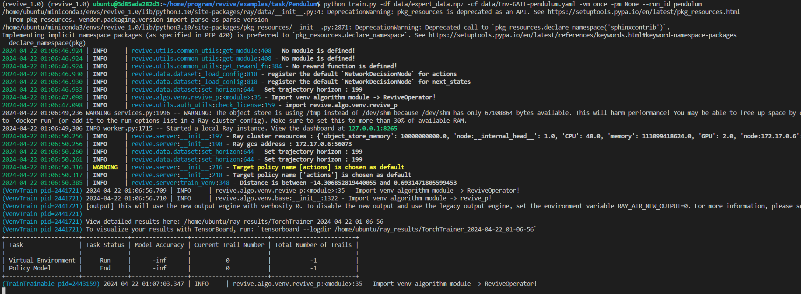

### 3.3.1 训练虚拟环境模型
当我们准备好训练数据集( .npz 或 .h5 文件)、决策流图描述文件( .yaml ) 后。 我们可就可以使用REVIVE进行虚拟环境模型训练。REVIVE提供了默认的train.py脚本来进行训练，该脚本会示例化一个revive.server.ReviveServer 类对象进行训练。
完整的train脚本使用示例如下：
```bash
python train.py -df <训练数据文件路径> -cf <决策流图文件路径> -rf <奖励函数文件路径> -vm <训练虚拟环境模式> -pm <训练策略模型模式> --run_id <训练实验名称>
```

运行 train.py 脚本可定义的命令行参数如下:

- -df: 训练数据的文件路径( .npz 或 .h5 文件)。
- -vf: 验证数据的文件路径(可选)。
- -cf: 决策流图的文件路径( .yaml )。
- -rf: 定义的奖励函数的文件路径( reward.py )(仅在训练策略时需要，训练策略时不需要定义奖励函数文件)。
- -rcf: 支持进行超参配置的 .json 文件(可选)。
- -tpn: 策略节点的名称。必须是决策流图中定义的节点；如果未指定，在默认情况下，排在拓扑顺序第一位的节点将作为策略节点。
- -vm: 训练虚拟环境的不同模式, 包括: once,tune,None。
   - once 模式: REVIVE SDK将使用默认参数训练模型。
   - tune 模式: REVIVE SDK将使用超参数搜索来训练模型，需要消耗大量的算力和时间，以搜寻超参数来获得更优的模型结果。
   - None 模式: REVIVE SDK不会训练虚拟环境，它适用于调用已有虚拟环境进行策略训练。
- -pm: 策略模型的训练模式, 包括: once,tune,None。
   - once 模式: REVIVE SDK将使用默认参数训练模型。
   - tune 模式: REVIVE SDK将使用超参数搜索来训练模型，需要消耗大量的算力和时间，以搜寻超参数来获得更优的模型结果。
   - None 模式: REVIVE SDK不会训练策略，它适用于只训练虚拟环境而不进行策略训练的情况。
- --run_id: 用户为训练实验提供的名称。REVIVE将创建 logs/<run_id> 作为日志目录。如果未提供，REVIVE将随机生成名称。、

**启动训练脚本训练环境模型示例：**
```bash
python train.py -df <训练数据文件> -cf <决策流图文件> -vm <训练虚拟环境模式> -pm None--run_id <训练实验名称>
```

使用默认参数训练单个虚拟环境模型示例：
```bash
python train.py -df test_data.npz -cf test.yaml -vm once -pm None --run_id venv_once
```

使用tune模式进行虚拟环境模型搜参训练示例：
```bash
python train.py -df test_data.npz -cf test.yaml -vm tune -pm None --run_id venv_tune
```
注：使用tune模式会从预设超参数空间中采样多组超参数用于模型训练，根据验证指标返回训练最好的模型，通常使用tune模式可以获得更好的模型，但是也会消耗更多的资源和时间。
### 3.3.2 倒立摆控制任务示例
我们在上一节中已经完成了倒立摆任务的决策流图构建存储和数组数据生成。接下来我们需要使用REVIVE提供的训练脚本来进行倒立摆任务的虚拟环境模型训练。我们将之前构建的npz文件和YAML文件统一存储在data目录下,使用下面的BASH命令启动虚拟环境模型训练：
```bash
 python train.py -df ./data/pendulum.npz -cf ./data/pendulum.yaml -vm once -pm None --run_id pendulum
```

执行上述命令之后，REVIVE会自动加载数据进行虚拟环境模型的训练，训练过程中也会持续的输出日志显示训练结果，命令行的输出如下：




在训练过程中，REVIVE 会持续记录训练日志到日志文件夹中，我们将在下一节中展示如何通过日志文件进行虚拟环境检验。


