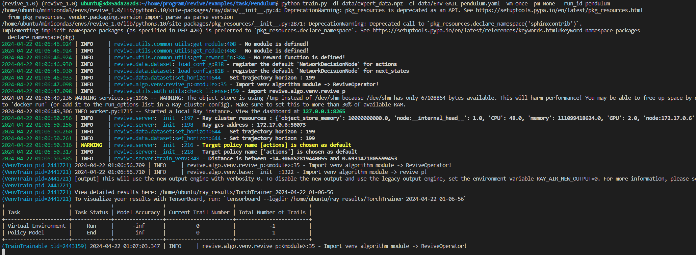

### 3.5.1  定义奖励函数
奖励函数是强化学习中非常重要的组成部分。它定义了策略在与环境交互时所获得的奖励，这些奖励可以是正数、负数或零。强化学习的目标是最大化累积奖励，因此奖励函数定义了策略的优化目标。
在强化学习中，智能体通过与环境的交互来寻找最优策略。策略根据当前的状态选择一个动作，并接收相应的奖励以及下一个状态。这个过程不断重复，直到达到终止状态。如果策略在一系列的动作和状态转换中获得高额的奖励，那么它就找到了一种较好的策略。因此，奖励函数的设计对于强化学习策略的优化至关重要。一个良好的奖励函数应该能够引导策略向着期望的方向进行学习。
奖励函数定义了策略的优化目标，REVIVE支持使用Python源文件来定义奖励函数。奖励函数的输入是决策流图中单个时间步情况下的所有节点， 奖励函数的输出是该时间步下策略执行获得的奖励值。下面我们使用一个简单的示例来展示奖励函数的定义。
假设我们要教一个智能体玩一款跳跃游戏。该智能体应该根据屏幕上的信息，学习如何跳过障碍。奖励函数可以设计为，每当智能体跳过一个障碍， 就给予一定的正面奖励；每次掉入障碍时，就给予一定的负面奖励。对应的奖励函数示例如下：
```python
import torch
from typing import Dict

def get_reward(data: Dict[str, torch.Tensor]) -> torch.Tensor:
    """奖励函数"""

    # 获得是否跳过障碍的状态
    is_passed = torch.gt(data['obs'][..., :1], 0.5)

    # 通过障碍给予100的奖励，不通过则给予-10的奖励(惩罚)
    passed_reward = 100
    unpassed_reward = -10

    # 根据条件计算每一个时间步的奖励
    reward = torch.where(is_passed, passed_reward, unpassed_reward)

    return reward
```
注：REVIVE为了便于解析奖励函数，奖励函数的名称必须是 get_reward。
如果我们面对一个机器人控制任务，策略的目标是将将机器人从一个位置移动到另一个位置的情况， 奖励函数会根据机器人与目标位置的距离的缩小值来计算。那么对应的奖励函数示例如下：
```python
import torch
from typing import Dict

def get_reward(data: Dict[str, torch.Tensor], target_pos: torch.Tensor) -> torch.Tensor:
    """机器人控制任务奖励函数"""

    # 获取当前机器人在做动作之前的位置
    pos = data['obs'][..., :2]
    # 获取当前机器人在做动作之后的位置
    next_pos = data['next_obs'][..., :2]
    # 获取目标位置
    target_pos = data['target_pos'][..., :2]

    # 计算机器人与目标位置的距离的缩小值作为reward
    dist1 = torch.norm(pos - target_pos)
    dist2 = torch.norm(next_pos - target_pos)
    reward = (dist1 - dist2) / dist1

    return reward
```
在使用奖励函数对数据进行处理时，确保函数能够处理与输入张量形状相对应的多维数据是很重要的。同时，在计算奖励时，通常会关注最后一维的特征维度。以下是一个示例，演示如何使用切片方式获取最后一维的特征：
```python
obs_features = data['obs'][..., :2]  # 取最后一维的第一列和第二列
```
在上述示例中，obs是输入的观测数据，它具有多维形状。通过使用切片方式[..., :2]，我们可以获取obs数据的最后一维的前两个特征，存储在obs_features中。然后，您可以对这些特征进行计算，计算得到的奖励值reward将被返回。示例中的奖励计算只是一个简单的示例，您需要根据您的具体任务和目标来设计和实现适合的奖励函数。确保理解和适应奖励函数的输入数据形状以及最后一维特征的提取方式是很重要的。
### 3.5.2 进行策略训练
当我们定义完成奖励函数之后。 我们可就可以使用REVIVE进行策略模型训练。我们仍然可以调用默认的train.py脚本来进行训练，该脚本会示例化一个revive.server.ReviveServer 类对象进行训练。
完整的train脚本使用示例如下：
```bash
python train.py -df <训练数据文件路径> -cf <决策流图文件路径> -rf <奖励函数文件路径> -vm <训练虚拟环境模式> -pm <训练策略模型模式> --run_id <训练实验名称>
```

运行 train.py 脚本可定义的命令行参数如下:

- -df: 训练数据的文件路径( .npz 或 .h5 文件)。
- -vf: 验证数据的文件路径(可选)。
- -cf: 决策流图的文件路径( .yaml )。
- -rf: 定义的奖励函数的文件路径( reward.py )(仅在训练策略时需要，训练策略时不需要定义奖励函数文件)。
- -rcf: 支持进行超参配置的 .json 文件(可选)。
- -tpn: 策略节点的名称。必须是决策流图中定义的节点；如果未指定，在默认情况下，排在拓扑顺序第一位的节点将作为策略节点。
- -vm: 训练虚拟环境的不同模式, 包括: once,tune,None。
   - once 模式: REVIVE SDK将使用默认参数训练模型。
   - tune 模式: REVIVE SDK将使用超参数搜索来训练模型，需要消耗大量的算力和时间，以搜寻超参数来获得更优的模型结果。
   - None 模式: REVIVE SDK不会训练虚拟环境，它适用于调用已有虚拟环境进行策略训练。
- -pm: 策略模型的训练模式, 包括: once,tune,None。
   - once 模式: REVIVE SDK将使用默认参数训练模型。
   - tune 模式: REVIVE SDK将使用超参数搜索来训练模型，需要消耗大量的算力和时间，以搜寻超参数来获得更优的模型结果。
   - None 模式: REVIVE SDK不会训练策略，它适用于只训练虚拟环境而不进行策略训练的情况。
- --run_id: 用户为训练实验提供的名称。REVIVE将创建 logs/<run_id> 作为日志目录。如果未提供，REVIVE将随机生成名称。、

**启动训练脚本训练策略模型示例：**
```bash
python train.py -df <训练数据文件> -cf <决策流图文件> -rf <奖励函数文件> -vm None-pm once--run_id <训练实验名称>
```

使用默认参数训练单个策略模型示例：
```bash
python train.py -df test_data.npz -cf test.yaml -vm None -pm once --run_id task
```

使用tune模式进行虚拟环境模型搜参训练示例：
```bash
python train.py -df test_data.npz -cf test.yaml -vm None -pm tune --run_id task
```
注：使用tune模式会从预设超参数空间中采样多组超参数用于模型训练，根据验证指标返回训练最好的模型，通常使用tune模式可以获得更好的模型，但是也会消耗更多的资源和时间。

### 3.5.3 倒立摆控制任务示例
上一节中我们已经完成了虚拟环境模型的训练和检验。接下来我们可以开始进行策略模型的训练，训练策略模型之前我们首先需要定义一个奖励函数。倒立摆任务的目标是通过施加力矩，使摆杆保持在垂直向上的位置，同时尽量减小摆杆的摆动幅度和速度。任务的奖励函数如下：
$r = - \left( \theta^2 + 0.1 \cdot \theta_{dt}^2 + 0.001 \cdot \text{torque}^2 \right)$
我们需要使用Python源文件的方法将上述公式表示出来：
```bash
import torch
import math
from typing import Dict


def get_reward(data : Dict[str, torch.Tensor]) -> torch.Tensor:
        action = data['action'][...,0:1]
        u = torch.clamp(action, -2, 2)

        state = data['observation'][...,0:3]
        costheta = state[:,0].view(-1,1)
        sintheta = state[:, 1].view(-1,1)
        thdot = state[:, 2].view(-1,1)

        x = torch.acos(costheta)
        theta = ((x + math.pi) % (2 * math.pi)) - math.pi
        costs = theta ** 2 + 0.1 * thdot**2 + 0.001 * (u**2)
        
        return -costs
```
完成奖励函数定义。接下来我们需要使用REVIVE提供的训练脚本来进行倒立摆任务的策略模型训练。我们将构建的奖励函数和之前构建的npz文件和YAML文件统一存储在data目录下,使用下面的BASH命令启动虚拟环境模型训练, run_id保持和之前训练虚拟环境模型的一致，revive会自动加载之前训练好的虚拟环境模型进行策略训练。
```bash
python train.py -df ./data/pendulum.npz -cf ./data/pendulum.yaml -rf ./data/pendulum_reward.py -vm None -pm once --run_id pendulum
```

执行上述命令之后，REVIVE会自动加载数据进行虚拟环境模型的训练，训练过程中也会持续的输出日志显示训练结果，命令行的输出如下：




