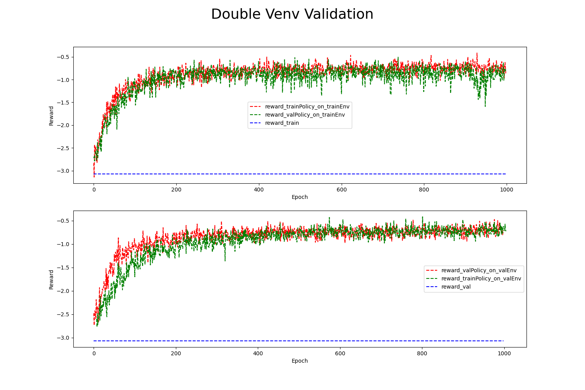

### 3.6.1 策略模型联合检验
当完成策略训练之后, 我们需要进行策略模型效果的检验,REVIVE默认使用双环境验证的方法来评估策略模型的结果。双环境验证是一种用于评估策略模型性能的重要方法。它通过将训练和测试环境定义为两个不同的环境来进行评估。在训练期间，智能体使用一个环境进行学习，而在测试期间，它必须在另一个环境中进行操作，该环境可能与训练环境略有不同。通过双环境验证，我们可以检测策略模型是否过度拟合到特定的训练环境。如果训练环境和测试环境非常相似，那么模型可能会在测试环境中表现良好，因为它已经学习到了与测试环境相似的模式和策略。然而，如果测试环境与训练环境存在明显的区别，模型可能无法泛化到新环境中，导致性能下降。通过双环境验证，我们也可以评估策略模型在不同环境中的表现，并检查其是否具有适应不同环境的能力。如果模型在测试环境中表现良好，即使与训练环境有明显区别，我们可以得出结论它具有较强的泛化能力。双环境验证帮助用户确定策略模型的实际效果，并评估其在真实场景中的可靠性和鲁棒性。
在使用REVIVE SDK进行任务学习的过程中，REVIVE会默认将数据集划分为训练数据集和验证数据集，并在这两个数据集上构建相应的虚拟环境。这些虚拟环境被命名为trainEnv和valEnv，对应的数据集为trainData和valData。在策略模型的学习过程中，REVIVE会在trainEnv和valEnv以及对应的数据集trainData和valData上分别进行策略模型的训练。这将产生两个策略模型，分别为trainPolicy和valPolicy。训练结束后，REVIVE SDK会根据用户设定的奖励函数，对trainPolicy在trainEnv和valEnv上以及valPolicy在trainEnv和valEnv上的平均单步奖励进行记录。这些记录将用于生成双重环境验证图，并保存在logs/<run_id>/policy_train(tune/../)/double_validation.png路径下。下面是一个标准的双环境验证图片：

从上图中我们可以看到，红绿两条线都高于蓝色虚线。这意味着在两个环境中，两种策略得到的奖励数值都高于了历史数据集中的奖励数值。上图中的红线（ reward_trainPolicy_on_trainEnv ）和下图中的绿线（ reward_trainPolicy_on_valEnv ）随着训练轮次的增加有相似的走势。 我们也能从上图中的绿线和下图中的红线发现同样的结果。这表明，训练的 trainPolicy 并没有在其对应训练的虚拟环境 trainEnv 上过拟合。 得到的策略模型可以泛化到其他的环境中。由于 trainPolicy 能够在 valEnv 中有良好的表现，我们可以认为 trainEnv 和 valEnv 有一定的相似性。 这表明在虚拟环境训练时的超参数设置能够在划分的训练数据和验证数据上得到相近且有价值的环境模型。

下面我们来展示一个失败的例子：

从图中我们发现，同一策略并没有在两个环境中有相似的表现。另外，两种策略表现都没有稳定地收敛并高于蓝色虚线之上。这说明双环境验证不通过，模型未通过联合检验。一般情况下双环境验证不通过的原因有以下几点：

1. 训练环境与测试环境不一致。如果训练集和测试集中一些维度的数据分布差异较大，那么训练集得到的 trainPolicy 在 valEnv 的表现可能会大打折扣。
2. 过度拟合。当 trainPolicy 在 trainEnv 中过多地学习了噪声或特定环境下的规律时，就会导致其在 valEnv 下表现不佳。 如果 trainPolicy 复杂度过高，它可能会过度拟合 trainData ，导致在 valEnv 中的性能下降。
3. 样本数量不足。如果训练数据太少，模型可能无法充分学习环境中的规律，从而导致学习得到的虚拟环境并不能很好的模拟真实环境。
4. 超参数选择不当。例如，学习率过高或过低、折扣因子选择不当等，都可能导致模型在测试环境中表现不佳。
5. 环境动态变化。如果环境的动态性较大，比如说在训练期间环境发生了变化，那么模型在测试环境中的表现也可能会出现差异。

最后需要明确，双环境验证方法是评估策略模型性能的众多方法之一，也是判断策略模型泛化性能的重要指标。 但这并不意味着如果双环境验证通过，那么策略模型在真正的实际环境中就能够有理想的效果。 同时也并不代表学习得到的虚拟环境就能够完美地复刻真实环境。

### 3.6.2 倒立摆控制任务示例
在上一节中，我们完成了策略模型的训练。下面我们打开对应的双环境验证图片（logs/revive/policy_train/double_validation.png）如下图。可以看到下图是一个较好的双环境验证图片，红线和绿线均稳定超过了蓝线。说明联合检验通过，下面就可以上线到业务场景中了。

