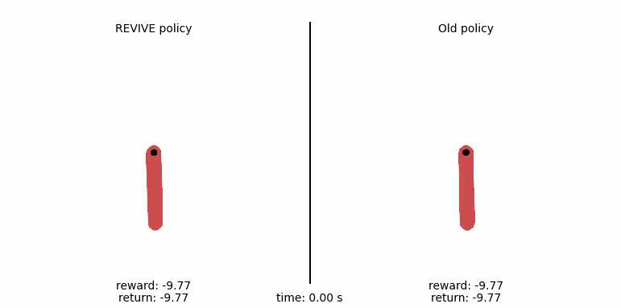

### 3.7.1 模型部署
当REVIVE SDK完成虚拟环境模型训练和策略模型训练后。我们可以在日志文件夹（ logs/<run_id> ）下找到保存的模型（ .pkl 或 .onnx ）。虚拟环境模型可以用来进行模拟推演。虚拟环境模型能够接受不同的输入进行环境模拟，我们可以与虚拟环境进行交互实验。策略模型接受环境状态作为输入，并输出相应的动作。在实际应用中，我们可以将策略模型嵌入到系统中，使其能够根据当前的环境状态实时做出决策。
#### 部署训练完成的环境模型
**使用训练好的虚拟环境模型(env.pkl)**
虚拟环境模型会被序列化为 env.pkl 文件。使用虚拟环境模型时需要使用 pickle 加载序列化的环境模型，然后使用 venv.infer_one_step() 函数或 venv.infer_k_step() 函数进行虚拟环境推理。
```bash
import os
import pickle
import numpy as np

# 获得虚拟环境模型的文件路径
venv_path = os.path.join(os.path.dirname(os.path.abspath(__file__)), "logs/run_id", "env.pkl")

# 加载虚拟环境模型
venv = pickle.load(open(venv_path, 'rb'), encoding='utf-8')

# 生成状态数据
state = {"states": np.array([-0.5, 0.5, 0.2]), "actions": np.array([1.])}

# 使用虚拟环境模型进行单时间步的推理
output = venv.infer_one_step(state)
print("Virtualenv model 1-step output:", output)

# 使用虚拟环境模型进行K个时间步推理
# 返回列表的长度为k，对应于K个时间步的输出。
output = venv.infer_k_steps(state, k=3)
print("Virtualenv model k-step output:", output)
```
使用虚拟环境模型进行推理时，可以额外传入 deterministic 和 clip 参数。其中 deterministic 参数用来决定 输出是否是确定性的。如果为True，则返回最可能的输出；如果为False，则根据模型的概率分布进行采样输出。默认值为True。 clip 用来决定是否应将输出的裁剪到指定的有效范围内， 裁剪范围是根据 *.yaml 文件中的配置进行，如果没有配置则从自动从数据中计算最小值和最大值。默认值为True，表示对输出的动作进行剪切。

**使用训练好的虚拟环境模型(env.onnx)**
```bash
import os
import onnxruntime
import numpy as np

venv_path = os.path.join(os.path.dirname(os.path.abspath(__file__)), "logs/run_id", "env.onnx")
venv = onnxruntime.InferenceSession(venv_path)

# onnx 模型现在已经支持灵活的 batch_size，默认在第 0 维
# 确保输入的数据为浮点类型
# venv_input需要是一个python的字典, 与.pkl模型的输入相似
venv_input = {'temperature' : np.array([0.5, 0.4, 0.3], dtype=np.float32).reshape(3, -1), 'door_open': np.array([1., 0., 1.], dtype=np.float32).reshape(3, -1)}
# 输出的数据需要将其名称囊括在venv_output_names列表中
venv_output_names = ["action", "next_temperature"]

# 这里将用输入的数据进行一次决策流的推理（类似于 .pkl 的 venv.infer_one_step()） --> 返回一个列表（List）
# 输出将以venv_output_names的名称顺序存储在数组中
output = venv.run(input_feed=venv_input, output_names=venv_output_names)
print(output)
```

#### 部署训练完成的策略模型
**使用策略模型(policy.pkl)**
策略模型会被序列化为 policy.pkl 文件。使用策略模型时需要使用 pickle 加载序列化的决策模型，然后使用 policy.infer() 函数进行策略模型推理。
```bash
import os
import pickle
import numpy as np

# 获得策略模型的文件路径
policy_path = os.path.join(os.path.dirname(os.path.abspath(__file__)), "logs/tmp", "policy.pkl")

# 加载策略模型
policy = pickle.load(open(policy_path, 'rb'), encoding='utf-8')

# 生成状态数据
state = {"states": np.array([-0.5, 0.5, 0.2])}
print("Policy model input state:", state)

# 使用策略模型进行推理，输出动作
action = policy.infer(state)
print("Policy model output action:", action)
```
策略模型进行推理时，同样可以额外传入 deterministic 和 clip 参数。其中 deterministic 参数用来决定 输出是否是确定性的。如果为True，则返回最可能的输出策略动作；如果为False，则根据策略模型的概率分布进行采样动作输出。默认值为True。 clip 用来决定是否应将输出的动作剪切到动作空间的有效范围内， 裁剪范围是根据 *.yaml 文件中的配置进行，如果没有配置则从自动从数据中计算最小值和最大值。默认值为True，表示对输出的动作进行剪切。

**使用策略模型(policy.onnx)**
```bash
import os
import onnxruntime
import numpy as np

policy_path = os.path.join(os.path.dirname(os.path.abspath(__file__)), "logs/run_id", "policy.onnx")
policy = onnxruntime.InferenceSession(policy_path)

# onnx 模型现在已经支持灵活的 batch_size，默认在第 0 维
# 确保输入的数据为浮点类型
# policy_input需要是一个python的字典, 与.pkl模型的输入相似
policy_input = {'temperature' : np.array([0.5, 0.4, 0.3], dtype=np.float32).reshape(3, -1)}
# 输出的数据需要将其名称囊括在policy_output_names列表中
policy_output_names = ["action"]

# 这里将用输入的数据进行一次决策流的推理（类似于 .pkl 的 policy.infer_one_step()） --> 返回一个列表（List）
# 输出将以venv_output_names的名称顺序存储在数组中
output = policy.run(input_feed=policy_input, output_names=policy_output_names)
print(output)
```

### 3.7.2 倒立摆控制任务示例
当我们完成倒立摆任务的策略模型训练和检验之后，我们就可以将策略模型用在真实的任务场景中。参考上面的方法我们加载训练完成的策略模型在倒立摆的环境下进行控制：
```bash
import os
import pickle
import gym
import numpy as np

# 获得策略模型的文件路径
policy_path = os.path.join(os.path.dirname(os.path.abspath(__file__)), "logs/pendulum", "policy.pkl")
# 加载策略模型
policy = pickle.load(open(policy_path, 'rb'), encoding='utf-8')

# 创建Pendulum环境
env = gym.make('Pendulum-v0')

# 定义策略控制函数
def policy_control(observation):
    # 策略做出动作
    action = policy.infer({"obs": observation})
    return action

# 运行Pendulum任务并进行随机测试
num_episodes = 50  # 测试轨迹的数量

for episode in range(num_episodes):
    total_reward = 0
    done = False
    observation = env.reset()

    while not done:
        # 在每个时间步应用策略控制函数选择动作
        action = policy_control(observation)

        # 执行动作，获取下一个状态、奖励和终止标志
        next_observation, reward, done, _ = env.step(action)

        # 更新当前观测
        observation = next_observation

        # 累计奖励
        total_reward += reward

    # 打印每条轨迹的累计奖励
    print("Episode {}: Total Reward = {}".format(episode + 1, total_reward))
```
通过上述代码我们可以将将策略在Gym-Pendulum环境中随机测试50次，每次执行300个时间步长，最后输出这50次的平均回报（累计奖励）。 REVIVE SDK的策略获得了-137.66平均奖励，远高于数据中原始策略的-861.74奖励值，控制效果提高了约84%。
为了更直观地比较策略，我们通过下面的代码生成策略的控制动画。我们在动画中展示钟摆运动的每一步， 从比较来看，左侧由REVIVE SDK输出的策略摆可以在3秒内将摆杆稳定地倒立在平衡点上， 而右侧数据中的原始策略始终不能将摆控制到目标位置。





到此，我们通过倒立摆的任务完整的展示了REVIVE的使用流程。但是REVIVE还有很多丰富的高级功能，我们将在接下来的章节给大家逐一展示。


