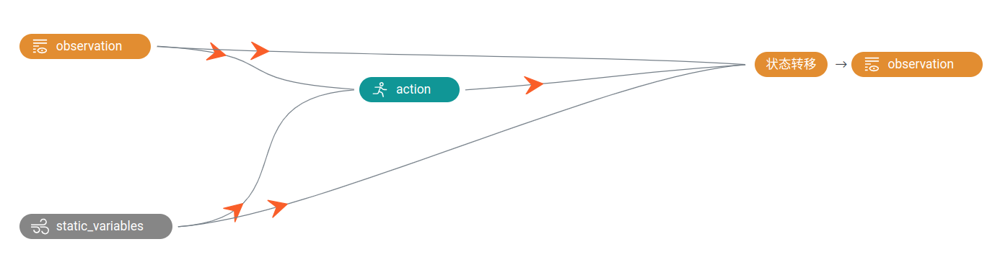
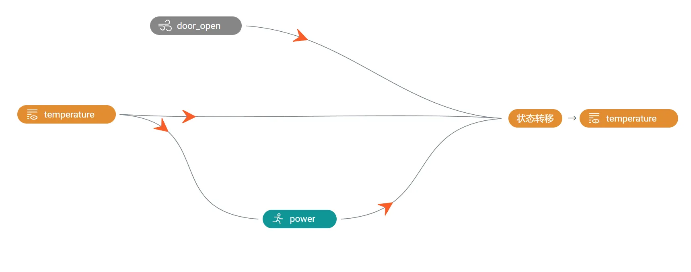
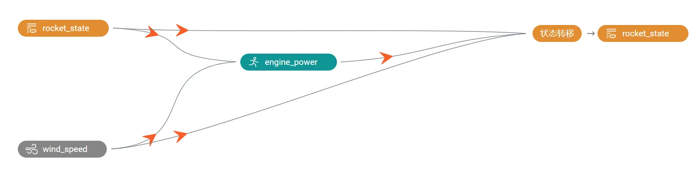
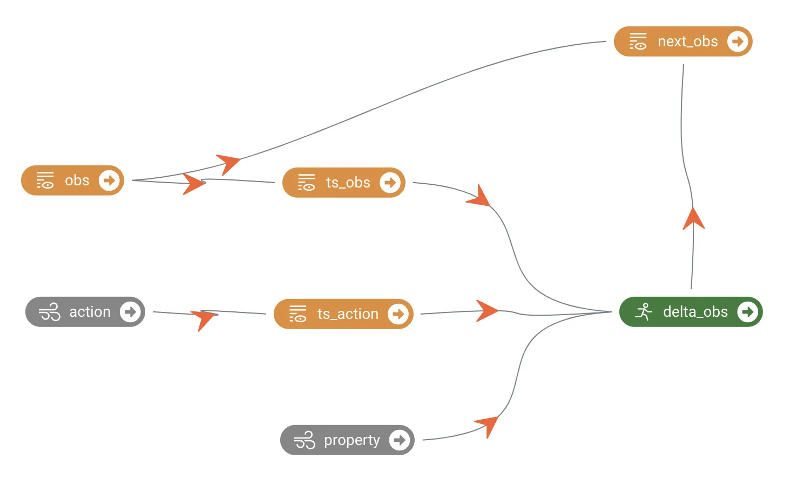

### 4.1.1 功能介绍
静态变量是指在某个系统或任务中，对当前系统产生影响但不会被当前系统所影响的变量。它们是由外部因素引起的，并且通常不能被当前系统所操纵或控制。在建模和分析过程中，考虑静态变量可以使模型更加准确和全面。通过将静态变量纳入模型，可以更好地建模输入和输出之间的因果关系，提高模型的预测能力和解释能力。
REVIVE 支持引入外部变量作为决策流图的输入，外部变量在决策流图中只作为输入使用，并不配置节点进行输出。

下面是一个示例展示如何在REVIVE的决策流图中引入静态变量。假设我们的任务中存在节点如下图所示，它会对我们的策略节点和状态转移节点产生影响，但是这些节点又不会对其后续的值产生影响，那么就可以将其定义为静态变量。如下图所示，静态变量节点(static_variables)即作为action节点的输入，也作为observation节点的输入。



上述决策流图对应的YAML文件如下：
```bash
metadata:
  graph:
    action:
    - observation
    - static_variables
    next_observation:
    - static_variables
    - observation
    - action
  columns:
    ...
```
在使用REVIVE SDK时，我们应根据具体的业务逻辑在决策流图中定义或构建静态变量节点。这样做可以使REVIVE学习的环境模型更准确、更接近真实情况，因为它能够考虑到系统中的各种因素和变量对决策和状态转移的影响。通过合理地引入静态变量，我们可以增强模型的表达能力，提高对系统行为的理解和预测能力。

### 4.1.2 案例展示
**案例1：**
冰箱案例 中， 冰箱内部温度会受冰箱门开关状态的影响，而冰箱门开关状态完全是冰箱使用者决定的，不会被冰箱自身影响，因此冰箱门开关状态被作为静态变量引入。



**案例2：**
在火箭回收任务中，环境风会对火箭的状态产生影响，但是火箭本身的状态并不会影响到外界风力的变化，因此我们在建模时需要把环境风建模为静态变量。


**案例3：**
在1型糖尿病人的胰岛素注射策略优化任务中我们进行环境建模时，由于原始的胰岛素注册是受医护人员控制的，而且病人的属性不会发生变化，因此建模时将胰岛素注册节点和病人属性节点定义为静态变量节点。



