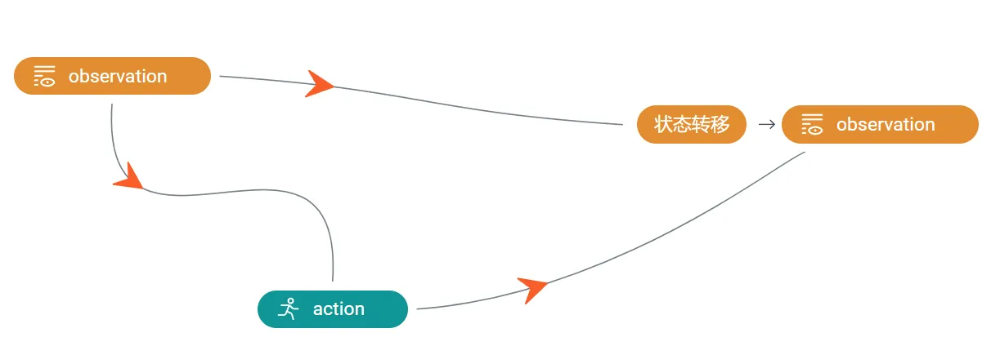

### 4.2.1 功能介绍
专家函数是由领域专家开发的函数，用于处理特定领域的问题。通过将专业知识嵌入或调用到模型中，专家函数使得模型能够更好地理解和处理特定领域的数据和任务。这种嵌入可以帮助模型快速学习核心问题并减少调参时间，从而降低了任务的难度。
在机械控制任务中使用PID控制器作为专家函数节点是一个很好的选择。PID控制器是一种经典的反馈控制方法，它可以根据系统的当前状态和期望状态来调整控制器的输出，以实现系统稳定和响应性能的优化。将PID控制器定义为专家函数节点可以将专业领域的知识和经验引入到模型学习中，从而加速训练过程并提高模型的控制精度。在自动驾驶任务中，将交通规则定义为专家函数节点也是很有意义的。交通规则是指导车辆行驶和交互的法规和规范，对于实现安全和高效的自动驾驶系统至关重要。通过将交通规则作为专家函数节点，可以将这些规则直接嵌入到模型中，使模型能够自动遵守交通规则并做出相应的决策，如避让其他车辆、遵守交通信号灯等。这样可以提高自动驾驶系统的安全性和合规性。
专家函数的引入不仅可以加强模型的能力，还可以帮助模型应对领域特定的挑战和复杂性。专家函数可以提供领域内的先验知识，帮助模型更好地理解数据和任务的背景和上下文，减少对大量标记数据的依赖，同时提高对于新情况和边界情况的处理能力,提高模型的精度。

下面我们以一个简单的示例展示如何使用专家函数：

如果我们有上图所示的决策流图，其对应的YAML文件如下：
```bash
metadata:
  graph:
    action:
    - observation
    next_observation:
    - observation
    - action
  columns:
    ...
```
现在假设数据中action节点固定返回的action值是1，那么我们可以使用下面的专家函数来计算action节点的输出：
```bash
import torch
from typing import Dict

def action(data: Dict[str, torch.Tensor]) -> torch.Tensor:
   action = data["obs"][...,:1] * 0

   return action
```
注：上述action计算仅仅是一个示例展示，专家函数的计算方法可以根据实际情况进行任意的定义。

我们将上述专家函数定义为一个文件expert_function.py 。我们可以通过在YAML文件中配置节点的专家函数信息来将定义的专家函数引入的决策流图的计算过程中。新的YAML文件如下所示。REVIVE在进行虚拟环境建模时，通常会初始化神经网络来拟合节点输入和输出之间的关系，如果定义了节点的函数，那么REVIVE就不会为该节点初始化神经网络，而是使用定义的专家函数进行计算。
```bash
metadata:
  graph:
    action:
    - observation
    next_observation:
    - observation
    - action
  expert_functions:
    action:
      'node_function' : 'expert_functions.action'
  columns:
    ...
```

一个决策流图可以引入多个专家函数，下面是一个复杂的示例：
```bash
metadata:
   graph:
     action:
     - obs_1
     - obs_2
     next_obs_1:
     - obs_1
     - obs_2
     - action
     next_obs_2:
     - obs_1
     - obs_2
     - action
     - next_obs_1
  expert_functions:
     next_obs_1:
       'node_function' : 'dynamics.transition_1'
     next_obs_2:
       'node_function' : 'dynamics.transition_2'
  columns:
    ...
```
上面的决流图为next_obs_1和next_obs_2节点分别定义了专家函数，其中next_obs_1节点会作为next_obs_2节点的输入。

需要注意的是，在使用专家函数对数据进行处理时，通常会将多个数据按批量（batch）组织起来进行一次性运算处理。这种方式可以提高代码的运行效率。 因此，在编写奖励函数时，需要注意保证函数能够处理与输入张量形状相对应的多维数据。此外，在计算专家函数输出时，我们通常会关注最后一维的特征维度。 为方便处理，专家函数的计算维度通常都设在了最后一维。因此，在使用数据时需要使用切片（[..., n:m ]）的方式获取数据的最后一维的特征， 并对特征进行计算。下面是一个示例：
```bash
import torch
from typing import Dict

def action(data: Dict[str, torch.Tensor]) -> torch.Tensor:
   action = data["obs"][...,:1] + data["obs"][...,1:2] 

   return action
```
专家函数的输出应该是一个对应的Pytorch Tensor，其Batch维度(第一维)保持和输入数据一致， 最后一维特征的维度应该与 *.yaml 文件中该节点的定义一致。

### 4.1.2 示例展示
**案例1**
在长时滞反馈情况下的管道流量控制任务中，根据业务知识，Q_out_history记录的是历史的Q_out, CV_in_history记录的是历史的CV_in , 因此根据Q_out 和Q_out_history可以获得next_Q_out_history, 根据CV_in 和CV_in_history和可以计算获得next_CV_in_history。我们引入了专家函数来计算next_Q_out_history和next_CV_in_history节点。
```yaml
metadata:
  columns:
    ...
  graph:
    ...
  expert_functions:
    next_CV_in_history:
      node_function: expert_functions.next_CV_in_history
    next_Q_out_history:
      node_function: expert_functions.next_Q_out_history
```
对应的专家函数如下：
```yaml
import torch
import numpy as np

# 根据Q_out_history和Q_out计算next_Q_out_history
def next_Q_out_history(data):    
    Q_out_history = data["Q_out_history"]
    Q_out = data["Q_out"]
    
    singel_sample = False
    if len(Q_out_history.shape) == 1:
        Q_out_history = Q_out_history.reshape(1,-1)
        singel_sample = True

    if len(Q_out.shape) == 1:
        Q_out = Q_out.reshape(1,-1)
    
    if isinstance(Q_out, np.ndarray):
        array_type = np
    else:
        array_type = torch
        
    
    if isinstance(Q_out, np.ndarray):
        next_Q_out_history = np.concatenate([Q_out,Q_out_history[...,:-1]],-1)
    else:
        next_Q_out_history = torch.cat([Q_out,Q_out_history[...,:-1]],-1)

    if singel_sample:
        next_Q_out_history = next_Q_out_history[0]
        if array_type == np:
            next_Q_out_history = next_Q_out_history.item()

    return next_Q_out_history


# 根据CV_in_history和CV_in计算next_CV_in_history
def next_CV_in_history(data):    
    CV_in_history = data["CV_in_history"]
    CV_in = data["CV_in"]
    
    singel_sample = False
    if len(CV_in_history.shape) == 1:
        CV_in_history = CV_in_history.reshape(1,-1)
        singel_sample = True
    if len(CV_in.shape) == 1:
        CV_in = CV_in.reshape(1,-1)
    
    if isinstance(CV_in_history, np.ndarray):
        array_type = np
    else:
        array_type = torch
        
    
    if isinstance(CV_in, np.ndarray):
        next_CV_in_history = np.concatenate([CV_in,CV_in_history[...,:-1]],-1)
    else:
        next_CV_in_history = torch.cat([CV_in,CV_in_history[...,:-1]],-1)

    if singel_sample:
        next_CV_in_history = next_CV_in_history[0]
        if array_type == np:
            next_CV_in_history = next_CV_in_history.item()

    return next_CV_in_history
```


