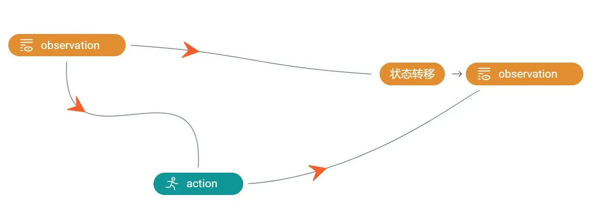
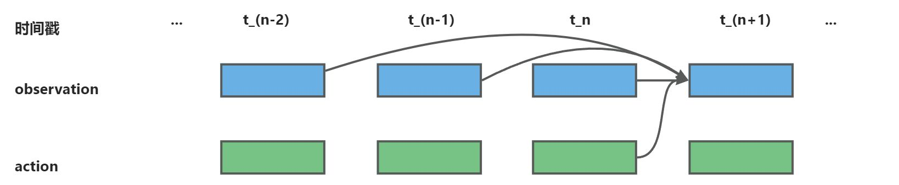
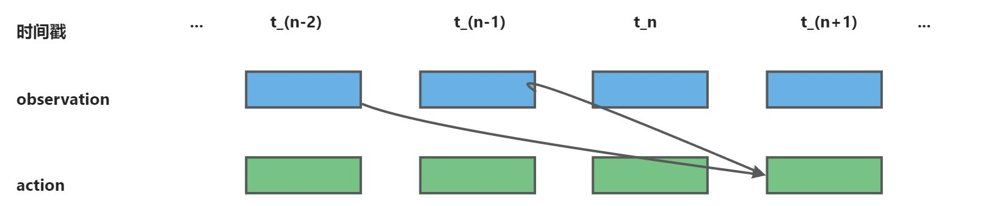
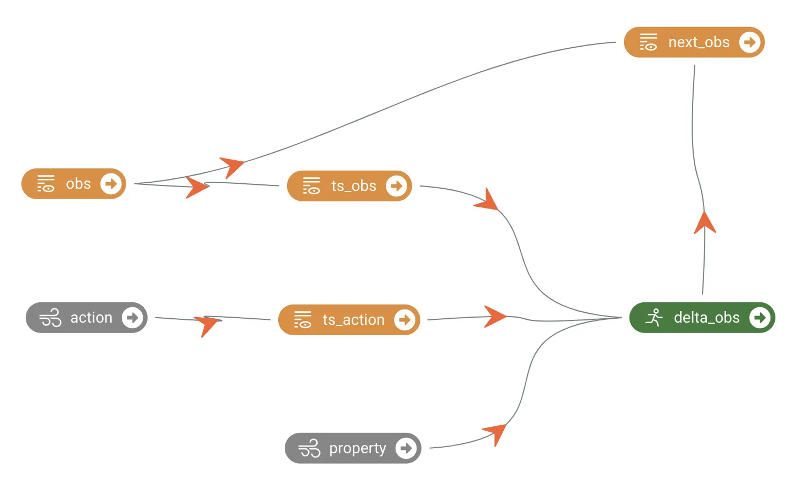

### 4.3.1 功能介绍 
时序建模是指在建立模型时，将多个时间步的数据拼接在一起作为输入，以提高模型的精度和鲁棒性。通过使用多个时间步节点，模型可以获得更丰富的历史信息，从而增强对时间序列数据的理解和预测能力。以汽车驾驶任务为例，考虑到仅仅使用当前时刻的速度可能无法提供足够的信息来准确预测未来的速度和行驶状态。为了解决这个问题，可以将多个时间步的速度数据拼接在一起作为输入。通过综合利用历史多个时间步的速度信息，模型可以获得更全面的速度特征，例如加速度。这样，模型能够更精确地预测汽车的未来速度的变化和行驶状态，从而提高车辆控制系统的精度和反馈能力。
时序建模可以提供以下好处：

- 丰富的输入信息：拼接多个时间步的数据可以为模型提供更多的历史信息，使其能够更好地理解时间序列数据中的模式和趋势。这有助于模型捕捉更多的特征和关联关系，从而提高建模的准确性。
- 捕捉时间依赖性：时序建模可以捕捉到时间序列数据中的时间依赖性和动态变化。通过考虑多个时间步的数据，模型能够更好地预测未来的状态和行为，因为它能够观察到时间序列数据的演变过程。
- 鲁棒性和泛化能力：通过考虑历史多个时间步的数据，时序建模可以提高模型的鲁棒性和泛化能力。模型可以更好地处理不同的时间序列模式和变化，而不仅仅依赖于单个时间步的信息。

REVIVE支持下面两种方式进行时序建模：

1. 多时间步输入信息拼接；
2. 使用时序神经网络。

下面我们来分别介绍这些功能的使用方法：
#### 多时间步输入信息拼接
多时间步输入信息拼接是指在建立模型时，将多个时间步的数据拼接在一起作为输入，以提高模型的精度和鲁棒性。通过使用多个时间步节点，模型可以获得更丰富的历史信息，从而增强对时间序列数据的理解和预测能力。

下面我们通过一个任务示例展示如何进行多时间步输入信息拼接：



假设我们的任务有如上的决策流图，经过REVIVE建模之后，我们发现环境的状态转移的建模存在问题，经过分析确定状态转移不仅依赖当前时间的observation节点信息，还受到过去一段时间的历史observation信息的影响。如下图所示：


那么我们就需要将observation节点过去的历史信息一起作为转移节点的输入。REVIVE支持在YAML文件中进行节点配置来自动构建多时间步信息拼帧的节点。下面是对应的YAML文件示例：
```yaml
metadata:
   graph:
     action:
     - ts_observation
     next_ts_observation:
     - action
     - ts_observation
   columns:
   ...
   nodes:
     observation:
       ts: 2
```
多时间步拼接后的节点会被构建一个新的节点，在原节点的名称前增加ts_前缀。 ts_observation 节点将自动将历史2个时间步的 observation 数据和当前的数据进行拼接。
需要注意的是，REVIVE SDK会自动检测存在 ts_ 前缀的节点。用户应避免在自定义节点名时使用 ts_ 前缀。此外，在上述例子中拼帧节点 ts_observation 可以类比为一个“长度为2的队列”， observation 在其中符合FIFO原则，最新的 observation 将会被拼在特征维度的最后。

REVIVE也支持选择过去某个时间段的历史信息进行拼接。如下图所示，假设我们想要只使用过去两帧的信息作为输入，而不包含当前时间该节点的信息：


上述决策流图对应的YAML文件如下：
```bash
metadata:
   graph:
     action:
     - ts_observation
     next_ts_observation:
     - action
     - ts_observation
   columns:
   ...
   nodes:
     observation:
       ts: 3
       ts_length: 2
```
### 4.1.2 案例展示
案例1：
在1型糖尿病人的胰岛素注射策略优化任务中，由于胰岛素注射后血糖发生变化的时间延迟主要受到胰岛素吸收速度、作用时间、胰岛素调节血糖的过程以及食物摄入等多种因素的影响，因此这是一个带有不确定性时延的任务。该任务中对obs节点和action节点使用了多时间步输入信息拼接方法构建了ts_obs节点和ts_action节点。


