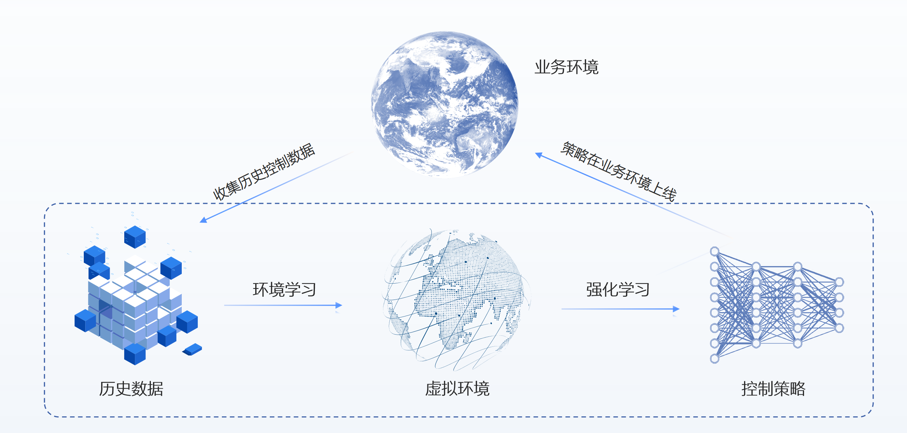

## 任务背景
冰箱是一种常见的冷藏和储存食物、药品和其他物品的家电设备。它的主要功能是通过制冷系统将内部温度降低，以延缓食物腐败和细菌滋生的速度，从而保持食物的新鲜和质量。冰箱恒温控制的基本原理是通过控制制冷系统的运行来调节冰箱的温度。在冰箱中，制冷系统通常由压缩机、冷凝器、膨胀阀和蒸发器等组成。冰箱内的温度传感器会实时的测量冰箱内部温度。冰箱的温度控制系统根据温度信号反馈调整制冷系统的运行，以降低温度并将其维持在目标温度范围内。
常见的控制策略是使用PID控制器（比例-积分-微分控制），它根据当前温度与目标温度之间的偏差来调整制冷系统的输出。PID控制器根据比例项、积分项和微分项的权重，计算出一个控制信号，以控制制冷系统的运行。比例项根据当前温度偏差进行调整，积分项用于修正累积的温度偏差，而微分项则通过监测温度变化率来预测未来的温度趋势，以更快地响应温度波动。
## 任务介绍
冰箱温度控制案例中提供了一个简化的冰箱温度控制环境。在这个环境中，冰箱可以观测的状态包括冰箱内部温度(temperature)，当前的压缩机制冷功率(power)，冰箱门会随机打开。任务目标是需要控制压缩机功率来将冰箱内部温度稳定控制在目标温度附近。冰箱的温度会受到多方面因素的影响，包括外界环境温度的影响，环境温度越高，冰箱内温度上升越快，冰箱门打开会造成冰箱内温度快速上升。需要注意的是控制系统的输入只包含冰箱内部温度。
当前的环境中存在一个PID的温度控制策略。PID控制器通过测量冰箱当前温度与预设目标温度之间的差异， 将这个误差转换成一个输出信号来控制用电功率以调节温度。但是由于PID控制策略可能无法应对非线性和时变性的特性，导致温度波动较大。其次，冰箱门的开关会导致外界温度进入冰箱内部，对温度控制造成干扰，导致控制效果不理想。
## 数据介绍
已有的PID控制策略已经在冰箱温度控制任务中运行了一段时间，系统收集了一段时间的历史日志数据。历史数据以CSV文件的形式进行存储。下面是日志文件的截图:


整个CSV文件包含2000个时间点德日志信息，下面是CSV文件表头信息的描述：

| **信息名称** | **信息类别** | **信息描述** |
| --- | --- | --- |
| time | 时间信息 | 当前行信息的记录时间索引 |
| temperature | 冰箱状态信息 | 冰箱内部当前温度 |
| power | 冰箱控制信息 | 压缩机制冷功率（功率范围是[0,10]，功率越大，制冷效率越高） |
| door_open | 冰箱状态信息 | 冰箱门是否是打开状态 |

## 任务目标
任务目标是需要控制压缩机功率来将冰箱内部温度稳定控制在目标温度(-2摄氏度)附近。
## 解决方案
由于已有的PID控制策略已经运行了一段时间并记录了历史控制数据。我们希望能够基于这些数据直接优化控制策略提升控制效果。我们采用离线强化学习工具REVIVE来解决上述任务。REVIVE是一套数据驱动强化学习的工业决策软件，该软件通过利用历史数据来学习最优策略， 而无需与真实环境进行额外交互，从而实现决策过程的自动化并率先实现真实业务的落地。


### 任务分析
我们首先结合对业务环境的理解对任务和数据进行分析，time列提供了时间戳表示时间信息，可以用于确定信息的顺序和时间序列的变化，用于分析数据之间时序上的因果关系。数据中的信息可以分为3大类，第一类是冰箱的状态信息，包括冰箱的内部温度和冰箱门是否打开，第二类是冰箱的控制信息，包括压缩机制冷功率。在时序上进行可视化如下：


冰箱温度控制案例中，我们需要考虑多个因素来实现稳定的温度控制。以下是对这些因素的进一步描述和可能的控制策略：

1. 冰箱内部温度：冰箱内部温度是我们需要控制的目标。我们可以使用温度传感器来监测冰箱内部温度，并将其与目标温度进行比较。根据温度的偏差，我们可以相应地调整压缩机的制冷功率。当温度高于目标温度时，增加压缩机的制冷功率；当温度接近或低于目标温度时，减少压缩机的制冷功率。
2. 压缩机制冷功率：压缩机的制冷功率直接影响冰箱内部温度的降低速度。我们可以通过控制压缩机的运行时间和功率水平来调整制冷效果。根据温度的偏差和变化趋势，适时增加或减少压缩机的运行时间和功率，以使温度稳定在目标温度附近。
3. 外界环境温度：外界环境温度的升高会导致冰箱内部温度上升的速度加快。在高环境温度下，可以增加压缩机的制冷功率，以弥补温度上升的影响。在低环境温度下，可以适度减少制冷功率，以避免过度制冷。
4. 冰箱门的频繁打开会导致冷空气流失，热空气进入冰箱内部，导致温度迅速上升。当冰箱门打开时，可以增加压缩机的制冷功率，以迅速降低温度回到目标范围。当冰箱门关闭后，逐渐减少制冷功率以避免过度制冷。

根据对业务的理解，如果想要实现冰箱温度的稳定控制，需要综合考虑冰箱内部温度、压缩机制冷功率、外界环境温度和冰箱门状态等因素。但是由于系统限制，控制器无法获得外界环境的温度和冰箱门的开关状态，因此控制器的输入只包含当前温度。冰箱内部的温度变化会受到当前温度，压缩机功率和门开关状态的影响。根据上述分析，我们构建下面的因果关系：


### 构建业务决策流图
#### 定义决策流图
在5.1中我们结合业务知识和数据对冰箱业务进行详细的分析，为了使用REVIVE来解决该任务，我们首先需要将上述的业务逻辑分析转换为决策流图。决策流图是一个有向无环图，用于描述业务数据时序上的交互逻辑。 决策流图中的每个节点代表数据，每条边代表数据之间的映射关系。决策流图可以根据需要来扩展任意多个节点， 节点之间的顺序可以是任意指定的，单个节点可以作为多个节点的输入。
根据对上述的业务分析，我们构建如下的决策流图。其中,temperature(冰箱内部温度)节点作为power(压缩机功率)节点的输入,表示了控制系统的输入只包含冰箱内温度，只能依靠冰箱内温度来进行压缩机功率调整。状态转移后的temperature(冰箱内部温度)节点的表示下一时刻的冰箱内部温度,决策流图中的当前时间的temperature(冰箱内部温度)节点和door_open(冰箱门开关)节点作为engine_power(控制系统节点)都会影响该状态转移,因此全部指向状态转移节点。wind_speed(环境风力)节点不受火箭系统的影响,因此没有节点指向它。


构建完决策流图后,我们通常需要把它组织成yaml文件进行表示,下面就是上述决策流图对应的yaml文件,yaml文件下的graph表示了对应的决策流图:
```yaml
metadata:
  graph:
    power:
    - temperature
    next_temperature:
    - power
    - temperature
    - door_open
```
完成决策流图的构建之后,我们需要在YAML文件中增加每个节点的特征描述信息,通过columns来定义,下面是将原始数据中特征划分到每个节点中, columns可以定义每一维所属的节点,类似和值范围, 具体的描述可以参考[REVIVE文档](https://revive.cn/help/polixir-revive-sdk-pro/html_cn/tutorial/data_preparation_cn.html)部分的描述。增加columns之后的YAML文件如下:
```yaml
metadata:
  graph:
    power:
    - temperature
    next_temperature:
    - power
    - temperature
    - door_open
  columns:
  - obs_temp:
      dim: temperature
      type: continuous
  - power:
      dim: power
      type: continuous
      max: 10
      min: 0
  - door_open:
      dim: door_open
      type: continuous
```
### 准备REVIVE的训练数据
通过YAML文件构建完成决策流图之后,我们下一步需要根据决策流图按节点整理提供的训练数据来作为REVIVE的训练数据。数据应该是一个Python字典对象，以节点名字作为键值（key），以Numpy数组的数据作为数值（value）。 所有值应为2D ndarray，样本数 N 为第一维度，特征数 C 为第二维度。键值（key）应该与 .yaml 文件中 graph 描述的节点名称对应。为了区分不同轨迹的数据, 数据中需要使用index来标记数据中每条轨迹的结束索引。例如，如果数据的形状为 （100，F），其中包含两个轨迹，其长度分别为40和60。 index 应该设置为 np.ndarray（[40， 100]） 。数据以字典形式完成构建后，应该将它们存储在单个 .npz 或 .h5 文件中。
下面是数据转换的代码,代码读取原始的csv文件,生成revive需要的npz文件。
```yaml
import numpy as np
import pandas as pd

file_path = '../task_data/refrigerator.csv'

df = pd.read_csv(file_path)

# 提取数据
temperature = df[["temperature",]].values
power = df[["power",]].values
door_open = df[["door_open",]].values
index = np.array([len(df),])


# 保存数据为npz文件
data = {
    "temperature" : temperature,
    "power" : power,
    "door_open" : door_open,
    "index" : index,
}
np.savez_compressed("./data/refrigerator.npz",**data)
```
### 使用REVIVE进行虚拟环境模型训练
当我们准备好训练数据集( .npz  文件)、决策流图描述文件( .yaml )后。 我们可以使用启动revive提供的train.py脚本进行虚拟环境模型。
训练命令:
```yaml
# 通过参数指定之前准备好的npz数据和yaml文件启动虚拟环境训练
python train.py -df ./data/rocketrecovery.npz -cf ./data/rocketrecovery.yaml --run_id revive -vm once -pm None
```

开启训练之后, 命令行会打印如下信息,说明虚拟环境正在训练:


### 进行虚拟环境模型有效性验证
REVIVE提供多种工具用于验证环境模型的有效性,其中最常用的两种方法是通过tensorboard查看loss曲线和通过日志查看rollout图片:

Tensorboard的启动命令如下:
```yaml
tensorboard --logdir .../logs/revive
```
Tensorboard提供一个web界面可以查看损失函数的曲线,我们可以查看里面的now_metric 和 least_metric指标来分析模型是否收敛,以及收敛的效果如何,默认情况下metric计算的是轨迹rollout的MAE。


我们还可以打开日志文件夹下的rollout图片文件夹查看每个节点的rollout情况,REVIVE会从数据集中随机采集10条轨迹，进行虚拟环境模型和真实历史数据的对比, 通过rollout图可以直观的分析虚拟环境模型的时序预测误差。rollout图片文件夹默认存储在logs/revive/venv_train/rollout_images文件夹下。


### 分析任务目标，定义控制目标优化函数
REVIVE使用强化学习算法来训练策略模型。在强化学习中，智能体通过不断地与环境交互来寻找最优策略。策略会根据当前状态选择一个行动，并接收相应的奖励以及 下一个状态。这样的过程会不断地进行，直到达到终止状态为止。如果策略在一系列动作和状态转换中获得高额的奖励， 那么它就找到了一种较好的策略。因此，奖励函数的设计对于强化学习策略的优化至关重要。一个好的奖励函数应该能够指导策略向着预期的方向进行学习。
控制策略的任务目标是使冰箱内的温度尽可能接近目标温度（-2°C）。REVIVE SDK支持支持以python源文件的方式定义奖励函数。奖励函数定义了策略的优化目标。奖励函数的输入是单步决策流的数据， 奖励函数的输出当前步策略获得的奖励值。下面是上述奖励函数对应的Python源代码：
```yaml
import torch
from typing import Dict


def get_reward(data : Dict[str, torch.Tensor]) -> torch.Tensor:
    target_temperature = -2
    reward = - torch.abs(data['next_temperature'][...,0:1] - target_temperature)

    return reward
```

### 使用REVIVE进行策略模型训练
当我们准备好降落函数之后。 我们就可以使用启动revive提供的train.py脚本进行策略模型训练。
训练命令:
```yaml
python train.py -df ./data/rocketrecovery.npz -cf ./data/rocketrecovery.yaml -rf ./data/rocketrecovery_reward.py --run_id revive -vm None -pm once
```

开启训练之后, 命令行会打印如下信息,说明策略正在训练:


### 进行策略模型有效性验证
在使用REVIVE SDK进行任务学习的过程中，默认情况下，REVIVE会将数据集进行切分，并分为训练数据集以及验证数据集（参考 数据准备）。 并在这两个数据集上分别构建虚拟环境，并命名为 trainEnv 和 valEnv。 在随后的策略模型学习过程中，REVIVE会在 trainEnv 和 valEnv 两个环境以及对应的数据集 trainData 和 valData 中分别进行策略模型的训练， 训练出各自的策略模型 trainPolicy 和 valPolicy。在训练过程中，REVIVE SDK会在训练结束后，依据用户设定的 奖励函数 ， 对 trainPolicy 在 trainEnv 和 valEnv``上，以及 ``valPolicy 在 trainEnv 和 valEnv 上所获得的平均单步奖励进行记录， 并在训练结束后生成双重环境验证图,默认的存储路径是 logs/<run_id>/policy_train/double_validation.png 。下面双环境验证图片种蓝色虚线是对历史数据使用降落函数计算得到的单步奖励平均值。从图中我们可以看到,红绿两条线都高于蓝色虚线。这意味着在两个环境中，两种策略得到的奖励数值都高于了历史数据集中的奖励数值。


双环境验证是一种用于评估策略模型性能的方法。它涉及将训练和测试环境定义为两个不同的环境。 在训练期间，智能体使用一个环境进行学习；而在测试期间，它必须在另一个环境中进行操作，该环境可能与训练环境略有不同。 通过这种方式，双重环境验证可以检测出策略模型过度拟合特定的环境。 如果训练环境和测试环境非常相似，那么模型可能会在测试环境中表现良好。 但如果测试环境与训练环境有明显区别，则模型可能无法泛化到新环境中。 因此，双环境验证可以帮助用户确定评估策略模型的实际效果，并检查它们是否具有适应不同环境的能力。
### 策略模型上线测试
策略模型会被序列化为 policy.pkl 和onnx文件。使用策略模型时需要使用 pickle 加载序列化的决策模型， 然后使用 policy.infer() 函数进行策略模型推理。

下面是加载pkl文件进行引擎控制的代码示例:
```yaml
import os
import pickle
import numpy as np


```

| **策略训练算法** | **实际环境测试Reward** |
| --- | --- |
| Data | 115 |
| Expert | 208 |
| REVIVE | -5 |


