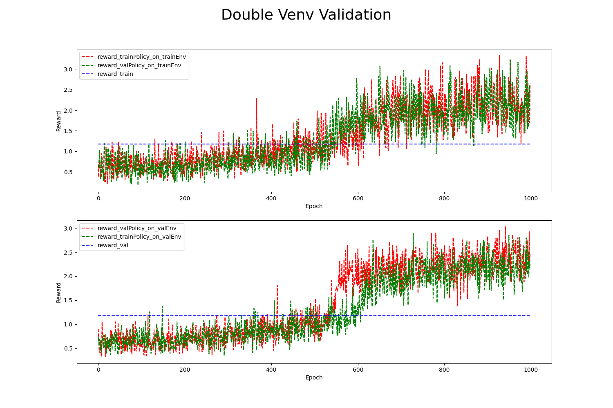

## 任务背景
飞行器悬停控制是在航空领域中的一项重要技术，旨在实现飞行器在空中保持稳定的位置和高度，而不受外界干扰的影响。悬停控制对于无人机、直升机和垂直起降飞行器等各种飞行器类型都至关重要。飞行器的悬停控制任务背景源于多个方面。首先，无人机的广泛应用使得悬停能力成为一项必要的技术，例如在航拍、搜救、物流等领域。无人机在悬停时需要对风速、气压和外界干扰等因素进行实时响应，以保持稳定的位置和高度。其次，直升机作为传统的垂直起降飞行器，其悬停控制任务一直是研究的重点。直升机需要克服旋翼和尾桨产生的气流以及其他不稳定因素，以保持平稳的悬停状态。悬停控制任务对于直升机的安全性和操作效率至关重要，尤其是在紧急救援、军事作战等关键任务中。通过研究和开发悬停控制算法和系统，可以提高飞行器的悬停能力，实现更安全、高效的飞行操作，拓展飞行器在各个领域的应用潜力。
## 任务介绍


飞行器悬停控制任务是基于Gym中的Lunar Lander任务改造而成的, 任务简化3维坐标系为2维坐标系。任务的目标是将飞行器悬停在目标位置的目标高度。控制系统可以通过控制飞行器引擎来改变飞行器的飞行姿态。控制引擎采用离散的动作空间，共有四个可用的独立动作：不采取任何动作、启动左引擎、启动主引擎和启动右引擎。飞行器的状态观测空间是一个4维向量，包括着陆器的x轴坐标、y轴坐标、x轴线速度和y轴线速度。任务目标是使得飞行器能够稳定悬停目标点位于（0,1）。如果飞行器的坐标和目标坐标的偏差小于0.2，则认为悬停是成功的。
当前系统中已经存在一个基于物理规则对飞行器进行控制的策略，这个策略是基于飞行器的坐标对控制引擎进行操作，通过比较 y 坐标和 x 坐标的绝对值大小，确定飞行器是更接近垂直方向还是水平方向的目标点。如果飞行器更接近垂直方向的目标点（即 |y| >= |x|），则根据 y 的正负值选择动作。如果 y 大于 0，则返回动作 0，表示不采取任何动作；如果 y 小于等于 0，则返回动作 2，表示启动右引擎。如果飞行器更接近水平方向的目标点（即 |x| > |y|），则根据 x 的正负值选择动作。如果 x 大于 0，则返回动作 1，表示启动左引擎；如果 x 小于等于 0，则返回动作 3，表示启动右引擎。这样，通过基于飞行器的坐标与目标点的位置关系来选择动作，该策略可以帮助飞行器朝着目标点移动并尽可能接近目标点位置。下面是该规则策略的代码实现：
```yaml
def rule_policy(data):
    y = data["obs"][0][1] - 1
    x = data["obs"][0][0] - 0

    if abs(y) >= abs(x):
        if y > 0:
            return 0
        else:
            return 2
    else:
        if x > 0:
            return 1
        else:
            return 3
```
## 数据介绍
当前的规则控制策略已经运行了一段时间，系统记录了一系列相关的历史数据。历史数据以CSV文件的形式进行存储。下面是日志文件的截图:


| **信息名称** | **信息类别** | **信息描述** |
| --- | --- | --- |
| time | 时间信息 | 当前行信息的记录时间 |
| X-axis | 飞行器状态信息（state） | 火箭在X轴（水平）方向上相对于目标着陆区域的位置 |
| Y-axis | 飞行器状态信息（state） | 火箭在Y轴（垂直）方向上相对于目标着陆区域的位置 |
| X-velocity | 飞行器状态信息（state） | 火箭在X轴（水平）方向的线速度 |
| Y-velocity | 飞行器状态信息（state） | 火箭在Y轴（水平）方向的线速度 |
| engine_power | 控制系统信息 | 火箭引擎推力，可选值是[0,1,2,3], 分别表示不采取任何动作、启动左引擎、启动主引擎和启动右引擎 |

## 任务目标
任务目标是使得飞行器能够稳定悬停目标点位于（0,1）。如果飞行器的坐标和目标坐标的偏差小于0.2，则认为悬停是成功的。已有的规则策略的控制效果不理想，在部分情况下不能稳定有效的将飞行器控制在目标点。
## 解决方案
们希望能够基于上述的历史数据直接优化控制策略提升控制效果。我们采用离线强化学习工具REVIVE来解决上述任务。REVIVE是一套数据驱动强化学习的工业决策软件，该软件通过利用历史数据来学习最优策略， 而无需与真实环境进行额外交互，从而实现决策过程的自动化并率先实现真实业务的落地。


### 任务分析
我们首先结合对火箭系统的理解对任务和数据进行分析，time列提供了时间戳表示时间信息，可以用于确定信息的顺序和时间序列的变化，用于分析数据之间时序上的因果关系。
数据中的信息可以分为2大类，第一类是飞行器的状态信息，包括飞行器的位置信息和速度信息，第二类是的控制信息，包括引擎推力。在时序上进行可视化如下：


根据业务知识对上述2类信息之间的关系进行分析：

1. 状态信息(state)：飞行器的状态信息受到多方面因素的影响，飞行器的状态会受到的引擎推力和重力的共同影响发生改变，这种改变在观测信息上具有时滞性，例如t_n时刻的飞行器的状态会受到当前时刻的引擎推力和重力影响，在未来的t_(n+1)时刻产生状态信息变化。
2. 控制信息(engine_power)：飞行器的控制系统需要控制引擎实现飞行器的姿态控制，飞行器的控制系统需要根据火箭当前的状态信息来实时调整引擎推力实现目标。

根据上述的分析，我们构建了下面的业务逻辑关系，t_n时刻的状态信息，控制信息和环境风力信息会共同影响到t_(n+1)时刻的状态信息。t_n时刻的控制信息应该根据t_n时刻的状态信息和环境风力信息来确定。我们在下图中用箭头表明这些业务关系。


### 构建业务决策流图
#### 定义决策流图
在5.1中我们结合业务知识对火箭回收任务进行详细的分析，为了适应REVIVE来解决该任务，我们首先需要将上述的业务逻辑分析转换为决策流图。决策流图是一个有向无环图，用于描述业务数据时序上的交互逻辑。 决策流图中的每个节点代表数据，每条边代表数据之间的映射关系。决策流图可以根据需要来扩展任意多个节点， 节点之间的顺序可以是任意指定的，单个节点可以作为多个节点的输入。
根据对上述的业务分析，我们构建如下的决策流图。下面的决策流图中,state(飞行器状态)节点作为power(控制节点)的输入,表示了引擎的推力应该根据当前的飞行器状态信息来确定。状态转移后的飞行器状态表示下一时刻的飞行状态,决策流图中的当前时间的state(飞行器状态)节点和_power(控制节点)都会影响该状态转移,因此全部指向状态转移节点。


构建完决策流图后,我们通常需要把它组织成yaml文件进行表示,下面就是上述决策流图对应的yaml文件,yaml文件下的graph表示了对应的决策流图:
```yaml
graph:
  engine_power:
  - state
  next_state:
  - state
  - engine_power
```
完成决策流图的构建之后,我们需要在YAML文件中增加每个节点的特征描述信息,通过columns来定义,下面是将原始数据中特征划分到每个节点中, columns可以定义每一维所属的节点,类似和值范围, 具体的描述可以参考[REVIVE文档](https://revive.cn/help/polixir-revive-sdk-pro/html_cn/tutorial/data_preparation_cn.html)部分的描述。增加columns之后的YAML文件如下:
```yaml
metadata:
  columns:
  - X-axis:
      dim: state
      type: continuous
  - Y-axis:
      dim: state
      type: continuous
  - X-velocity:
      dim: state
      type: continuous
  - Y-velocity:
      dim: state
      type: continuous
  - engine_power:
      dim: engine_power
      type: continuous
  graph:
    engine_power:
    - state
    next_state:
    - state
    - engine_power
```

### 准备REVIVE的训练数据
通过YAML文件构建完成决策流图之后,我们下一步需要根据决策流图按节点整理提供的训练数据来作为REVIVE的训练数据。数据应该是一个Python字典对象，以节点名字作为键值（key），以Numpy数组的数据作为数值（value）。 所有值应为2D ndarray，样本数 N 为第一维度，特征数 C 为第二维度。键值（key）应该与 .yaml 文件中 graph 描述的节点名称对应。为了区分不同轨迹的数据, 数据中需要使用index来标记数据中每条轨迹的结束索引。例如，如果数据的形状为 （100，F），其中包含两个轨迹，其长度分别为40和60。 index 应该设置为 np.ndarray（[40， 100]） 。数据以字典形式完成构建后，应该将它们存储在单个 .npz 或 .h5 文件中。
下面是数据转换的代码,代码读取原始的csv文件,生成revive需要的npz文件。
```yaml
import os
import numpy as np
import pandas as pd

state_columns = ["X-axis","Y-axis","X-velocity","Y-velocity",]
engine_power_columns = ["engine_power",]

state = []
engine_power = []
index = []

folder_path = '../task_data/csv/'

# 获取所有CSV文件
file_list = os.listdir(folder_path)
csv_files = [file for file in file_list if file.endswith('.csv')]

pre_index = 0

# 遍历 CSV 文件并使用 Pandas 读取节点数据
for csv_file in csv_files:
    file_path = os.path.join(folder_path, csv_file)
    df = pd.read_csv(file_path)
    
    # 获得各个节点的数据
    state.append(df[state_columns].values)
    engine_power.append(df[engine_power_columns].values)

    index.append(len(df)+pre_index)
    pre_index = index[-1]

# 把节点数据转换为2维数组
state = np.concatenate(state)
engine_power = np.concatenate(engine_power)
index = np.array(index)

# 保存数据为npz文件
data = {
    "state" : state,
    "engine_power" : engine_power,
    "index" : index,
}

np.savez_compressed("./data/hover.npz",**data)
```
### 使用REVIVE进行虚拟环境模型训练
当我们准备好训练数据集( .npz  文件)、决策流图描述文件( .yaml )后。 我们可以使用启动revive提供的train.py脚本进行虚拟环境模型。
训练命令:
```yaml
# 通过参数指定之前准备好的npz数据和yaml文件启动虚拟环境训练
python train.py -df ./data/hover.npz -cf ./data/hover.yaml --run_id revive -vm once -pm None
```

开启训练之后, 命令行会打印如下信息,说明虚拟环境正在训练:


### 进行虚拟环境模型有效性验证
REVIVE提供多种工具用于验证环境模型的有效性,其中最常用的两种方法是通过tensorboard查看loss曲线和通过日志查看rollout图片:

Tensorboard的启动命令如下:
```yaml
tensorboard --logdir .../logs/revive
```
Tensorboard提供一个web界面可以查看损失函数的曲线,我们可以查看里面的now_metric 和 least_metric指标来分析模型是否收敛,以及收敛的效果如何,默认情况下metric计算的是轨迹rollout的MAE。


我们还可以打开日志文件夹下的rollout图片文件夹查看每个节点的rollout情况,REVIVE会从数据集中随机采集10条轨迹，进行虚拟环境模型和真实历史数据的对比, 通过rollout图可以直观的分析虚拟环境模型的时序预测误差。rollout图片文件夹默认存储在logs/revive/venv_train/rollout_images文件夹下。


### 分析任务目标，定义控制目标优化函数
REVIVE使用强化学习算法来训练策略模型。在强化学习中，智能体通过不断地与环境交互来寻找最优策略。策略会根据当前状态选择一个行动，并接收相应的奖励以及 下一个状态。这样的过程会不断地进行，直到达到终止状态为止。如果策略在一系列动作和状态转换中获得高额的奖励， 那么它就找到了一种较好的策略。因此，奖励函数的设计对于强化学习策略的优化至关重要。一个好的奖励函数应该能够指导策略向着预期的方向进行学习。
控制策略的任务目标使得飞行器能够稳定悬停目标点位于（0,1）。如果飞行器的坐标和目标坐标的偏差小于0.2，则认为悬停是成功的。
```yaml
import torch
from typing import Dict


def get_reward(data : Dict[str, torch.Tensor]):
    return torch.where((torch.abs(data["next_state"][...,0:1])<0.2) & (torch.abs(data["next_state"][...,1:2] - 1) < 0.2), 10,-0.3)
```

### 使用REVIVE进行策略模型训练
当我们准备好降落函数之后。 我们就可以使用启动revive提供的train.py脚本进行策略模型训练。
训练命令:
```yaml
python train.py -df ./data/hover.npz -cf ./data/hover.yaml -rf ./data/hover_reward.py --run_id revive -vm None -pm once
```

开启训练之后, 命令行会打印如下信息,说明策略正在训练:


### 进行策略模型有效性验证
在使用REVIVE SDK进行任务学习的过程中，默认情况下，REVIVE会将数据集进行切分，并分为训练数据集以及验证数据集（参考 数据准备）。 并在这两个数据集上分别构建虚拟环境，并命名为 trainEnv 和 valEnv。 在随后的策略模型学习过程中，REVIVE会在 trainEnv 和 valEnv 两个环境以及对应的数据集 trainData 和 valData 中分别进行策略模型的训练， 训练出各自的策略模型 trainPolicy 和 valPolicy。在训练过程中，REVIVE SDK会在训练结束后，依据用户设定的 奖励函数 ， 对 trainPolicy 在 trainEnv 和 valEnv``上，以及 ``valPolicy 在 trainEnv 和 valEnv 上所获得的平均单步奖励进行记录， 并在训练结束后生成双重环境验证图,默认的存储路径是 logs/<run_id>/policy_train/double_validation.png 。下面双环境验证图片种蓝色虚线是对历史数据使用降落函数计算得到的单步奖励平均值。从图中我们可以看到,红绿两条线都高于蓝色虚线。这意味着在两个环境中，两种策略得到的奖励数值都高于了历史数据集中的奖励数值。


双环境验证是一种用于评估策略模型性能的方法。它涉及将训练和测试环境定义为两个不同的环境。 在训练期间，智能体使用一个环境进行学习；而在测试期间，它必须在另一个环境中进行操作，该环境可能与训练环境略有不同。 通过这种方式，双重环境验证可以检测出策略模型过度拟合特定的环境。 如果训练环境和测试环境非常相似，那么模型可能会在测试环境中表现良好。 但如果测试环境与训练环境有明显区别，则模型可能无法泛化到新环境中。 因此，双环境验证可以帮助用户确定评估策略模型的实际效果，并检查它们是否具有适应不同环境的能力。
### 策略模型上线测试
策略模型会被序列化为 policy.pkl 和onnx文件。使用策略模型时需要使用 pickle 加载序列化的决策模型， 然后使用 policy.infer() 函数进行策略模型推理。

下面是加载pkl文件进行引擎控制的代码示例:
```yaml
import os
import pickle
import numpy as np


```

| **策略训练算法** | **实际环境测试Reward** |
| --- | --- |
| Data | 
 |
| Expert | 
 |
| REVIVE | 
 |


