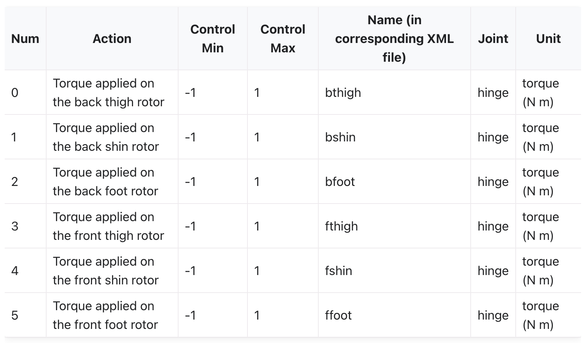
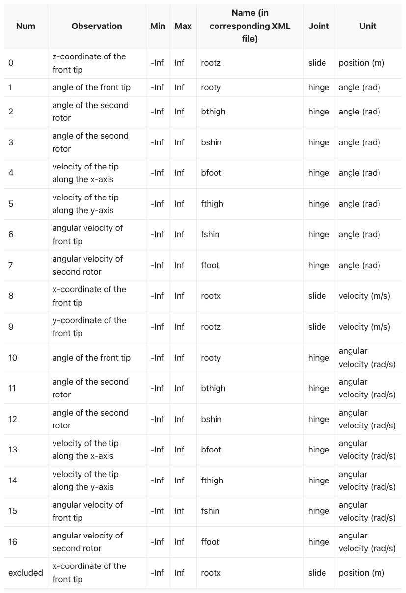
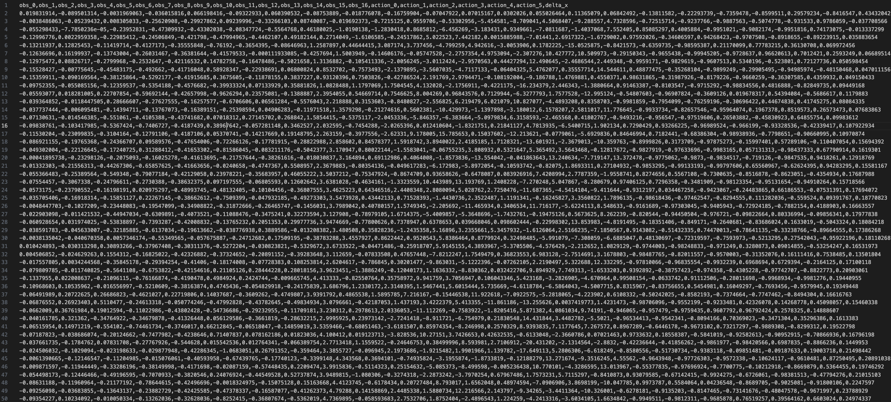
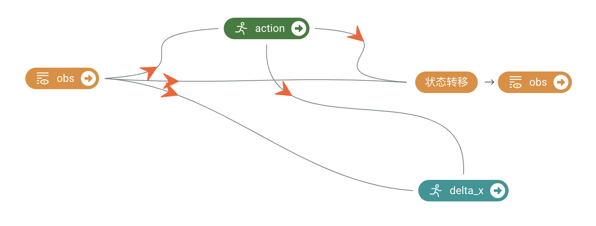
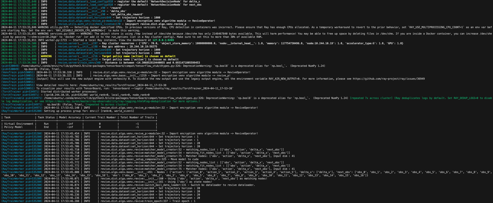
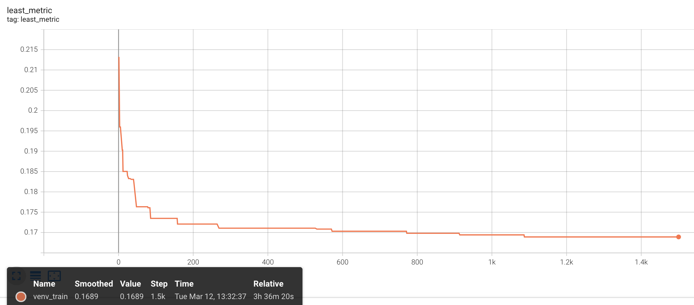
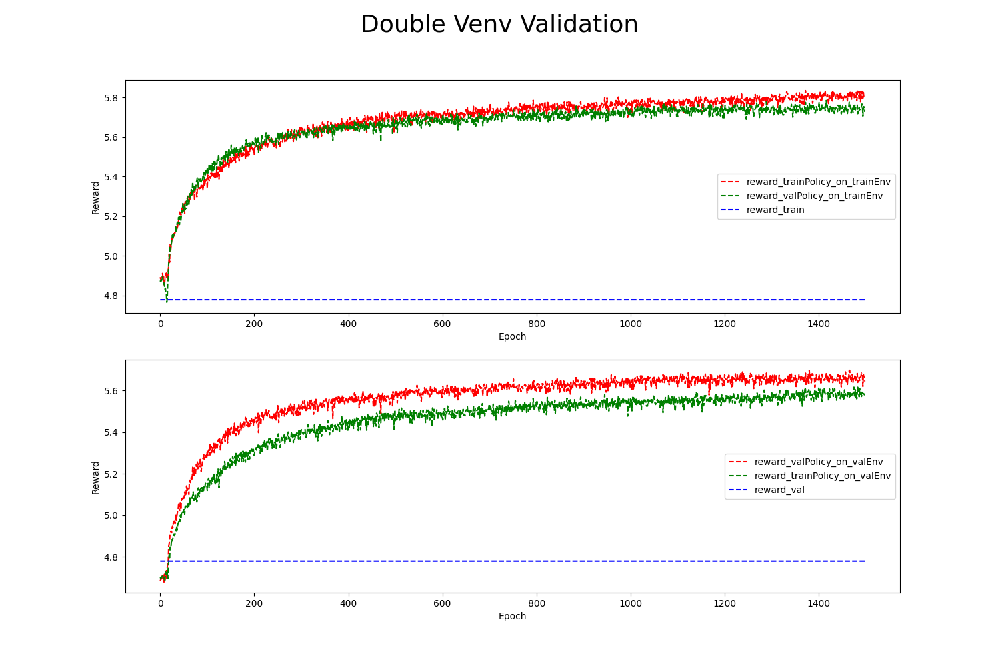
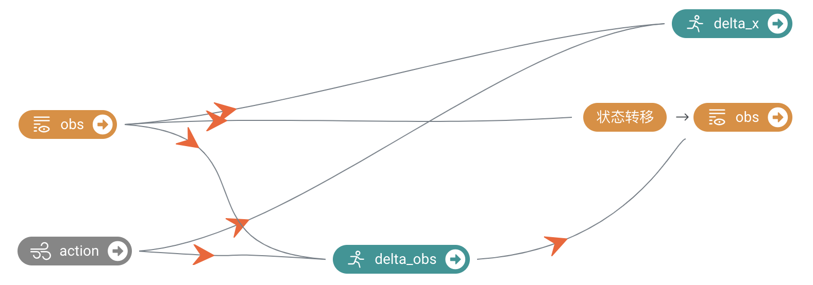
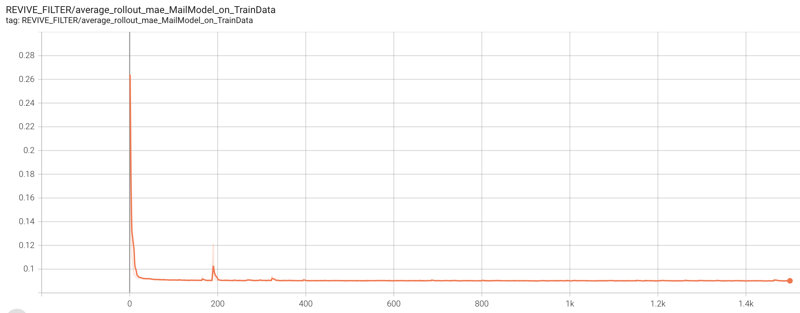
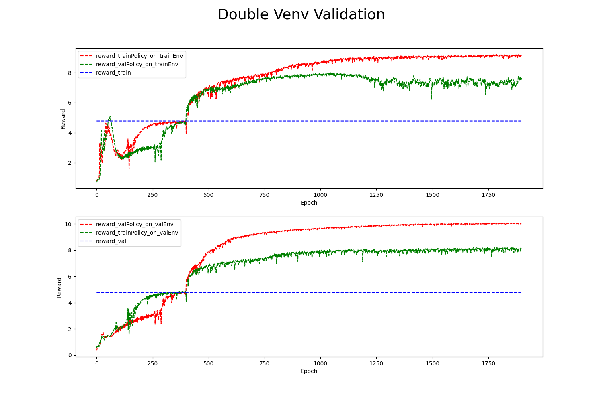

# 任务背景：
MuJoCo（Multi-Joint dynamics with Contact）是一种常用的物理仿真引擎，用于模拟多关节动态系统的动力学和接触行为。MuJoCo通过对多体动力学和接触动力学进行数值模拟，能够准确地模拟各种物体的运动和交互，广泛应用于机器人学、控制理论、运动学和运动规划等领域。HalfCheetah（半猎豹）是 MuJoCo 中的一个常用任务，是指一个具有半身猎豹形状的机器人。HalfCheetah是一个四足机器人，拥有类似于猎豹的身体结构，具有四条长长的腿和强健的身体。每条腿由多个关节连接，可以进行自由运动。HalfCheetah任务的目标通常是使机器人学会在给定的环境中快速、稳定地移动。具体来说，任务可以是使机器人在给定的起点和终点之间尽快移动，并且在移动过程中保持平衡和稳定。HalfCheetah任务在MuJoCo中进行动力学模拟。MuJoCo能够准确地模拟机器人的运动学和动力学特性，包括关节运动、接触力和动力学约束等，从而能够模拟出机器人在真实环境中的运动行为。HalfCheetah任务通常需要开发有效的控制策略，使机器人能够快速、稳定地移动。控制策略可以是基于模型的控制方法、强化学习方法或者优化方法等。HalfCheetah任务是一个典型的强化学习任务，常用于测试和评估强化学习算法在连续动作空间和高维观测空间下的性能。通过在HalfCheetah任务上进行训练和测试，可以评估算法的收敛速度、稳定性和泛化能力，从而为机器人控制和运动规划等领域的研究提供重要参考。

# 任务介绍
这个环境基于 P. Wawrzyński 在《[A Cat-Like Robot Real-Time Learning to Run](https://staff.elka.pw.edu.pl/~pwawrzyn/pub-s/0812_LSCLRR.pdf)》中的工作。HalfCheetah 是一个二维机器人，由 9 个身体部分和连接它们的 8 个关节组成（包括两只爪）。目标是在关节上施加扭矩，使猎豹向前（向右）尽可能快地奔跑，根据向前移动的距离分配正奖励，向后移动则分配负奖励。猎豹的躯干和头部是固定的，扭矩只能施加在其他 6 个关节上，这些关节位于前腿和后腿的大腿（连接到躯干）、小腿（连接到大腿）和脚（连接到小腿）。
## 动作空间
动作空间是一个6维向量。一个动作代表了在铰链关节处施加的扭矩。

## 观测空间
观测结果包括猎豹不同身体部位的位置值，然后是这些各个部位的速度（它们的导数），其中所有位置在所有速度之前排序。观测空间将是一个18维向量，其中元素对应如下：

## 奖励设置
奖励包括两个部分：
1. forward_reward：向前移动的奖励，计算公式为 1.0 * (动作前的 x 坐标 - 动作后的 x 坐标) / dt。dt 是动作之间的时间间隔，取决于帧间跳过参数（固定为 5），其中帧时间为 0.01，这使得默认 dt = 5 * 0.01 = 0.05。如果猎豹向前奔跑（向右），则这个奖励是正的。
2. ctrl_cost：如果猎豹采取的动作过大，对其进行惩罚的成本。它的计算公式为 0.1 * sum(action^2)。返回的总奖励为 reward = forward_reward - ctrl_cost，info 中还包含各个单独的奖励项。
## 初始状态
所有观测都从状态 (0.0, 0.0, 0.0, 0.0, 0.0, 0.0, 0.0, 0.0, 0.0, 0.0, 0.0, 0.0, 0.0, 0.0, 0.0, 0.0, 0.0, 0.0) 开始，为了增加随机性，初始状态中添加了噪声。如前所述，状态中的前 9 个值是位置，后 9 个值是速度。对于位置值，添加了一个均匀分布的噪声，范围为 [-0.1, 0.1]；对于初始速度值，添加了一个均值为 0，标准差为 0.1 的标准正态分布噪声，其初始值为全零。
## 终止状态
当一个 episode 的长度大于 1000 时，该 episode 将被截断。
# 数据介绍
根据revive提供的代码案例，我们可以生成“halfcheetah-medium-v2.npz”文件。我们把它数据可视化：

其中总共包含了1000000个数据点。具体地，共有1000条轨迹，每条轨迹长度为1000步。数据每个维度的对应解释参考任务介绍。
# 任务目标
HalfCheetah任务的目标通常是使机器人学会在给定的环境中快速、稳定地移动。具体来说，任务可以是使机器人在给定的起点和终点之间尽快移动，并且在移动过程中保持平衡和稳定。
# 解决方案
我们下面采用离线强化学习工具REVIVE来解决上述任务。REVIVE是一套数据驱动强化学习的工业决策软件，该软件通过利用历史数据来学习最优策略， 而无需与真实环境进行额外交互，从而实现决策过程的自动化并率先实现真实业务的落地。

## 任务分析
这是一个标准的MDP问题。以下我们将用2种不同的学习算法来展示如何通过REVIVE来优化HalfCheetah的控制策略。下面是一些变量说明：

| 变量名 | 变量含义 |
| --- | --- |
| obs | halfcheetah的状态 |
| action | 控制策略采取的动作 |
| next_obs | 下一时刻halfcheetah的状态 |
| delta_x | x轴方向的位移变化量 |
| delta_obs | halfcheetah状态的变化量 |

## REVIVE_P 训练流程
### 构建决策流图
在5.1中我们结合业务知识对HalfCheetah控制策略优化任务进行详细的分析，为了适应REVIVE来解决该任务，我们首先需要将上述的业务逻辑分析转换为决策流图。决策流图是一个有向无环图，用于描述业务数据时序上的交互逻辑。 决策流图中的每个节点代表数据，每条边代表数据之间的映射关系。决策流图可以根据需要来扩展任意多个节点， 节点之间的顺序可以是任意指定的，单个节点可以作为多个节点的输入。
我们可以用标准的MDP问题来建模该任务环境，我们构建如下的决策流图。下面的决策流图中action，delta_x，next_obs节点作为网络节点。由于action的决策只与obs相关，因此obs作为action的输入；delta_x的改变只与[obs, action]相关，因此[action, obs]作为delta_x的输入；next_obs只与[obs, action, delta_x]相关，因此[obs, action, delta_x]作为next_obs的输入。

构建完决策流图后,我们通常需要把它组织成yaml文件进行表示,下面就是上述决策流图对应的yaml文件,yaml文件下的graph表示了对应的决策流图:
```yaml
graph:
  action:
  - obs
  delta_x:
  - obs
  - action
  next_obs:
  - obs
  - action
  - delta_x
```
完成决策流图的构建之后,我们需要在YAML文件中增加每个节点的特征描述信息,通过columns来定义,下面是将原始数据中特征划分到每个节点中, columns可以定义每一维所属的节点,类似和值范围, 具体的描述可以参考[REVIVE文档](https://revive.cn/help/polixir-revive-sdk-pro/html_cn/tutorial/data_preparation_cn.html)部分的描述。增加columns之后的完整YAML文件如下:
```yaml
metadata:
  columns:
  - obs_0:
      dim: obs
      type: continuous
  - obs_1:
      dim: obs
      type: continuous
  - obs_2:
      dim: obs
      type: continuous
  - obs_3:
      dim: obs
      type: continuous
  - obs_4:
      dim: obs
      type: continuous
  - obs_5:
      dim: obs
      type: continuous
  - obs_6:
      dim: obs
      type: continuous
  - obs_7:
      dim: obs
      type: continuous
  - obs_8:
      dim: obs
      type: continuous
  - obs_9:
      dim: obs
      type: continuous
  - obs_10:
      dim: obs
      type: continuous
  - obs_11:
      dim: obs
      type: continuous
  - obs_12:
      dim: obs
      type: continuous
  - obs_13:
      dim: obs
      type: continuous
  - obs_14:
      dim: obs
      type: continuous
  - obs_15:
      dim: obs
      type: continuous
  - obs_16:
      dim: obs
      type: continuous

  - action_0:
      dim: action
      type: continuous
  - action_1:
      dim: action
      type: continuous
  - action_2:
      dim: action
      type: continuous
  - action_3:
      dim: action
      type: continuous
  - action_4:
      dim: action
      type: continuous
  - action_5:
      dim: action
      type: continuous

  - delta_x:
      dim: delta_x
      type: continuous
      min: -1
      max: 1

  graph:
    action:
    - obs
    delta_x:
    - obs
    - action
    next_obs:
    - obs
    - action
    - delta_x
```
### 准备REVIVE训练数据
通过YAML文件构建完成决策流图之后,我们下一步需要根据决策流图按节点整理提供的训练数据来作为REVIVE的训练数据。数据应该是一个Python字典对象，以节点名字作为键值（key），以Numpy数组的数据作为数值（value）。 所有值应为2D ndarray，样本数 N 为第一维度，特征数 C 为第二维度。键值（key）应该与 .yaml 文件中 graph 描述的节点名称对应。为了区分不同轨迹的数据, 数据中需要使用index来标记数据中每条轨迹的结束索引。例如，如果数据的形状为 （100，F），其中包含两个轨迹，其长度分别为40和60。 index 应该设置为 np.ndarray（[40， 100]） 。数据以字典形式完成构建后，应该将它们存储在单个 .npz 或 .h5 文件中。
下面是数据转换的代码，生成revive需要的npz文件：
```python
import os
import urllib.request
import h5py
import numpy as np


def get_keys(h5file):
    keys = []

    def visitor(name, item):
        if isinstance(item, h5py.Dataset):
            keys.append(name)

    h5file.visititems(visitor)
    return keys

def filepath_from_url(dataset_url):
    _, dataset_name = os.path.split(dataset_url)
    dataset_filepath = os.path.join(os.getcwd(), dataset_name)
    return dataset_filepath

def download_dataset_from_url(dataset_url):
    dataset_filepath = filepath_from_url(dataset_url)
    if not os.path.exists(dataset_filepath):
        print('Downloading dataset:', dataset_url, 'to', dataset_filepath)
        urllib.request.urlretrieve(dataset_url, dataset_filepath)
    if not os.path.exists(dataset_filepath):
        raise IOError("Failed to download dataset from %s" % dataset_url)
    return dataset_filepath


if __name__ == "__main__":
    # 加载 halfcheetah-medium-v2 数据集
    data_path = download_dataset_from_url("http://rail.eecs.berkeley.edu/datasets/offline_rl/gym_mujoco_v2/halfcheetah_medium-v2.hdf5")
    data_dict = {}
    with h5py.File(data_path, 'r') as dataset_file:
        for k in get_keys(dataset_file):
            try:  # first try loading as an array
                data_dict[k] = dataset_file[k][:]
            except ValueError as e:  # try loading as a scalar
                data_dict[k] = dataset_file[k][()]
    data = {key: data_dict[key] for key in ['actions','next_observations', 'observations', 'rewards', 'terminals', 'timeouts']}

    # recover delta_x from reward 
    timestep = 0.002
    frame_skip = 4
    dt = 0.05
    healthy_reward = 1
    ctrl_cost_weight = 0.1

    ctrl_cost = ctrl_cost_weight * np.sum(np.square(data['actions']),axis=-1, keepdims=True)
    forward_reward = data['rewards'].reshape(-1,1) + ctrl_cost
    data['delta_x'] = forward_reward * dt 
    data['done'] = data['terminals']*1

    # generate index info
    index = (np.where(np.sum((data['next_observations'][:-1] - data['observations'][1:]),axis=-1)!=0)[0]+1).tolist()+[data['observations'].shape[0]]
    index = [0]+index
    start = index[:-1]
    end = index[1:]
    traj = np.array(end) - np.array(start)

    # generate dataset for REVIVE
    outdata = {}
    outdata['obs'] = data['observations']
    outdata['next_obs'] = data['next_observations']
    outdata['action'] = data['actions']
    outdata['delta_x'] = data['delta_x']

    outdata['reward'] = data['rewards'].reshape(-1,1)
    outdata['done'] = data['done'].reshape(-1,1)
    outdata['done'] = (outdata['done']*1.0)

    outdata['index'] = (np.where(np.sum((outdata['next_obs'][:-1] - outdata['obs'][1:]),axis=-1)!=0)[0]+1).tolist() \
                        + [outdata['obs'].shape[0]]

    outdata_file = np.savez_compressed("halfcheetah-medium-v2.npz", **outdata)

```
此外我们也需要准备一份算法超参数的配置文件（算法有一套默认的超参数，但每个任务都需要单独调整一些超参数来达到最好的效果），它是一个json文件：
```json
{
    "base_config": [
        {
            "name": "train_venv_trials",
            "abbreviation": "tvt",
            "description": "Number of total trails searched by the search algorithm in venv training.",
            "type": "int",
            "default": 150,
            "doc": true
        },
        {
            "name": "global_seed",
            "abbreviation": "gs",
            "description": "Set the random number seed for the experiment.",
            "type": "int",
            "default": 42
        },
        {
            "name": "val_split_ratio",
            "abbreviation": "vsr",
            "description": "Ratio to split validate dataset if it is not explicitly given.",
            "type": "float",
            "default": 0.5
        },
        {
            "name": "val_split_mode",
            "abbreviation": "vsm",
            "description": "Mode of auto splitting training and validation dataset, choose from `outside_traj` and `inside_traj`. `outside_traj` means the split is happened outside the trajectories, one trajectory can only be in one dataset. `inside_traj` means the split is happened inside the trajectories, former part of one trajectory is in training set, later part is in validation set.",
            "type": "str",
            "default": "outside_traj"
        },
        {
            "name": "ignore_check",
            "abbreviation": "igc",
            "description": "Flag to ignore data related check, force training.",
            "type": "bool",
            "default": false
        },
        {
            "name": "venv_rollout_horizon",
            "abbreviation": "vrh",
            "description": "Length of sampled trajectory, validate only if the algorithm works on sequential data.",
            "type": "int",
            "default": 20
        },
        {
            "name": "venv_gpus_per_worker",
            "abbreviation": "vgpw",
            "description": "Number of gpus per worker in venv training, small than 1 means launch multiple workers on the same gpu.",
            "type": "float",
            "default": 0.2
        },
        {
            "name": "venv_metric",
            "description": "Metric used to evaluate the trained venv, choose from `nll`, `mae`, `mse`, `wdist`.",
            "type": "str",
            "default": "mae"
        },
        {
            "name": "venv_algo",
            "description": "Algorithm used in venv training. There are currently three algorithms to choose from, `bc` and `revive_p`.",
            "type": "str",
            "default": "revive_p"
        },
        {
            "name": "policy_algo",
            "description": "Algorithm used in policy training. There are currently two algorithms to choose from, `ppo` and `sac`.",
            "type": "str",
            "default": "sac",
            "doc": true
        },
        {
            "name": "policy_gpus_per_worker",
            "abbreviation": "pgpw",
            "description": "Number of gpus per worker in venv training, small than 1 means launch multiple workers on the same gpu.",
            "type": "float",
            "default": 0.25
        },
        {
            "name": "save_start_epoch",
            "abbreviation": "sse",
            "description": "We only save models after this epoch, default is 0 which means we save models from the beginning.",
            "type": "int",
            "default": 0
        },
        {
            "name": "test_horizon",
            "abbreviation": "th",
            "description": "Rollout length of the venv test.",
            "type": "int",
            "default": 50
        }
    ],
    "venv_algo_config": {
        "revive_p": [
            {
                "name": "finetune_fre",
                "type": "int",
                "default": 1,
                "search_mode": "grid",
                "search_values": [
                    1, 
                    10, 
                    100
                ]
            },
            {
                "name": "revive_batch_size",
                "description": "Batch size of training process.",
                "abbreviation": "mbs",
                "type": "int",
                "default": 1024
            },
            {
                "name": "revive_epoch",
                "description": "Number of epcoh for the training process",
                "abbreviation": "mep",
                "type": "int",
                "default": 1500
            },
            {
                "name": "policy_hidden_features",
                "description": "Number of neurons per layer of the policy network.",
                "abbreviation": "phf",
                "type": "int",
                "default": 256
            },
            {
                "name": "policy_hidden_layers",
                "description": "Depth of policy network.",
                "abbreviation": "phl",
                "type": "int",
                "default": 3
            },
            {
                "name": "policy_backbone",
                "description": "Backbone of policy network.",
                "abbreviation": "pb",
                "type": "str",
                "default": "mlp"
            },
            {
                "name": "transition_hidden_features",
                "description": "Number of neurons per layer of the transition network.",
                "abbreviation": "thf",
                "type": "int",
                "default": 256
            },
            {
                "name": "transition_hidden_layers",
                "abbreviation": "thl",
                "type": "int",
                "default": 4
            },
            {
                "name": "transition_backbone",
                "description": "Backbone of Transition network.",
                "abbreviation": "tb",
                "type": "str",
                "default": "res"
            },
            {
                "name": "matcher_pretrain_epoch",
                "abbreviation": "dpe",
                "type": "int",
                "default": 0
            },
            {
                "name": "matcher_hidden_features",
                "description": "Number of neurons per layer of the matcher network.",
                "abbreviation": "dhf",
                "type": "int",
                "default": 256
            },
            {
                "name": "matcher_hidden_layers",
                "description": "Depth of the matcher network.",
                "abbreviation": "dhl",
                "type": "int",
                "default": 4
            },
            {
                "name": "g_steps",
                "description": "The number of update rounds of the generator in each epoch.",
                "type": "int",
                "default": 1,
                "search_mode": "grid",
                "search_values": [
                    1, 
                    3, 
                    5
                ]
            },  
            {
                "name": "d_steps",
                "description": "Number of update rounds of matcher in each epoch.",
                "type": "int",
                "default": 1,
                "search_mode": "grid",
                "search_values": [
                    1, 
                    3, 
                    5
                ]
            },
            {
                "name": "g_lr",
                "description": "Initial learning rate of the generator.",
                "type": "float",
                "default": 1e-4,
                "search_mode": "grid",
                "search_values": [
                    1e-4,
                    3e-4,
                    7e-4,
                    1e-5,
                    7e-5
                ]
            },
            {
                "name": "d_lr",
                "description": "Initial learning rate of the matcher.",
                "type": "float",
                "default": 8e-4,
                "search_mode": "grid",
                "search_values": [
                    1e-3,
                    5e-3,
                    1e-4,
                    8e-4
                ]
            },
            {
                "name": "generator_data_repeat",
                "description": "Repeat rollout more data to train generator.",
                "type": "int",
                "default": 1
            },
            {
                "name": "mae_reward_weight",
                "description": "reward = (1-mae_reward_weight)*matcher_reward + mae_reward_weight*mae_reward.",
                "type": "float",
                "default": 0.0
            },
            {
                "name": "controller_weight",
                "type": "int",
                "default": 10,
                "search_mode": "grid",
                "search_values": [
                    1,
                    5,
                    10
                ]
            }
        ]
    },
    "policy_algo_config": {
        "sac": [
            {
                "name": "policy_bc_epoch",
                "type": "int",
                "default": 0
            },
            {
                "name": "sac_batch_size",
                "description": "Batch size of training process.",
                "abbreviation": "pbs",
                "type": "int",
                "default": 1024
            },
            {
                "name" : "sac_rollout_horizon",
                "abbreviation" : "srh",
                "type" : "int",
                "default" : 10,
                "search_mode": "grid",
                "search_values": [
                    5,
                    10,
                    20
                ]
            }, 
            {
                "name": "sac_steps_per_epoch",
                "description": "The number of update rounds of sac in each epoch.",
                "abbreviation": "sspe",
                "type": "int",
                "default": 200
            },
            {
                "name": "policy_hidden_features",
                "description": "Number of neurons per layer of the policy network.",
                "abbreviation": "phf",
                "type": "int",
                "default": 256
            },
            {
                "name": "policy_hidden_layers",
                "description": "Depth of policy network.",
                "abbreviation": "phl",
                "type": "int",
                "default": 4
            },
            {
                "name": "policy_backbone",
                "description": "Backbone of policy network.",
                "abbreviation": "pb",
                "type": "str",
                "default": "mlp"
            },
            {
                "name": "buffer_size",
                "description": "Size of the buffer to store data.",
                "abbreviation": "bfs",
                "type": "int",
                "default": 1000000.0
            },
            {
                "name": "g_lr",
                "description": "Initial learning rate of the training process.",
                "type": "float",
                "default": 1e-03,
                "search_mode": "grid",
                "search_values": [
                    2e-4,
                    5e-4,
                    8e-4,
                    1e-3
                ]
            }
        ]
    }
}
```
### 使用REVIVE进行虚拟环境模型训练
当我们准备好训练数据集( .npz  文件)、决策流图描述文件( .yaml )后。 我们可以使用启动revive提供的train.py脚本进行虚拟环境模型。
训练命令:
```bash
CUDA_VISIBLE_DEVICES=3 \
python train.py \
-df data/halfcheetah-medium-v2.npz \
-cf data/halfcheetah-medium-v2.yaml \
-rcf data/config.json \
\
-vm once \
-pm None \
\
--global_seed 42 \
--run_id halfcheetah-revive \
--venv_algo revive_p \
\
--bc_loss nll \
--policy_hidden_layers 4 \
--policy_backbone res \
--bc_weight_decay 1e-7 \

```
开启训练之后, 命令行会打印如下信息,说明虚拟环境正在训练：

### 验证虚拟环境模型的有效性
REVIVE提供多种工具用于验证环境模型的有效性,其中最常用的两种方法是通过tensorboard查看loss曲线和通过日志查看rollout图片：
Tensorboard的启动命令如下：

```bash
tensorboard --logdir=path_to_logs --port 10086
```
Tensorboard提供一个web界面可以查看损失函数的曲线,我们可以查看里面的now_metric 和 least_metric指标来分析模型是否收敛，以及收敛的效果如何。默认情况下metric计算的是轨迹rollout的MAE。least_metri指标越低越好！

我们还可以打开日志文件夹下的rollout图片文件夹查看每个节点的rollout情况,REVIVE会从数据集中随机采集10条轨迹，进行虚拟环境模型和真实历史数据的对比, 通过rollout图可以直观的分析虚拟环境模型的时序预测误差。rollout图片文件夹默认存储在logs/<run_id>/venv_train/rollout_images文件夹下。红色代表数据中真实的轨迹，绿色代表训练得到的虚拟环境的轨迹。两条轨迹贴合的越紧密越好！

### 分析任务目标，定义控制目标优化函数
REVIVE使用强化学习算法来训练策略模型。在强化学习中，智能体通过不断地与环境交互来寻找最优策略。策略会根据当前状态选择一个行动，并接收相应的奖励以及 下一个状态。这样的过程会不断地进行，直到达到终止状态为止。如果策略在一系列动作和状态转换中获得高额的奖励， 那么它就找到了一种较好的策略。因此，奖励函数的设计对于强化学习策略的优化至关重要。一个好的奖励函数应该能够指导策略向着预期的方向进行学习。
HalfCheetah任务的目标通常是使机器人学会在给定的环境中快速、稳定地移动。具体来说，任务可以是使机器人在给定的起点和终点之间尽快移动，并且在移动过程中保持平衡和稳定。
REVIVE SDK支持支持以python源文件的方式定义奖励函数。奖励函数定义了策略的优化目标。奖励函数的输入是单步决策流的数据， 奖励函数的输出当前步策略获得的奖励值。下面是上述奖励函数对应的Python源代码：
```python
import torch
import numpy as np
from typing import Dict


def get_reward(data : Dict[str, torch.Tensor]) -> torch.Tensor:
    action = data["action"]
    delta_x = data["delta_x"]
    
    
    forward_reward_weight = 1.0 
    ctrl_cost_weight = 0.1
    dt = 0.05
    
    if isinstance(action, np.ndarray):
        array_type = np
        ctrl_cost = ctrl_cost_weight * array_type.sum(array_type.square(action),axis=-1, keepdims=True)
    else:
        array_type = torch
        ctrl_cost = ctrl_cost_weight * array_type.sum(array_type.square(action),axis=-1, keepdim=True)
    
    x_velocity = delta_x / dt
    forward_reward = forward_reward_weight * x_velocity
    
    reward = forward_reward - ctrl_cost
    
    return reward
```
### 使用REVIVE进行策略模型训练
当我们准备好奖励函数之后。 我们就可以使用启动revive提供的train.py脚本进行策略模型训练。这是策略训练启动命令:
```bash
CUDA_VISIBLE_DEVICES=3 \
python train.py \
-df data/halfcheetah-medium-v2.npz \
-cf data/halfcheetah-medium-v2.yaml \
-rcf data/config.json \
\
-rf data/halfcheetah_reward.py \
\
-vm None \
-pm once \
\
--global_seed 42 \
--target_policy_name action \
--run_id halfcheetah-revive \
--venv_algo revive_p \
\
--bc_loss nll \
--policy_hidden_layers 4 \
--policy_backbone res \
--bc_weight_decay 1e-7 \
\
--sac_epoch 1500

```
### 进行策略模型有效性验证
在使用REVIVE SDK进行任务学习的过程中，默认情况下，REVIVE会将数据集进行切分，并分为训练数据集以及验证数据集（参考 数据准备）。 并在这两个数据集上分别构建虚拟环境，并命名为 trainEnv 和 valEnv。 在随后的策略模型学习过程中，REVIVE会在 trainEnv 和 valEnv 两个环境以及对应的数据集 trainData 和 valData 中分别进行策略模型的训练， 训练出各自的策略模型 trainPolicy 和 valPolicy。在训练过程中，REVIVE SDK会在训练结束后，依据用户设定的 奖励函数 ， 对 trainPolicy 在 trainEnv 和 valEnv``上，以及 ``valPolicy 在 trainEnv 和 valEnv 上所获得的平均单步奖励进行记录， 并在训练结束后生成双重环境验证图,默认的存储路径是 logs/<run_id>/policy_train/double_validation.png 。下面双环境验证图片种蓝色虚线是对历史数据使用降落函数计算得到的单步奖励平均值。从图中我们可以看到,红绿两条线都高于蓝色虚线。这意味着在两个环境中，两种策略得到的奖励数值都高于了历史数据集中的奖励数值。

双环境验证是一种用于评估策略模型性能的方法。它涉及将训练和测试环境定义为两个不同的环境。 在训练期间，智能体使用一个环境进行学习；而在测试期间，它必须在另一个环境中进行操作，该环境可能与训练环境略有不同。 通过这种方式，双重环境验证可以检测出策略模型过度拟合特定的环境。 如果训练环境和测试环境非常相似，那么模型可能会在测试环境中表现良好。 但如果测试环境与训练环境有明显区别，则模型可能无法泛化到新环境中。 因此，双环境验证可以帮助用户确定评估策略模型的实际效果，并检查它们是否具有适应不同环境的能力。
### 策略模型上线测试
策略模型会被序列化为 policy.pkl 和onnx文件。使用策略模型时需要使用 pickle 加载序列化的决策模型， 然后使用 policy.infer() 函数进行策略模型推理。
下面是加载pkl文件进行HalfCheetah控制的代码示例:
```python
import pickle
import numpy as np
import gym
import d4rl


if __name__ == "__main__":
    policy_path = "path_to_policy.pkl"

    policy_revive = pickle.load(open(policy_path, 'rb'))
    env = gym.make('halfcheetah-medium-v2')

    re_list = []
    for traj in range(100):
        obs = env.reset()
        re_turn = []
        done = False
        while not done:
            action = policy_revive.infer({'obs': obs})
            next_state, reward, done, _ = env.step(action)
            re_turn.append(reward)
            obs = next_state
        
        print(len(re_turn), np.sum(np.array(re_turn)[:]))
        re_list.append(np.sum(re_turn))

    print('mean return:',np.mean(re_list), ' std:',np.std(re_list), ' normal_score:', env.get_normalized_score(np.mean(re_list)))

```
## REVIVE_F 训练流程
### 构建环境模型决策流
我们也可以选择预测下一步与当前步的残差值，也就是delta_obs，然后通过next_obs = obs + delta_obs来得到下一步的转移。这里next_obs可以通过专家节点实现。在此实验中，我们使用了异构决策流功能，即训练环境与训练策略所用的决策流是不一样。在训练环境时，我们把action节点当作静态变量，以下是训练环境的决策流：

构建完决策流图后,我们通常需要把它组织成yaml文件进行表示,下面就是上述决策流图对应的yaml文件,yaml文件下的graph表示了对应的决策流图:
```yaml
  graph:
    delta_x:
    - obs
    - action
    delta_obs:
    - obs
    - action
    next_obs:
    - obs
    - delta_obs
  
  expert_functions:
    next_obs:
        'node_function' : 'delta_obs.get_next_obs'
```
```python
import torch
import numpy as np 


def get_next_obs(data):
    obs = data["obs"]
    delta_obs = data["delta_obs"]

    if len(obs.shape) == 1:
        obs = obs.reshape(1, -1)
        delta_obs = delta_obs.reshape(1, -1)

    next_obs = obs + delta_obs

    if len(data["obs"].shape) == 1:
        next_obs = next_obs.reshape(-1)

    return next_obs

```
完成决策流图的构建之后,我们需要在YAML文件中增加每个节点的特征描述信息,通过columns来定义,下面是将原始数据中特征划分到每个节点中, columns可以定义每一维所属的节点,类似和值范围, 具体的描述可以参考[REVIVE文档](https://revive.cn/help/polixir-revive-sdk-pro/html_cn/tutorial/data_preparation_cn.html)部分的描述。增加columns之后的完整YAML文件如下:
```python
metadata:
  columns:
  - obs_0:
      dim: obs
      type: continuous
      max: 1
      min: -1
  - obs_1:
      dim: obs
      type: continuous
      max: 6
      min: -6
  - obs_2:
      dim: obs
      type: continuous
      max: 2
      min: -2
  - obs_3:
      dim: obs
      type: continuous
      max: 2
      min: -2
  - obs_4:
      dim: obs
      type: continuous
      max: 2
      min: -1
  - obs_5:
      dim: obs
      type: continuous
      max: 2
      min: -2
  - obs_6:
      dim: obs
      type: continuous
      max: 2
      min: -2
  - obs_7:
      dim: obs
      type: continuous
      max: 2
      min: -2
  - obs_8:
      dim: obs
      type: continuous
      max: 13
      min: -4
  - obs_9:
      dim: obs
      type: continuous
      max: 6
      min: -7
  - obs_10:
      dim: obs
      type: continuous
      max: 14
      min: -14
  - obs_11:
      dim: obs
      type: continuous
      max: 32
      min: -39
  - obs_12:
      dim: obs
      type: continuous
      max: 39
      min: -42
  - obs_13:
      dim: obs
      type: continuous
      max: 32
      min: -39
  - obs_14:
      dim: obs
      type: continuous
      max: 42
      min: -39
  - obs_15:
      dim: obs
      type: continuous
      max: 44
      min: -44
  - obs_16:
      dim: obs
      type: continuous
      max: 38
      min: -40

  - delta_obs_0:
      dim: delta_obs
      type: continuous
      max: 1
      min: -1
  - delta_obs_1:
      dim: delta_obs
      type: continuous
      max: 1
      min: -1
  - delta_obs_2:
      dim: delta_obs
      type: continuous
      max: 2
      min: -2
  - delta_obs_3:
      dim: delta_obs
      type: continuous
      max: 2
      min: -2
  - delta_obs_4:
      dim: delta_obs
      type: continuous
      max: 2
      min: -2
  - delta_obs_5:
      dim: delta_obs
      type: continuous
      max: 2
      min: -2
  - delta_obs_6:
      dim: delta_obs
      type: continuous
      max: 2
      min: -2
  - delta_obs_7:
      dim: delta_obs
      type: continuous
      max: 2
      min: -2
  - delta_obs_8:
      dim: delta_obs
      type: continuous
      max: 5
      min: -6
  - delta_obs_9:
      dim: delta_obs
      type: continuous
      max: 9
      min: -6
  - delta_obs_10:
      dim: delta_obs
      type: continuous
      max: 16
      min: -19
  - delta_obs_11:
      dim: delta_obs
      type: continuous
      max: 45
      min: -56
  - delta_obs_12:
      dim: delta_obs
      type: continuous
      max: 64
      min: -57
  - delta_obs_13:
      dim: delta_obs
      type: continuous
      max: 63
      min: -57
  - delta_obs_14:
      dim: delta_obs
      type: continuous
      max: 72
      min: -58
  - delta_obs_15:
      dim: delta_obs
      type: continuous
      max: 62
      min: -59
  - delta_obs_16:
      dim: delta_obs
      type: continuous
      max: 55
      min: -49

  - action_0:
      dim: action
      type: continuous
      min: -1
      max: 1
  - action_1:
      dim: action
      type: continuous
      min: -1
      max: 1
  - action_2:
      dim: action
      type: continuous
      min: -1
      max: 1
  - action_3:
      dim: action
      type: continuous
      min: -1
      max: 1
  - action_4:
      dim: action
      type: continuous
      min: -1
      max: 1
  - action_5:
      dim: action
      type: continuous
      min: -1
      max: 1

  - delta_x_0:
      dim: delta_x
      type: continuous
      max: 1
      min: -1

  graph:
    delta_x:
    - obs
    - action
    delta_obs:
    - obs
    - action
    next_obs:
    - obs
    - delta_obs
  
  expert_functions:
    next_obs:
        'node_function' : 'delta_obs.get_next_obs'

```
### 准备REVIVE训练数据
通过YAML文件构建完成决策流图之后,我们下一步需要根据决策流图按节点整理提供的训练数据来作为REVIVE的训练数据。数据应该是一个Python字典对象，以节点名字作为键值（key），以Numpy数组的数据作为数值（value）。 所有值应为2D ndarray，样本数 N 为第一维度，特征数 C 为第二维度。键值（key）应该与 .yaml 文件中 graph 描述的节点名称对应。为了区分不同轨迹的数据, 数据中需要使用index来标记数据中每条轨迹的结束索引。例如，如果数据的形状为 （100，F），其中包含两个轨迹，其长度分别为40和60。 index 应该设置为 np.ndarray（[40， 100]） 。数据以字典形式完成构建后，应该将它们存储在单个 .npz 或 .h5 文件中。
下面是数据转换的代码，生成revive需要的npz文件：
```python
import os
import urllib.request
import h5py
import numpy as np


def get_keys(h5file):
    keys = []

    def visitor(name, item):
        if isinstance(item, h5py.Dataset):
            keys.append(name)

    h5file.visititems(visitor)
    return keys

def filepath_from_url(dataset_url):
    _, dataset_name = os.path.split(dataset_url)
    dataset_filepath = os.path.join(os.getcwd(), dataset_name)
    return dataset_filepath

def download_dataset_from_url(dataset_url):
    dataset_filepath = filepath_from_url(dataset_url)
    if not os.path.exists(dataset_filepath):
        print('Downloading dataset:', dataset_url, 'to', dataset_filepath)
        urllib.request.urlretrieve(dataset_url, dataset_filepath)
    if not os.path.exists(dataset_filepath):
        raise IOError("Failed to download dataset from %s" % dataset_url)
    return dataset_filepath


if __name__ == "__main__":
    # 加载 halfcheetah-medium-v2 数据集
    data_path = download_dataset_from_url("http://rail.eecs.berkeley.edu/datasets/offline_rl/gym_mujoco_v2/halfcheetah_medium-v2.hdf5")
    data_dict = {}
    with h5py.File(data_path, 'r') as dataset_file:
        for k in get_keys(dataset_file):
            try:  # first try loading as an array
                data_dict[k] = dataset_file[k][:]
            except ValueError as e:  # try loading as a scalar
                data_dict[k] = dataset_file[k][()]
    data = {key: data_dict[key] for key in ['actions','next_observations', 'observations', 'rewards', 'terminals', 'timeouts']}

    # recover delta_x from reward 
    timestep = 0.002
    frame_skip = 4
    dt = 0.05
    healthy_reward = 1
    ctrl_cost_weight = 0.1

    ctrl_cost = ctrl_cost_weight * np.sum(np.square(data['actions']),axis=-1, keepdims=True)
    forward_reward = data['rewards'].reshape(-1,1) + ctrl_cost
    data['delta_x'] = forward_reward * dt 
    data['done'] = data['terminals']*1

    # generate index info
    index = (np.where(np.sum((data['next_observations'][:-1] - data['observations'][1:]),axis=-1)!=0)[0]+1).tolist()+[data['observations'].shape[0]]
    index = [0]+index
    start = index[:-1]
    end = index[1:]
    traj = np.array(end) - np.array(start)

    # generate dataset for REVIVE
    outdata = {}
    outdata['obs'] = data['observations']
    outdata['next_obs'] = data['next_observations']
    outdata['action'] = data['actions']
    outdata['delta_x'] = data['delta_x']
    outdata['delta_obs'] = data['next_observations'] - data['observations']

    outdata['reward'] = data['rewards'].reshape(-1,1)
    outdata['done'] = data['done'].reshape(-1,1)
    outdata['done'] = (outdata['done']*1.0)

    outdata['index'] = (np.where(np.sum((outdata['next_obs'][:-1] - outdata['obs'][1:]),axis=-1)!=0)[0]+1).tolist() \
                        + [outdata['obs'].shape[0]]

    outdata_file = np.savez_compressed("halfcheetah-medium-v2.npz", **outdata)

```
此外我们也需要准备一份算法超参数的配置文件（算法有一套默认的超参数，但每个任务都需要单独调整一些超参数来达到最好的效果），它是一个json文件：
```json
{
    "base_config": [
        {
            "name": "train_venv_trials",
            "abbreviation": "tvt",
            "description": "Number of total trails searched by the search algorithm in venv training.",
            "type": "int",
            "default": 4,
            "doc": true
        },
        {
            "name": "train_policy_trials",
            "abbreviation": "tpt",
            "description": "Number of total trails searched by the search algorithm in policy training.",
            "type": "int",
            "default": 8,
            "doc": true
        },
        {
            "name": "global_seed",
            "abbreviation": "gs",
            "description": "Set the random number seed for the experiment.",
            "type": "int",
            "default": 42
        },
        {
            "name": "val_split_ratio",
            "abbreviation": "vsr",
            "description": "Ratio to split validate dataset if it is not explicitly given.",
            "type": "float",
            "default": 0.5
        },
        {
            "name": "val_split_mode",
            "abbreviation": "vsm",
            "description": "Mode of auto splitting training and validation dataset, choose from `outside_traj` and `inside_traj`. `outside_traj` means the split is happened outside the trajectories, one trajectory can only be in one dataset. `inside_traj` means the split is happened inside the trajectories, former part of one trajectory is in training set, later part is in validation set.",
            "type": "str",
            "default": "outside_traj"
        },
        {
            "name": "ignore_check",
            "abbreviation": "igc",
            "description": "Flag to ignore data related check, force training.",
            "type": "bool",
            "default": false
        },
        {
            "name": "venv_rollout_horizon",
            "abbreviation": "vrh",
            "description": "Length of sampled trajectory, validate only if the algorithm works on sequential data.",
            "type": "int",
            "default": 1
        },
        {
            "name": "venv_gpus_per_worker",
            "abbreviation": "vgpw",
            "description": "Number of gpus per worker in venv training, small than 1 means launch multiple workers on the same gpu.",
            "type": "float",
            "default": 1.0
        },
        {
            "name": "venv_metric",
            "description": "Metric used to evaluate the trained venv, choose from `nll`, `mae`, `mse`, `wdist`.",
            "type": "str",
            "default": "mae"
        },
        {
            "name": "test_horizon",
            "abbreviation": "th",
            "description": "Rollout length of the venv test.",
            "type": "int",
            "default": 100
        },
        {
            "name": "policy_algo",
            "description": "Algorithm used in policy training. There are currently two algorithms to choose from, `ppo` and `sac`.",
            "type": "str",
            "default": "sac",
            "doc": true
        },
        {
            "name": "policy_gpus_per_worker",
            "abbreviation": "pgpw",
            "description": "Number of gpus per worker in venv training, small than 1 means launch multiple workers on the same gpu.",
            "type": "float",
            "default": 0.5
        },
        {
            "name": "data_workers",
            "abbreviation": "dw",
            "description": "Number of workers to load data.",
            "type": "int",
            "default": 2
        }
    ],
    "venv_algo_config": {
        "revive_f": [
            {
                "name": "bc_epoch",
                "type": "int",
                "default": 1500
            },
            {
                "name": "revive_epoch",
                "description": "Number of epcoh for the training process",
                "abbreviation": "mep",
                "type": "int",
                "default": 1500
            },
            {
                "name": "bc_lr",
                "type": "float",
                "default": 1e-3
            },
            {
                "name": "bc_steps",
                "type": "int",
                "default": 5
            },
            {
                "name": "matcher_record_len",
                "type": "int",
                "default": 50
            },
            {
                "name": "fix_std",
                "type": "float",
                "default": 0.125
            },
            {
                "name": "bc_l2_coef",
                "type": "float",
                "default": 5e-5
            },
            {
                "name": "logstd_loss_coef",
                "type": "float",
                "default": 0.01
            },
            {
                "name": "matcher_l2_norm_coeff",
                "type": "float",
                "default": 0.0005
            },
            {
                "name": "discr_ent_coef",
                "type": "float",
                "default": 0.01
            },
            {
                "name": "value_l2_norm_coef",
                "type": "float",
                "default": 1e-6
            },
            {
                "name": "generator_l2_norm_coef",
                "type": "float",
                "default": 1e-6
            },
            {
                "name": "gp_coef",
                "type": "float",
                "default": 0.5
            },
            {
                "name": "replace_ratio",
                "type": "float",
                "default": 0.1
            },
            {
                "name": "replace_with_expert",
                "type": "bool",
                "default": true
            },
            {
                "name": "mix_sample_ratio",
                "type": "float",
                "default": 0.5
            },
            {
                "name": "mix_sample",
                "type": "bool",
                "default": true
            },
            {
                "name": "revive_batch_size",
                "description": "Batch size of training process.",
                "abbreviation": "mbs",
                "type": "int",
                "default": 20000
            },
            {
                "name": "matching_nodes",
                "type": "list",
                "default": [["obs", "action", "delta_x"], ["obs", "action", "delta_obs"]]
            },
            {
                "name": "matching_fit_nodes",
                "type": "list",
                "default": [["delta_x"], ["delta_obs"]]
            },
            {
                "name": "policy_hidden_features",
                "description": "Number of neurons per layer of the policy network.",
                "abbreviation": "phf",
                "type": "int",
                "default": 256
            },
            {
                "name": "policy_hidden_layers",
                "description": "Depth of policy network.",
                "abbreviation": "phl",
                "type": "int",
                "default": 4
            },
            {
                "name": "policy_backbone",
                "description": "Backbone of policy network.",
                "abbreviation": "pb",
                "type": "str",
                "default": "res"
            },
            {
                "name": "transition_hidden_features",
                "description": "Number of neurons per layer of the transition network.",
                "abbreviation": "thf",
                "type": "int",
                "default": 256
            },
            {
                "name": "transition_hidden_layers",
                "abbreviation": "thl",
                "type": "int",
                "default": 4
            },
            {
                "name": "transition_backbone",
                "description": "Backbone of Transition network.",
                "abbreviation": "tb",
                "type": "str",
                "default": "res"
            },
            {
                "name": "matcher_pretrain_epoch",
                "abbreviation": "dpe",
                "type": "int",
                "default": 0
            },
            {
                "name": "matcher_hidden_features",
                "description": "Number of neurons per layer of the matcher network.",
                "abbreviation": "dhf",
                "type": "int",
                "default": 256
            },
            {
                "name": "matcher_hidden_layers",
                "description": "Depth of the matcher network.",
                "abbreviation": "dhl",
                "type": "int",
                "default": 4
            },
            {
                "name": "g_steps",
                "description": "The number of update rounds of the generator in each epoch.",
                "type": "int",
                "default": 5
            },  
            {
                "name": "d_steps",
                "description": "Number of update rounds of matcher in each epoch.",
                "type": "int",
                "default": 5
            },
            {
                "name": "g_lr",
                "description": "Initial learning rate of the generator.",
                "type": "float",
                "default": 7e-4
            },
            {
                "name": "value_lr",
                "type": "float",
                "default": 1e-3
            },
            {
                "name": "ppo_epsilon",
                "type": "float",
                "default": 0.1
            },
            {
                "name": "ppo_entropy_cof",
                "type": "float",
                "default": 0.005
            },
            {
                "name": "d_lr",
                "description": "Initial learning rate of the matcher.",
                "type": "float",
                "default": 1e-4
            },
            {
                "name": "generator_data_repeat",
                "description": "Repeat rollout more data to train generator.",
                "type": "int",
                "default": 1
            }
        ]
    },
    "policy_algo_config": {
        "sac": [
            {
                "name": "penalty_type",
                "type": "str",
                "default": "filter"
            },
            {
                "name": "penalty_sample_num",
                "type": "int",
                "default": 50
            },
            {
                "name": "reward_uncertainty_weight",
                "type": "float",
                "default": 0.75
            },
            {
                "name": "generate_deter",
                "type": "int",
                "default": 1
            },
            {
                "name": "critic_pretrain",
                "type": "bool",
                "default": true
            },
            {
                "name": "ensemble_choosing_interval",
                "type": "int",
                "default": 5
            },
            {
                "name": "ensemble_size",
                "type": "int",
                "default": 10
            },
            {
                "name": "candidate_num",
                "type": "int",
                "default": 20
            },
            {
                "name": "filter",
                "type": "bool",
                "default": false
            },
            {
                "name": "policy_bc_epoch",
                "type": "int",
                "default": 400
            },
            {
                "name": "sac_epoch",
                "type": "int",
                "default": 700
            },
            {
                "name": "sac_batch_size",
                "description": "Batch size of training process.",
                "abbreviation": "pbs",
                "type": "int",
                "default": 1024
            },
            {
                "name" : "sac_rollout_horizon",
                "abbreviation" : "srh",
                "type" : "int",
                "default" : 100
            }, 
            {
                "name": "sac_steps_per_epoch",
                "description": "The number of update rounds of sac in each epoch.",
                "abbreviation": "sspe",
                "type": "int",
                "default": 200
            },
            {
                "name": "policy_hidden_features",
                "description": "Number of neurons per layer of the policy network.",
                "abbreviation": "phf",
                "type": "int",
                "default": 256
            },
            {
                "name": "policy_hidden_layers",
                "description": "Depth of policy network.",
                "abbreviation": "phl",
                "type": "int",
                "default": 4
            },
            {
                "name": "policy_backbone",
                "description": "Backbone of policy network.",
                "abbreviation": "pb",
                "type": "str",
                "default": "res"
            },
            {
                "name": "buffer_size",
                "description": "Size of the buffer to store data.",
                "abbreviation": "bfs",
                "type": "int",
                "default": 100000.0
            },
            {
                "name": "g_lr",
                "description": "Initial learning rate of the training process.",
                "type": "float",
                "default": 5e-4
            },
            {
                "name": "num_venv_in_use",
                "type": "int",
                "default": 1
            },
            {
                "name": "batch_ratio",
                "type": "float",
                "default": 1
            },
            {
                "name": "num_q_net",
                "type": "int",
                "default": 4
            },
            {
                "name": "w_kl",
                "type": "float",
                "default": 0.1
            }
        ]
    }
}
```
### 使用REVIVE进行虚拟环境模型
当我们准备好训练数据集( .npz 文件)、决策流图描述文件( .yaml )后。 我们可以使用启动revive提供的train.py脚本进行虚拟环境模型。
训练命令:
```bash
CUDA_VISIBLE_DEVICES=0 \
python train.py \
-df data/halfcheetah-medium-v2.npz \
-cf data/halfcheetah-medium-venv-for-policy.yaml \
-rcf data/config_f.json \
\
-vm once \
-pm None \
\
--global_seed 42 \
--run_id halfcheetah-filter \
--venv_algo revive_f \
\
--bc_loss nll \
--policy_hidden_layers 4 \
--policy_backbone res \
--bc_weight_decay 1e-7 \
--rollout_plt_frequency 100 \
--controller_weight 0 \

```
开启训练之后, 命令行会打印如下信息,说明虚拟环境正在训练：

### 验证虚拟环境模型的有效性
REVIVE提供多种工具用于验证环境模型的有效性,其中最常用的两种方法是通过tensorboard查看loss曲线和通过日志查看rollout图片：
Tensorboard的启动命令如下：
```bash
tensorboard --logdir=path_to_logs --port 10086
```
Tensorboard提供一个web界面可以查看损失函数的曲线,我们可以查看里面的now_metric 和 least_metric指标来分析模型是否收敛，以及收敛的效果如何。默认情况下metric计算的是轨迹rollout的MAE。least_metri指标越低越好！此外使用revive_f算法训练还需注意average_rollout_mae_MailModel_on_TrainData这项指标，它也是越低越好！

我们还可以打开日志文件夹下的rollout图片文件夹查看每个节点的rollout情况,REVIVE会从数据集中随机采集10条轨迹，进行虚拟环境模型和真实历史数据的对比, 通过rollout图可以直观的分析虚拟环境模型的时序预测误差。rollout图片文件夹默认存储在logs/simglucose-revive-no-action_horizon_100_ts/venv_train/rollout_images文件夹下。红色代表数据中真实的轨迹，绿色代表训练得到的虚拟环境的轨迹。两条轨迹贴合的越紧密越好！

### 分析任务目标，定义控制目标优化函数
REVIVE使用强化学习算法来训练策略模型。在强化学习中，智能体通过不断地与环境交互来寻找最优策略。策略会根据当前状态选择一个行动，并接收相应的奖励以及 下一个状态。这样的过程会不断地进行，直到达到终止状态为止。如果策略在一系列动作和状态转换中获得高额的奖励， 那么它就找到了一种较好的策略。因此，奖励函数的设计对于强化学习策略的优化至关重要。一个好的奖励函数应该能够指导策略向着预期的方向进行学习。
HalfCheetah任务的目标通常是使机器人学会在给定的环境中快速、稳定地移动。具体来说，任务可以是使机器人在给定的起点和终点之间尽快移动，并且在移动过程中保持平衡和稳定。
REVIVE SDK支持支持以python源文件的方式定义奖励函数。奖励函数定义了策略的优化目标。奖励函数的输入是单步决策流的数据， 奖励函数的输出当前步策略获得的奖励值。下面是上述奖励函数对应的Python源代码：
```python
import torch
import numpy as np
from typing import Dict


def get_reward(data : Dict[str, torch.Tensor]) -> torch.Tensor:
    action = data["action"]
    delta_x = data["delta_x"]
    
    
    forward_reward_weight = 1.0 
    ctrl_cost_weight = 0.1
    dt = 0.05
    
    if isinstance(action, np.ndarray):
        array_type = np
        ctrl_cost = ctrl_cost_weight * array_type.sum(array_type.square(action),axis=-1, keepdims=True)
    else:
        array_type = torch
        ctrl_cost = ctrl_cost_weight * array_type.sum(array_type.square(action),axis=-1, keepdim=True)
    
    x_velocity = delta_x / dt
    forward_reward = forward_reward_weight * x_velocity
    
    reward = forward_reward - ctrl_cost
    
    return reward
```
### 构建策略模型决策流
正如上文提到，在训练策略时我们把action节点当作优化目标。以下是训练策略的决策流：
```yaml
graph:
  action:
  - obs
  delta_x:
  - obs
  - action
  delta_obs:
  - obs
  - action
  next_obs:
  - obs
  - delta_obs

expert_functions:
  next_obs:
      'node_function' : 'delta_obs.get_next_obs'
```
```python
import torch
import numpy as np 


def get_next_obs(data):
    obs = data["obs"]
    delta_obs = data["delta_obs"]

    if len(obs.shape) == 1:
        obs = obs.reshape(1, -1)
        delta_obs = delta_obs.reshape(1, -1)

    next_obs = obs + delta_obs

    if len(data["obs"].shape) == 1:
        next_obs = next_obs.reshape(-1)

    return next_obs

```
完成决策流图的构建之后,我们需要在YAML文件中增加每个节点的特征描述信息,通过columns来定义,下面是将原始数据中特征划分到每个节点中, columns可以定义每一维所属的节点,类似和值范围, 具体的描述可以参考[REVIVE文档](https://revive.cn/help/polixir-revive-sdk-pro/html_cn/tutorial/data_preparation_cn.html)部分的描述。增加columns之后的完整YAML文件如下:
```yaml
metadata:
  columns:
  - obs_0:
      dim: obs
      type: continuous
      max: 1
      min: -1
  - obs_1:
      dim: obs
      type: continuous
      max: 6
      min: -6
  - obs_2:
      dim: obs
      type: continuous
      max: 2
      min: -2
  - obs_3:
      dim: obs
      type: continuous
      max: 2
      min: -2
  - obs_4:
      dim: obs
      type: continuous
      max: 2
      min: -1
  - obs_5:
      dim: obs
      type: continuous
      max: 2
      min: -2
  - obs_6:
      dim: obs
      type: continuous
      max: 2
      min: -2
  - obs_7:
      dim: obs
      type: continuous
      max: 2
      min: -2
  - obs_8:
      dim: obs
      type: continuous
      max: 13
      min: -4
  - obs_9:
      dim: obs
      type: continuous
      max: 6
      min: -7
  - obs_10:
      dim: obs
      type: continuous
      max: 14
      min: -14
  - obs_11:
      dim: obs
      type: continuous
      max: 32
      min: -39
  - obs_12:
      dim: obs
      type: continuous
      max: 39
      min: -42
  - obs_13:
      dim: obs
      type: continuous
      max: 32
      min: -39
  - obs_14:
      dim: obs
      type: continuous
      max: 42
      min: -39
  - obs_15:
      dim: obs
      type: continuous
      max: 44
      min: -44
  - obs_16:
      dim: obs
      type: continuous
      max: 38
      min: -40

  - delta_obs_0:
      dim: delta_obs
      type: continuous
      max: 1
      min: -1
  - delta_obs_1:
      dim: delta_obs
      type: continuous
      max: 1
      min: -1
  - delta_obs_2:
      dim: delta_obs
      type: continuous
      max: 2
      min: -2
  - delta_obs_3:
      dim: delta_obs
      type: continuous
      max: 2
      min: -2
  - delta_obs_4:
      dim: delta_obs
      type: continuous
      max: 2
      min: -2
  - delta_obs_5:
      dim: delta_obs
      type: continuous
      max: 2
      min: -2
  - delta_obs_6:
      dim: delta_obs
      type: continuous
      max: 2
      min: -2
  - delta_obs_7:
      dim: delta_obs
      type: continuous
      max: 2
      min: -2
  - delta_obs_8:
      dim: delta_obs
      type: continuous
      max: 5
      min: -6
  - delta_obs_9:
      dim: delta_obs
      type: continuous
      max: 9
      min: -6
  - delta_obs_10:
      dim: delta_obs
      type: continuous
      max: 16
      min: -19
  - delta_obs_11:
      dim: delta_obs
      type: continuous
      max: 45
      min: -56
  - delta_obs_12:
      dim: delta_obs
      type: continuous
      max: 64
      min: -57
  - delta_obs_13:
      dim: delta_obs
      type: continuous
      max: 63
      min: -57
  - delta_obs_14:
      dim: delta_obs
      type: continuous
      max: 72
      min: -58
  - delta_obs_15:
      dim: delta_obs
      type: continuous
      max: 62
      min: -59
  - delta_obs_16:
      dim: delta_obs
      type: continuous
      max: 55
      min: -49

  - action_0:
      dim: action
      type: continuous
      min: -1
      max: 1
  - action_1:
      dim: action
      type: continuous
      min: -1
      max: 1
  - action_2:
      dim: action
      type: continuous
      min: -1
      max: 1
  - action_3:
      dim: action
      type: continuous
      min: -1
      max: 1
  - action_4:
      dim: action
      type: continuous
      min: -1
      max: 1
  - action_5:
      dim: action
      type: continuous
      min: -1
      max: 1

  - delta_x_0:
      dim: delta_x
      type: continuous
      max: 1
      min: -1

  graph:
    action:
    - obs
    delta_x:
    - obs
    - action
    delta_obs:
    - obs
    - action
    next_obs:
    - obs
    - delta_obs
  
  expert_functions:
    next_obs:
        'node_function' : 'delta_obs.get_next_obs'

```
### 使用REVIVE进行策略模型训练
当我们准备好训练数据集( .npz  文件)、决策流图描述文件( .yaml )后。 我们可以使用启动revive提供的train.py脚本进行虚拟环境模型。
训练命令:
```bash
CUDA_VISIBLE_DEVICES=0 \
python train.py \
-df data/halfcheetah-medium-v2.npz \
-cf data/halfcheetah-medium-policy.yaml \
-rcf data/config_f.json \
\
-rf data/halfcheetah_reward.py \
\
-vm None \
-pm once \
\
--global_seed 42 \
--target_policy_name action \
--run_id halfcheetah-filter \
--venv_algo revive_f \
\
--bc_loss nll \
--policy_hidden_layers 4 \
--policy_backbone res \
--bc_weight_decay 1e-7 \
--rollout_plt_frequency 100 \
\
--sac_epoch 1500 \
```
### 进行策略模型有效性验证
在使用REVIVE SDK进行任务学习的过程中，默认情况下，REVIVE会将数据集进行切分，并分为训练数据集以及验证数据集（参考 数据准备）。 并在这两个数据集上分别构建虚拟环境，并命名为 trainEnv 和 valEnv。 在随后的策略模型学习过程中，REVIVE会在 trainEnv 和 valEnv 两个环境以及对应的数据集 trainData 和 valData 中分别进行策略模型的训练， 训练出各自的策略模型 trainPolicy 和 valPolicy。在训练过程中，REVIVE SDK会在训练结束后，依据用户设定的 奖励函数 ， 对 trainPolicy 在 trainEnv 和 valEnv``上，以及 ``valPolicy 在 trainEnv 和 valEnv 上所获得的平均单步奖励进行记录， 并在训练结束后生成双重环境验证图,默认的存储路径是 logs/<run_id>/policy_train/double_validation.png 。下面双环境验证图片种蓝色虚线是对历史数据使用降落函数计算得到的单步奖励平均值。从图中我们可以看到,红绿两条线都高于蓝色虚线。这意味着在两个环境中，两种策略得到的奖励数值都高于了历史数据集中的奖励数值。

双环境验证是一种用于评估策略模型性能的方法。它涉及将训练和测试环境定义为两个不同的环境。 在训练期间，智能体使用一个环境进行学习；而在测试期间，它必须在另一个环境中进行操作，该环境可能与训练环境略有不同。 通过这种方式，双重环境验证可以检测出策略模型过度拟合特定的环境。 如果训练环境和测试环境非常相似，那么模型可能会在测试环境中表现良好。 但如果测试环境与训练环境有明显区别，则模型可能无法泛化到新环境中。 因此，双环境验证可以帮助用户确定评估策略模型的实际效果，并检查它们是否具有适应不同环境的能力。
### 策略模型上线测试
策略模型会被序列化为 policy.pkl 和onnx文件。使用策略模型时需要使用 pickle 加载序列化的决策模型， 然后使用 policy.infer() 函数进行策略模型推理。
下面是加载pkl文件进行HalfCheetah控制的代码示例:
```python
import pickle
import numpy as np
import gym
import d4rl


if __name__ == "__main__":
    policy_path = "path_to_policy.pkl"

    policy_revive = pickle.load(open(policy_path, 'rb'))
    env = gym.make('halfcheetah-medium-v2')

    re_list = []
    for traj in range(100):
        obs = env.reset()
        re_turn = []
        done = False
        while not done:
            action = policy_revive.infer({'obs': obs})
            next_state, reward, done, _ = env.step(action)
            re_turn.append(reward)
            obs = next_state
        
        print(len(re_turn), np.sum(np.array(re_turn)[:]))
        re_list.append(np.sum(re_turn))

    print('mean return:',np.mean(re_list), ' std:',np.std(re_list), ' normal_score:', env.get_normalized_score(np.mean(re_list)))

```
# 涉及的功能：

1. 异构决策流
2. revive_p, revive_f
3. 专家函数节点
4. 静态变量

