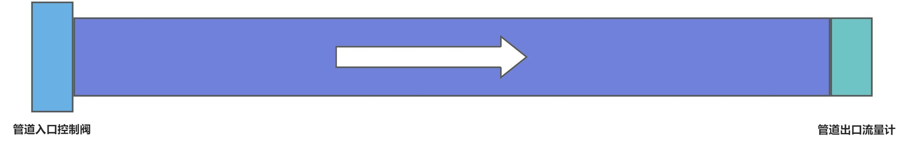
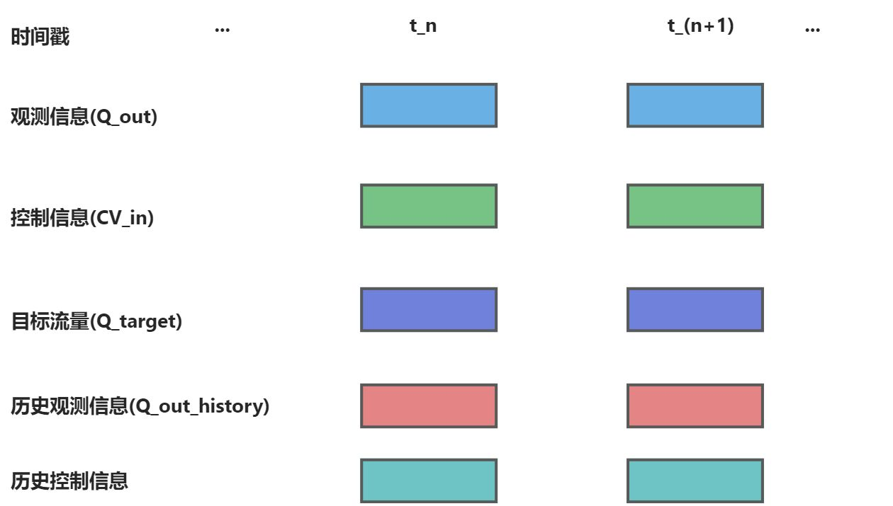
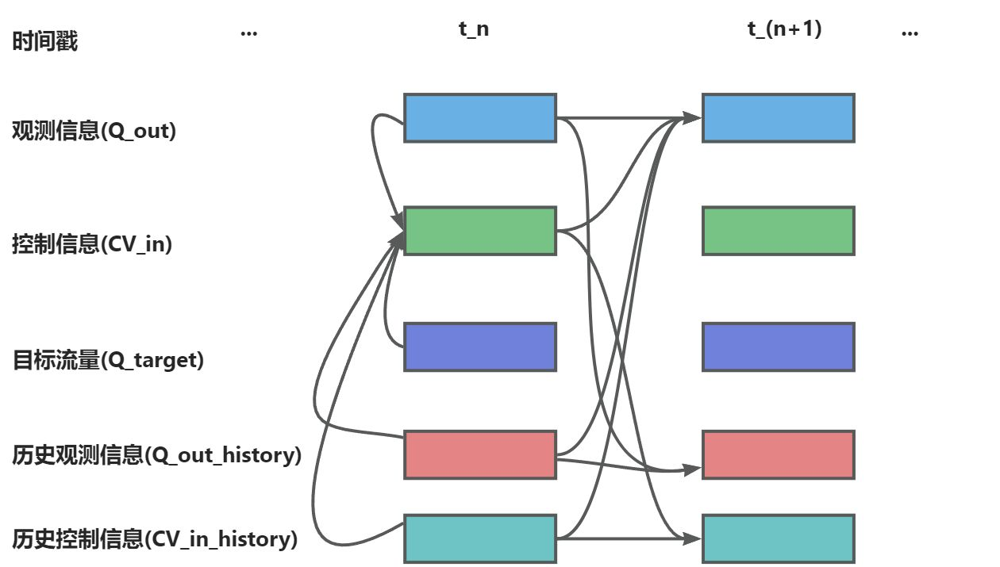
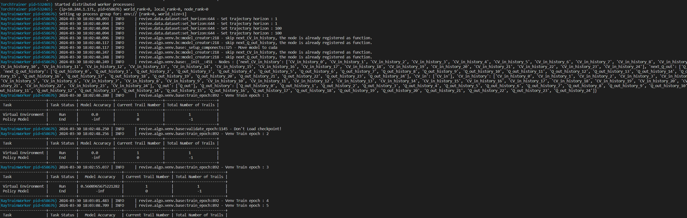

## 1.任务背景
管道流量控制系统是一种用于监测调节管道中流体的系统。它的主要目的是确保管道中的流量保持在预设的范围内，以满足生产需求或确保系统的安全运行。管道流量控制系统可以实现稳定、准确地控制管道中的流量，以满足生产需求，并确保系统的安全运行。这对于许多工业应用，如化工厂、石油和天然气输送管道、水处理系统等非常重要。一个典型的管道流量控制系统通常包括以下组件：
流量传感器：用于测量管道中的流量。这些传感器可以基于不同的原理，如涡轮、超声波、电磁等，来监测流体的流动速度和体积。
控制阀：根据测量到的流量信号，通过控制阀门的开度来调节管道中的流量。控制阀可以是手动操作的，也可以是自动化的，由控制系统根据设定的目标值进行调节。
控制器：控制器是管道流量控制系统的核心部分，它接收流量传感器的信号，并根据设定的控制策略和算法来计算并控制阀门的开度。
## 2.任务介绍

如上图所示,管道流量控制系统需要控制入口的控制阀调节入口的流量, 经过一段时间之后影响到出口流量实现流量控制, 目标流量是一个不定期发生变化的随机值, 控制器需要在目标值发生变化之后快速的调节入口控制阀将出口流量调整到目标流量附近。在管道流量控制系统中，由于管道长度较长，控制阀的控制和流量计的测量之间存在较大的时滞影响, 即对入口控制阀的调整不能马上反应到出口的流量变化上,直接根据出口的流量对控制阀进行调节很容易出现过调的现象。因此要求控制器应能处理时滞带来的观测影响,预估控制阀调整后的管道流量,避免出现过调。
## 3.数据介绍
管道流量控制系统提供了一批日志数据用于构建控制模型以提供更优的控制效果。数据存储一个CSV表中,下面是一个表信息的示例:

表中包含下列几类信息:

| **信息名称** | **信息类别** | **信息描述** |
| --- | --- | --- |
| time | 时间信息 | 当前信息的存储时间 |
| Q_out | 观测信息 | 管道出口流量计实时观测值 |
| CV_in | 控制信息 | 管道入口控制阀调节值,范围是[-1,1], 支持调大或调小当前的管道的流量 |
| Q_target | 目标流量 | 管道出口的目标流量 |
| Q_out_history | 历史观测信息 | 管道出口流量计历史观测值, 包含历史25帧的观察信息 |
| CV_in_history | 历史控制信息 | 管道入口控制阀调节历史调节值, 包含历史25帧的控制信息 |

## 4.任务目标
管道流量控制系统需要通过调节管道入口的控制阀来影响管道中的流量,使得管道出口的流量尽快的靠近目标流量。由于控制阀和出口之间存在控制时滞,因此控制策略需要根据历史观察信息和控制信息来预估控制阀的影响。
## 5.解决方案
管道流量控制系统需要通过调节管道入口的控制阀来影响管道中的流量,使得管道出口的流量尽快的靠近目标流量。任务训练数据包含了一批日志数据用于模型训练。由于成本巨大，所以不能在业务环境中进行试错学习，我们下面采用离线强化学习工具REVIVE来解决上述任务。REVIVE是一套数据驱动强化学习的工业决策软件，该软件通过利用历史数据来学习最优策略， 而无需与真实环境进行额外交互，从而实现决策过程的自动化并率先实现真实业务的落地。

### 5.1 任务分析
首先根据对数据的分析整理出如下的时序节点图(time列提供了时间戳表示时间信息，可以用于确定信息的顺序和时间序列的变化，用于帮助分析数据之间时序上的因果关系):


结合数据和对管道系统的了解,我们做出以下的分析:

1. 除时间信息以外,数据中的信息包含Q_out(管道出口流量计实时观测值), CV_in(管道入口控制阀调节值),Q_target (管道出口的目标流量) ,Q_out_history (管道出口流量计历史观测值)和CV_in_history (管道入口控制阀调节历史调节值)。控制策略需要通过调节CV_in来控制Q_out尽可能的靠近Q_target。同时由于由于管道长度较长，因此要求控制器应能处理时滞带来的观测影响,控制器需要根据Q_out_history和CV_in_history来预估时滞带来的影响。因此控制器的输出应该包含Q_out, Q_target, Q_out_history,CV_in_history。
2. 当我们调节控制阀(CV_in)之后,我们需要观察下一时刻Q_out(使用next_Q_out 来标识下一时刻的Q_out)的变化是否和Q_target一致,由于管道时滞大小未知, 但是我们可以根据Q_out_history (管道出口流量计历史观测值)和CV_in_history (管道入口控制阀调节历史调节值)帮助确定Q_out的变化。
3. 当得到CV_in和next_Q_out之后, 我们需要分析其它节点是如何变化的, Q_out_history记录的是历史的Q_out, CV_in_history记录的是历史的CV_in , 因此根据Q_out 和Q_out_history可以获得下一刻的Q_out_history(使用next_Q_out_history进行标识), 根据CV_in 和CV_in_history和可以计算获得下一时刻的CV_in_history(使用next_CV_in_history进行标识)。
4. 目标流量是一个外界预设值, 不受控制系统本身的影响。

根据以上的分析构建节点之间的因果关系如下:


### 5.2 构建业务决策流图
#### 5.2.1 构建决策流图
在5.1中我们结合业务知识对管道控制系统进行详细的分析，为了适应REVIVE来解决该任务，我们首先需要将上述的分析业务逻辑分析转换为决策流图。决策流图是一个有向无环图，用于描述业务数据时序上的交互逻辑。 决策流图中的每个节点代表数据，每条边代表数据之间的映射关系。决策流图可以根据需要来扩展任意多个节点， 节点之间的顺序可以是任意指定的，单个节点可以作为多个节点的输入。
根据对上述的业务分析，我们构建如下的决策流图:

构建完决策流图后,我们通常需要把它组织成yaml文件进行表示,下面就是上述决策流图对应的yaml文件,yaml文件下的graph表示了对应的决策流图:
```yaml
  graph:
    CV_in:
    - Q_out
    - Q_target
    - Q_out_history
    - CV_in_history
    next_CV_in_history:
    - CV_in_history
    - CV_in
    next_Q_out:
    - Q_out
    - CV_in
    - Q_out_history
    - CV_in_history
    next_Q_out_history:
    - Q_out_history
    - Q_out
```
完成决策流图的构建之后,我们需要在YAML文件中增加每个节点的特征描述信息,通过columns来定义,下面是将原始数据中特征划分到每个节点中, columns可以定义每一维所属的节点,类似和值范围, 具体的描述可以参考[REVIVE文档](https://revive.cn/help/polixir-revive-sdk-pro/html_cn/tutorial/data_preparation_cn.html)部分的描述。增加columns之后的YAML文件如下:
```yaml
metadata:
  columns:
  - Q_out:
      dim: Q_out
      type: continuous
  - Q_target:
      dim: Q_target
      type: continuous
  - CV_in:
      dim: CV_in
      type: continuous
  - Q_out_history_0:
      dim: Q_out_history
      type: continuous
  - Q_out_history_1:
      dim: Q_out_history
      type: continuous
  - Q_out_history_2:
      dim: Q_out_history
      type: continuous
  - Q_out_history_3:
      dim: Q_out_history
      type: continuous
  - Q_out_history_4:
      dim: Q_out_history
      type: continuous
  - Q_out_history_5:
      dim: Q_out_history
      type: continuous
  - Q_out_history_6:
      dim: Q_out_history
      type: continuous
  - Q_out_history_7:
      dim: Q_out_history
      type: continuous
  - Q_out_history_8:
      dim: Q_out_history
      type: continuous
  - Q_out_history_9:
      dim: Q_out_history
      type: continuous
  - Q_out_history_10:
      dim: Q_out_history
      type: continuous
  - Q_out_history_11:
      dim: Q_out_history
      type: continuous
  - Q_out_history_12:
      dim: Q_out_history
      type: continuous
  - Q_out_history_13:
      dim: Q_out_history
      type: continuous
  - Q_out_history_14:
      dim: Q_out_history
      type: continuous
  - Q_out_history_15:
      dim: Q_out_history
      type: continuous
  - Q_out_history_16:
      dim: Q_out_history
      type: continuous
  - Q_out_history_17:
      dim: Q_out_history
      type: continuous
  - Q_out_history_18:
      dim: Q_out_history
      type: continuous
  - Q_out_history_19:
      dim: Q_out_history
      type: continuous
  - Q_out_history_20:
      dim: Q_out_history
      type: continuous
  - Q_out_history_21:
      dim: Q_out_history
      type: continuous
  - Q_out_history_22:
      dim: Q_out_history
      type: continuous
  - Q_out_history_23:
      dim: Q_out_history
      type: continuous
  - Q_out_history_24:
      dim: Q_out_history
      type: continuous
  - CV_in_history_0:
      dim: CV_in_history
      type: continuous
  - CV_in_history_1:
      dim: CV_in_history
      type: continuous
  - CV_in_history_2:
      dim: CV_in_history
      type: continuous
  - CV_in_history_3:
      dim: CV_in_history
      type: continuous
  - CV_in_history_4:
      dim: CV_in_history
      type: continuous
  - CV_in_history_5:
      dim: CV_in_history
      type: continuous
  - CV_in_history_6:
      dim: CV_in_history
      type: continuous
  - CV_in_history_7:
      dim: CV_in_history
      type: continuous
  - CV_in_history_8:
      dim: CV_in_history
      type: continuous
  - CV_in_history_9:
      dim: CV_in_history
      type: continuous
  - CV_in_history_10:
      dim: CV_in_history
      type: continuous
  - CV_in_history_11:
      dim: CV_in_history
      type: continuous
  - CV_in_history_12:
      dim: CV_in_history
      type: continuous
  - CV_in_history_13:
      dim: CV_in_history
      type: continuous
  - CV_in_history_14:
      dim: CV_in_history
      type: continuous
  - CV_in_history_15:
      dim: CV_in_history
      type: continuous
  - CV_in_history_16:
      dim: CV_in_history
      type: continuous
  - CV_in_history_17:
      dim: CV_in_history
      type: continuous
  - CV_in_history_18:
      dim: CV_in_history
      type: continuous
  - CV_in_history_19:
      dim: CV_in_history
      type: continuous
  - CV_in_history_20:
      dim: CV_in_history
      type: continuous
  - CV_in_history_21:
      dim: CV_in_history
      type: continuous
  - CV_in_history_22:
      dim: CV_in_history
      type: continuous
  - CV_in_history_23:
      dim: CV_in_history
      type: continuous
  - CV_in_history_24:
      dim: CV_in_history
      type: continuous
  graph:
    CV_in:
    - Q_out
    - Q_target
    - Q_out_history
    - CV_in_history
    next_CV_in_history:
    - CV_in_history
    - CV_in
    next_Q_out:
    - Q_out
    - CV_in
    - Q_out_history
    - CV_in_history
    next_Q_out_history:
    - Q_out_history
    - Q_out
```
#### 5.2.2 引入专家函数
根据对业务知识的分析,Q_out_history记录的是历史的Q_out, CV_in_history记录的是历史的CV_in , 因此根据Q_out 和Q_out_history可以获得next_Q_out_history, 根据CV_in 和CV_in_history和可以计算获得next_CV_in_history。由于Q_out_history和CV_in_history分别记录的是历史25帧的信息, 所以可以直接使用最新的Q_out和CV_in更新Q_out_history和CV_in_history, 就可以获得next_Q_out_history和next_CV_in_history。这个更新过程可以通过定义一个函数来实现, 以下就是我们定义的函数:
```yaml
import torch
import numpy as np

# 根据Q_out_history和Q_out计算next_Q_out_history
def next_Q_out_history(data):    
    Q_out_history = data["Q_out_history"]
    Q_out = data["Q_out"]
    
    singel_sample = False
    if len(Q_out_history.shape) == 1:
        Q_out_history = Q_out_history.reshape(1,-1)
        singel_sample = True

    if len(Q_out.shape) == 1:
        Q_out = Q_out.reshape(1,-1)
    
    if isinstance(Q_out, np.ndarray):
        array_type = np
    else:
        array_type = torch
        
    
    if isinstance(Q_out, np.ndarray):
        next_Q_out_history = np.concatenate([Q_out,Q_out_history[...,:-1]],-1)
    else:
        next_Q_out_history = torch.cat([Q_out,Q_out_history[...,:-1]],-1)

    if singel_sample:
        next_Q_out_history = next_Q_out_history[0]
        if array_type == np:
            next_Q_out_history = next_Q_out_history.item()

    return next_Q_out_history


# 根据CV_in_history和CV_in计算next_CV_in_history
def next_CV_in_history(data):    
    CV_in_history = data["CV_in_history"]
    CV_in = data["CV_in"]
    
    singel_sample = False
    if len(CV_in_history.shape) == 1:
        CV_in_history = CV_in_history.reshape(1,-1)
        singel_sample = True
    if len(CV_in.shape) == 1:
        CV_in = CV_in.reshape(1,-1)
    
    if isinstance(CV_in_history, np.ndarray):
        array_type = np
    else:
        array_type = torch
        
    
    if isinstance(CV_in, np.ndarray):
        next_CV_in_history = np.concatenate([CV_in,CV_in_history[...,:-1]],-1)
    else:
        next_CV_in_history = torch.cat([CV_in,CV_in_history[...,:-1]],-1)

    if singel_sample:
        next_CV_in_history = next_CV_in_history[0]
        if array_type == np:
            next_CV_in_history = next_CV_in_history.item()

    return next_CV_in_history
```
完成上述定义的专家函数之后,我们需要在YAML文件中为对应的节点配置专家函数, 专家函数的配置可以通过配置expert_functions实现,下面代码完成了专家函数的配置:
```yaml
metadata:
  columns:
    ...
  graph:
    ...
  expert_functions:
    next_CV_in_history:
      node_function: expert_functions.next_CV_in_history
    next_Q_out_history:
      node_function: expert_functions.next_Q_out_history
```
配置完成专家函数后的完整YAML文件如下所示:
```yaml
metadata:
  columns:
  - Q_out:
      dim: Q_out
      type: continuous
  - Q_target:
      dim: Q_target
      type: continuous
  - CV_in:
      dim: CV_in
      type: continuous
  - Q_out_history_0:
      dim: Q_out_history
      type: continuous
  - Q_out_history_1:
      dim: Q_out_history
      type: continuous
  - Q_out_history_2:
      dim: Q_out_history
      type: continuous
  - Q_out_history_3:
      dim: Q_out_history
      type: continuous
  - Q_out_history_4:
      dim: Q_out_history
      type: continuous
  - Q_out_history_5:
      dim: Q_out_history
      type: continuous
  - Q_out_history_6:
      dim: Q_out_history
      type: continuous
  - Q_out_history_7:
      dim: Q_out_history
      type: continuous
  - Q_out_history_8:
      dim: Q_out_history
      type: continuous
  - Q_out_history_9:
      dim: Q_out_history
      type: continuous
  - Q_out_history_10:
      dim: Q_out_history
      type: continuous
  - Q_out_history_11:
      dim: Q_out_history
      type: continuous
  - Q_out_history_12:
      dim: Q_out_history
      type: continuous
  - Q_out_history_13:
      dim: Q_out_history
      type: continuous
  - Q_out_history_14:
      dim: Q_out_history
      type: continuous
  - Q_out_history_15:
      dim: Q_out_history
      type: continuous
  - Q_out_history_16:
      dim: Q_out_history
      type: continuous
  - Q_out_history_17:
      dim: Q_out_history
      type: continuous
  - Q_out_history_18:
      dim: Q_out_history
      type: continuous
  - Q_out_history_19:
      dim: Q_out_history
      type: continuous
  - Q_out_history_20:
      dim: Q_out_history
      type: continuous
  - Q_out_history_21:
      dim: Q_out_history
      type: continuous
  - Q_out_history_22:
      dim: Q_out_history
      type: continuous
  - Q_out_history_23:
      dim: Q_out_history
      type: continuous
  - Q_out_history_24:
      dim: Q_out_history
      type: continuous
  - CV_in_history_0:
      dim: CV_in_history
      type: continuous
  - CV_in_history_1:
      dim: CV_in_history
      type: continuous
  - CV_in_history_2:
      dim: CV_in_history
      type: continuous
  - CV_in_history_3:
      dim: CV_in_history
      type: continuous
  - CV_in_history_4:
      dim: CV_in_history
      type: continuous
  - CV_in_history_5:
      dim: CV_in_history
      type: continuous
  - CV_in_history_6:
      dim: CV_in_history
      type: continuous
  - CV_in_history_7:
      dim: CV_in_history
      type: continuous
  - CV_in_history_8:
      dim: CV_in_history
      type: continuous
  - CV_in_history_9:
      dim: CV_in_history
      type: continuous
  - CV_in_history_10:
      dim: CV_in_history
      type: continuous
  - CV_in_history_11:
      dim: CV_in_history
      type: continuous
  - CV_in_history_12:
      dim: CV_in_history
      type: continuous
  - CV_in_history_13:
      dim: CV_in_history
      type: continuous
  - CV_in_history_14:
      dim: CV_in_history
      type: continuous
  - CV_in_history_15:
      dim: CV_in_history
      type: continuous
  - CV_in_history_16:
      dim: CV_in_history
      type: continuous
  - CV_in_history_17:
      dim: CV_in_history
      type: continuous
  - CV_in_history_18:
      dim: CV_in_history
      type: continuous
  - CV_in_history_19:
      dim: CV_in_history
      type: continuous
  - CV_in_history_20:
      dim: CV_in_history
      type: continuous
  - CV_in_history_21:
      dim: CV_in_history
      type: continuous
  - CV_in_history_22:
      dim: CV_in_history
      type: continuous
  - CV_in_history_23:
      dim: CV_in_history
      type: continuous
  - CV_in_history_24:
      dim: CV_in_history
      type: continuous
  expert_functions:
    next_CV_in_history:
      node_function: expert_functions.next_CV_in_history
    next_Q_out_history:
      node_function: expert_functions.next_Q_out_history
  graph:
    CV_in:
    - Q_out
    - Q_target
    - Q_out_history
    - CV_in_history
    next_CV_in_history:
    - CV_in_history
    - CV_in
    next_Q_out:
    - Q_out
    - CV_in
    - Q_out_history
    - CV_in_history
    next_Q_out_history:
    - Q_out_history
    - Q_out
```

### 5.3 准备REVIVE的训练数据
通过YAML文件构建完成决策流图之后,我们下一步需要根据决策流图按节点整理提供的训练数据来作为REVIVE的训练数据。数据应该是一个Python字典对象，以节点名字作为键值（key），以Numpy数组的数据作为数值（value）。 所有值应为2D ndarray，样本数 N 为第一维度，特征数 C 为第二维度。键值（key）应该与 .yaml 文件中 graph 描述的节点名称对应。为了区分不同轨迹的数据, 数据中需要使用index来标记数据中每条轨迹的结束索引。例如，如果数据的形状为 （100，F），其中包含两个轨迹，其长度分别为40和60。 index 应该设置为 np.ndarray（[40， 100]） 。数据以字典形式完成构建后，应该将它们存储在单个 .npz 或 .h5 文件中。

下面是数据转换的代码,代码读取原始的csv文件,生成revive需要的npz文件。
```yaml
import os
import numpy as np
import pandas as pd


Q_out_columns = ["Q_out",]
Q_target_columns = ["Q_target",]
Q_out_history_columns = [f"Q_out_history_{i}" for i in range(25)]
CV_in_history_columns =  [f"CV_in_history_{i}" for i in range(25)]
CV_in_columns = ["CV_in",]

Q_out = []
Q_target = []
Q_out_history = []
CV_in_history = []
CV_in = []
index = []

folder_path = '../task_data/csv/'

# 获取所有CSV文件
file_list = os.listdir(folder_path)
csv_files = [file for file in file_list if file.endswith('.csv')]

pre_index = 0

# 遍历 CSV 文件并使用 Pandas 读取节点数据
for csv_file in csv_files:
    file_path = os.path.join(folder_path, csv_file)
    df = pd.read_csv(file_path)
    
    # 获得各个节点的数据
    Q_out.append(df[Q_out_columns].values)
    Q_target.append(df[Q_target_columns].values)
    Q_out_history.append(df[Q_out_history_columns].values)
    CV_in_history.append(df[CV_in_history_columns].values)
    
    CV_in.append(df[CV_in_columns].values)
    
    index.append(len(df)+pre_index)
    pre_index = index[-1]

# 把节点数据转换为2维数组
Q_out = np.concatenate(Q_out)
Q_target = np.concatenate(Q_target)
Q_out_history = np.concatenate(Q_out_history)
CV_in_history = np.concatenate(CV_in_history)
CV_in = np.concatenate(CV_in)
index = np.array(index)

# 保存数据为npz文件
data = {
    "Q_out" : Q_out,
    "Q_target" : Q_target,
    "Q_out_history" : Q_out_history,
    "CV_in_history" : CV_in_history,
    "CV_in" : CV_in,
    "index" : index,
}
np.savez_compressed("./data/pipeline.npz",**data)
```
### 5.4 使用REVIVE进行虚拟环境模型训练
当我们准备好训练数据集( .npz  文件)、决策流图描述文件( .yaml )后。 我们可以使用启动revive提供的train.py脚本进行虚拟环境模型。
训练命令:
```yaml
# 通过参数指定之前准备好的npz数据和yaml文件启动虚拟环境训练
python train.py -df ./data/pipeline.npz -cf ./data/pipeline.yaml -rcf ./data/config.json -vm once -pm None --run_id pipeline
```

开启训练之后, 命令行会打印如下信息,说明虚拟环境正在训练:

### 5.5 进行虚拟环境模型有效性验证
REVIVE提供多种工具用于验证环境模型的有效性,其中最常用的两种方法是通过tensorboard查看loss曲线和通过日志查看rollout图片:

Tensorboard的启动命令如下:
```yaml
tensorboard --logdir .../logs/pipeline
```

Tensorboard提供一个web界面可以查看损失函数的曲线,我们可以查看里面的now_metric 和 least_metric指标来分析模型是否收敛,以及收敛的效果如何,默认情况下metric计算的是轨迹rollout的MAE。

我们还可以打开日志文件夹下的rollout图片文件夹查看每个节点的rollout情况,REVIVE会从数据集中随机采集10条轨迹，进行虚拟环境模型和真实历史数据的对比, 通过rollout图可以直观的分析虚拟环境模型的时序预测误差。rollout图片文件夹默认存储在logs/bc/venv_train/rollout_images文件夹下。

### 5.6 分析任务目标，定义控制目标优化函数
REVIVE使用强化学习算法来训练策略模型。在强化学习中，智能体通过不断地与环境交互来寻找最优策略。策略会根据当前状态选择一个行动，并接收相应的奖励以及 下一个状态。这样的过程会不断地进行，直到达到终止状态为止。如果策略在一系列动作和状态转换中获得高额的奖励， 那么它就找到了一种较好的策略。因此，奖励函数的设计对于强化学习策略的优化至关重要。一个好的奖励函数应该能够指导策略向着预期的方向进行学习。
管道流量控制系统需要通过调节管道入口的控制阀来影响管道中的流量,使得管道出口的流量尽快的靠近目标流量。由于控制阀和出口之间存在控制时滞,因此控制策略需要根据历史观察信息和控制信息来预估控制阀的影响。
REVIVE SDK支持支持以python源文件的方式定义奖励函数。奖励函数定义了策略的优化目标。奖励函数的输入是单步决策流的数据， 奖励函数的输出当前步策略获得的奖励值。下面是降落函数对应的Python源代码：
```yaml
import torch
import numpy as np


def get_reward(data):    
    next_Q_out = data["next_Q_out"]
    Q_target = data["Q_target"]

    singel_sample = False
    
    if len(Q_target.shape) == 1:
        Q_target = Q_target.reshape(1,-1)
        singel_sample = True
    if len(next_Q_out.shape) == 1:
        next_Q_out = next_Q_out.reshape(1,-1)
    
    
    if isinstance(next_Q_out, np.ndarray):
        array_type = np
    else:
        array_type = torch
    
    # 计算Q_target和next_Q_out的MAE, 然后换算为一个正的奖励值,使用0.01的系数和-3的偏差值将奖励值映射到一个恰当的得分区间
    reward = array_type.square((200 - array_type.abs(Q_target - next_Q_out)) * 0.01) - 3
    
    if singel_sample:
        reward = reward[0]
        if array_type == np:
            reward = reward.item()

    return reward
```

### 5.7 使用REVIVE进行策略模型训练
当我们准备好降落函数之后。 我们就可以使用启动revive提供的train.py脚本进行策略模型训练。
训练命令:
```yaml
python train.py -df ./data/pipeline.npz -cf ./data/pipeline.yaml -rcf ./data/config.json  -rf ./data/pipeline_reward.py -vm None -pm once --run_id pipeline
```

开启训练之后, 命令行会打印如下信息,说明策略正在训练:

### 5.8 进行策略模型有效性验证
在使用REVIVE SDK进行任务学习的过程中，默认情况下，REVIVE会将数据集进行切分，并分为训练数据集以及验证数据集（参考 数据准备）。 并在这两个数据集上分别构建虚拟环境，并命名为 trainEnv 和 valEnv。 在随后的策略模型学习过程中，REVIVE会在 trainEnv 和 valEnv 两个环境以及对应的数据集 trainData 和 valData 中分别进行策略模型的训练， 训练出各自的策略模型 trainPolicy 和 valPolicy。在训练过程中，REVIVE SDK会在训练结束后，依据用户设定的 奖励函数 ， 对 trainPolicy 在 trainEnv 和 valEnv``上，以及 ``valPolicy 在 trainEnv 和 valEnv 上所获得的平均单步奖励进行记录， 并在训练结束后生成双重环境验证图,默认的存储路径是 logs/<run_id>/policy_train/double_validation.png 。下面双环境验证图片种蓝色虚线是对历史数据使用降落函数计算得到的单步奖励平均值。从图中我们可以看到,红绿两条线都高于蓝色虚线。这意味着在两个环境中，两种策略得到的奖励数值都高于了历史数据集中的奖励数值。

双环境验证是一种用于评估策略模型性能的方法。它涉及将训练和测试环境定义为两个不同的环境。 在训练期间，智能体使用一个环境进行学习；而在测试期间，它必须在另一个环境中进行操作，该环境可能与训练环境略有不同。 通过这种方式，双重环境验证可以检测出策略模型过度拟合特定的环境。 如果训练环境和测试环境非常相似，那么模型可能会在测试环境中表现良好。 但如果测试环境与训练环境有明显区别，则模型可能无法泛化到新环境中。 因此，双环境验证可以帮助用户确定评估策略模型的实际效果，并检查它们是否具有适应不同环境的能力。
### 5.9 策略模型上线测试
策略模型会被序列化为 policy.pkl 和onnx文件。使用策略模型时需要使用 pickle 加载序列化的决策模型， 然后使用 policy.infer() 函数进行策略模型推理。
下面是加载pkl文件进行引擎控制的代码示例:
```yaml
import os
import pickle
import numpy as np

# 获得策略模型的文件路径
policy_path = os.path.join(os.path.dirname(os.path.abspath(__file__)), "logs/pipeline", "policy.pkl")

# 加载策略模型
policy = pickle.load(open(policy_path, 'rb'), encoding='utf-8')


# 获得Q_out,Q_target,Q_out_history和CV_in_history作为输入
state = {
  "Q_out" :  ...,
  "Q_target" : ...,
  "Q_out_history" : ...,
  "CV_in_history" : ...,
}

# 使用策略模型进行推理，输出CV_in(控制阀调节值)
action = policy.infer(state)

```

| **策略训练算法** | **实际环境测试Reward** |
| --- | --- |
| Data | 429 |
| Expert | 751 |
| REVIVE | 571 |

