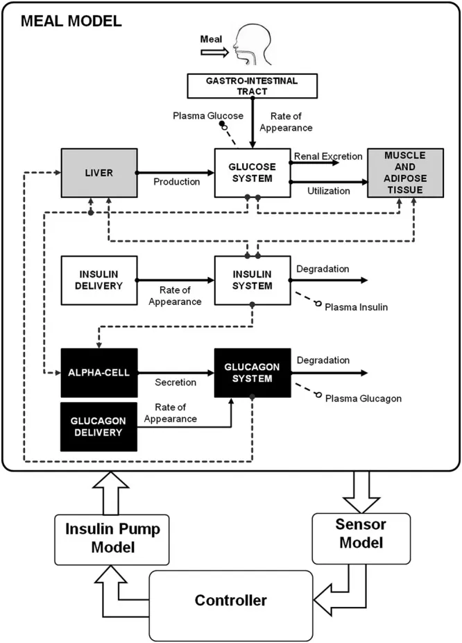
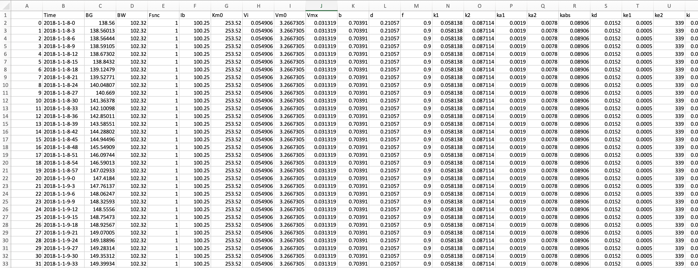
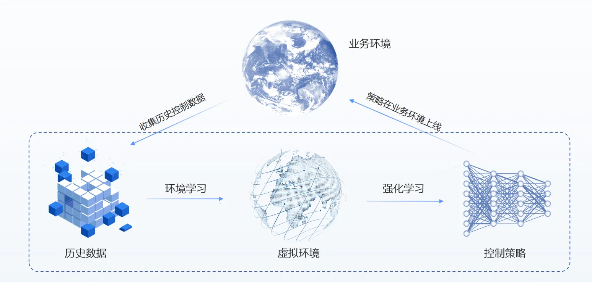
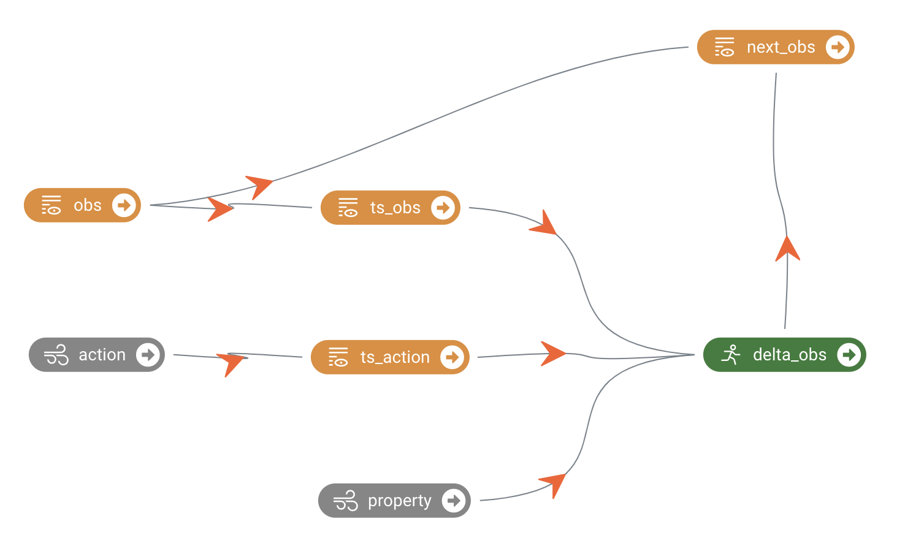
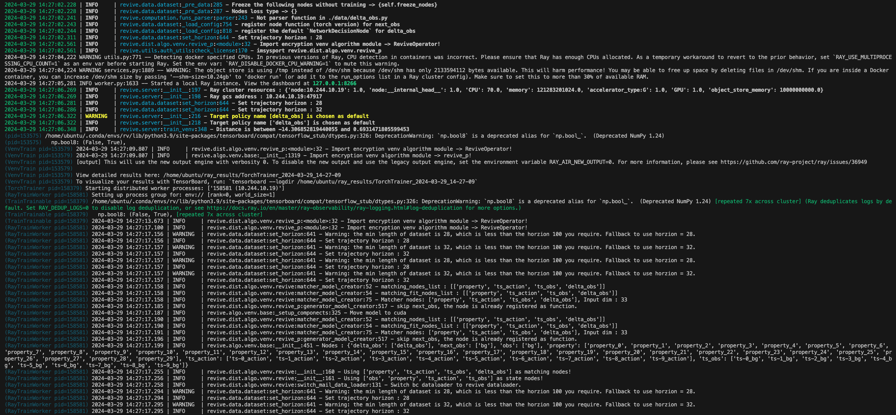
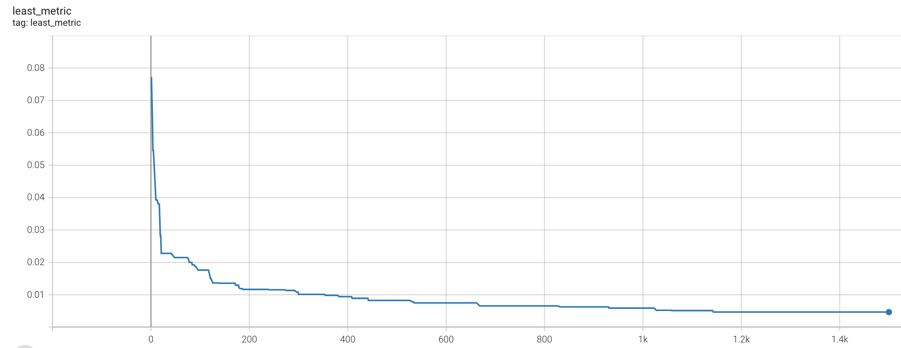
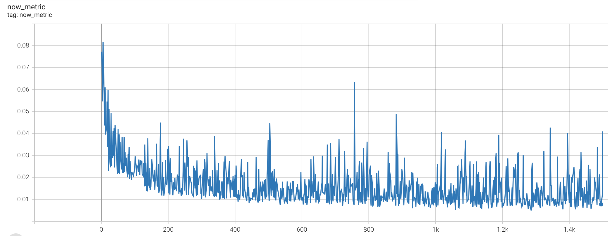
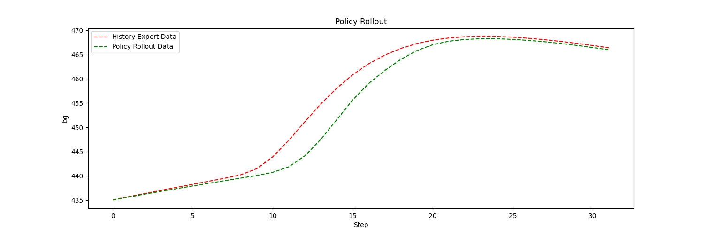

# 任务背景：
注射胰岛素是糖尿病治疗的重要手段之一，尤其是对于1型糖尿病患者。1型糖尿病患者通常需要注射胰岛素来控制血糖水平，因为他们的胰岛素分泌功能已经受损，无法产生足够的胰岛素来降低血糖水平。注射胰岛素时，一些患者需要使用胰岛素泵，这是一种能够持续输送胰岛素的设备，本任务使用胰岛素泵进行胰岛素注射。此外，根据作用时间的不同，胰岛素可分为不同种类，包括长效胰岛素、快速作用胰岛素、中等作用胰岛素等。本任务考虑长效胰岛素，它用于糖尿病患者管理血糖水平。与快速作用胰岛素（rapid-acting insulin）相比，长效胰岛素的作用持续时间更长，通常可以持续数小时到一整天，使其适合于维持基础胰岛素水平，帮助控制患者在不同时间段的血糖水平。之后，注射胰岛素的患者通常需要进行频繁的血糖监测，以确保胰岛素剂量的准确性和治疗效果的达到。因此如何调整胰岛素剂量和注射时机，是实现良好的血糖控制是关键因素。
# 任务介绍

胰岛素和人体作用的环境模拟器是基于[simglucose](https://github.com/jxx123/simglucose)实现的。整体模拟器由病人模拟器，场景模拟器，传感器模拟器，胰岛素泵模拟器构成。整体模拟器模拟糖尿病患者从某天早上8点开始，一天内的体内血糖浓度变化。一天中病人会随机进食，吃药。病人吃药以后，药效会在之后若干时间步内逐渐产生作用，从而影响体内各项指标。因此策略目标就是控制胰岛素注射策略使得病人皮下血糖浓度稳定在一定范围。此环境具有时延特性。任务将人体的各项指标简化为31维的连续性数组，胰岛素的注射行为由一个标量表示。
**血糖监测系统：**
每隔3分钟会返回一次病人的皮下血糖浓度信息【1维】。此外，血糖监测系统也会返回病人的基础身体属性【30维】。由此构成了31维向量：【血糖浓度，基础身体属性】。
**胰岛素注射系统：**
每隔3分钟向病人注射一定量基础胰岛素，使其适合于维持基础胰岛素水平，帮助控制患者在不同时间段的血糖水平。
# 数据介绍
胰岛素注射任务提供了一批历史的胰岛素注射任务数据进行模型训练。数据中包含15位病人的历史胰岛素注射数据，每个病人都包含多条胰岛素注射数据。历史数据以CSV文件的形式进行存储，每条轨迹包含在一个CSV文件中。下面是一个CSV文件的截图：

下面是每个CSV文件表头信息的描述：

| **信息名称** | **信息类别** |
| --- | --- |
| Time | 时间信息 |
| BG | 皮下血糖浓度 |
| BW | 病人身体信息 |
| Fsnc | 病人身体信息 |
| Ib | 病人身体信息 |
| Km0 | 病人身体信息 |
| Vi | 病人身体信息 |
| Vm0 | 病人身体信息 |
| Vmx | 病人身体信息 |
| b | 病人身体信息 |
| ... | ... |

在一条完整的轨迹中病人身体信息（30维）是不改变的，会改变的就是皮下血糖浓度（1维）信息。当然，每个病人的身体信息各不相同。
# 任务目标
控制胰岛素注射策略使得病人皮下血糖浓度稳定在一定范围。
# 解决方案
胰岛素注射策略优化任务目标是使得不同的病人皮下血糖浓度更加稳定。任务训练数据包含了一批历史的胰岛素注射策略任务数据。由于安全成本巨大，所以不能在真实人体中进行试错学习，我们下面采用离线强化学习工具REVIVE来解决上述任务。REVIVE是一套数据驱动强化学习的工业决策软件，该软件通过利用历史数据来学习最优策略， 而无需与真实环境进行额外交互，从而实现决策过程的自动化并率先实现真实业务的落地。

## 任务分析
根据先验知识可以知道，胰岛素注射后血糖发生变化的时间延迟主要受到胰岛素吸收速度、作用时间、胰岛素调节血糖的过程以及食物摄入等多种因素的影响，因此这是一个带有不确定性时延的任务。
根据经验，对于不确定性时延性质的问题，通常可以尝试用循环神经网络或者拼帧来解决。这里我们尝试拼帧方法。再由数据分析中我们可以知道，病人的30维身体属性是几乎不改变的。因此我们考虑只拼帧皮下血糖浓度信息，暂定拼历史10步的信息。并且根据经验，直接预测下一时刻的血糖浓度的效果不如先预测下一时刻与当前时刻血糖浓度的差值，然后通过当前时刻血糖浓度+预测的血糖浓度差值就可以得到下一时刻血糖浓度。
我们定义：

| 变量名 | 变量含义 |
| --- | --- |
| obs | 血糖浓度 |
| ts_obs | 拼帧后的血糖浓度 |
| delta_obs | 血糖浓度差值 |
| action | 胰岛素泵的注射量 |
| ts_action | 拼帧后的胰岛素泵的注射量 |
| property | 30维的病人身体属性 |
| next_obs | 下一时刻病人的血糖浓度 |

## 构建业务决策流图
在5.1中我们结合业务知识对胰岛素注射任务进行详细的分析，为了适应REVIVE来解决该任务，我们首先需要将上述的业务逻辑分析转换为决策流图。决策流图是一个有向无环图，用于描述业务数据时序上的交互逻辑。 决策流图中的每个节点代表数据，每条边代表数据之间的映射关系。决策流图可以根据需要来扩展任意多个节点， 节点之间的顺序可以是任意指定的，单个节点可以作为多个节点的输入。
根据对上述的业务分析，我们构建如下的决策流图。下面的决策流图中action与property节点作为静态变量，[ts_obs, ts_action, property]作为delta_obs的输入，最后我们通过专家函数节点对delta_obs与obs相加即可得到next_obs节点。

构建完决策流图后,我们通常需要把它组织成yaml文件进行表示,下面就是上述决策流图对应的yaml文件,yaml文件下的graph表示了对应的决策流图:
```yaml
graph:
  delta_obs:
  - ts_obs
  - ts_action
  - property
  next_obs:
  - obs
  - delta_obs

nodes:
  obs:
    ts: 10
  action:
    ts: 10

expert_functions:
  next_obs:
      'node_function' : 'delta_obs.get_next_obs'
```
```python
import torch
import numpy as np 


def get_next_obs(data):
    obs = data["obs"]
    delta_obs = data["delta_obs"]

    if len(obs.shape) == 1:
        obs = obs.reshape(1, -1)
        delta_obs = delta_obs.reshape(1, -1)

    next_obs = obs + delta_obs

    if len(data["obs"].shape) == 1:
        next_obs = next_obs.reshape(-1)

    return next_obs

```
完成决策流图的构建之后,我们需要在YAML文件中增加每个节点的特征描述信息,通过columns来定义,下面是将原始数据中特征划分到每个节点中, columns可以定义每一维所属的节点,类似和值范围, 具体的描述可以参考[REVIVE文档](https://revive.cn/help/polixir-revive-sdk-pro/html_cn/tutorial/data_preparation_cn.html)部分的描述。增加columns之后的完整YAML文件如下:
```yaml
metadata:
  columns:
  - bg:
      dim: obs
      type: continuous
      max: 600
      min: 35

  - delta_obs:
      dim: delta_obs
      type: continuous
      max: 40
      min: -40

  - property_0:
      dim: property
      type: continuous
      max: 112
      min: 28
  - property_1:
      dim: property
      type: continuous
      max: 1
      min: 1
  - property_2:
      dim: property
      type: continuous
      max: 132
      min: 83
  - property_3:
      dim: property
      type: continuous
      max: 279
      min: 185
  - property_4:
      dim: property
      type: continuous
      max: 1
      min: 0
  - property_5:
      dim: property
      type: continuous
      max: 13
      min: 2
  - property_6:
      dim: property
      type: continuous
      max: 1
      min: 0
  - property_7:
      dim: property
      type: continuous
      max: 1
      min: 0
  - property_8:
      dim: property
      type: continuous
      max: 1
      min: 0
  - property_9:
      dim: property
      type: continuous
      max: 1
      min: 0
  - property_10:
      dim: property
      type: continuous
      max: 1
      min: 0
  - property_11:
      dim: property
      type: continuous
      max: 1
      min: 0
  - property_12:
      dim: property
      type: continuous
      max: 1
      min: 0
  - property_13:
      dim: property
      type: continuous
      max: 1
      min: 0
  - property_14:
      dim: property
      type: continuous
      max: 2
      min: 0
  - property_15:
      dim: property
      type: continuous
      max: 1
      min: 0
  - property_16:
      dim: property
      type: continuous
      max: 1
      min: 0
  - property_17:
      dim: property
      type: continuous
      max: 339
      min: 339
  - property_18:
      dim: property
      type: continuous
      max: 1
      min: 0
  - property_19:
      dim: property
      type: continuous
      max: 1
      min: 0
  - property_20:
      dim: property
      type: continuous
      max: 12
      min: 3
  - property_21:
      dim: property
      type: continuous
      max: 1
      min: 0
  - property_22:
      dim: property
      type: continuous
      max: 1
      min: 0
  - property_23:
      dim: property
      type: continuous
      max: 1
      min: 0
  - property_24:
      dim: property
      type: continuous
      max: 1
      min: 0
  - property_25:
      dim: property
      type: continuous
      max: 1
      min: 0
  - property_26:
      dim: property
      type: continuous
      max: 1
      min: 0
  - property_27:
      dim: property
      type: continuous
      max: 1
      min: 0
  - property_28:
      dim: property
      type: continuous
      max: 1
      min: 0
  - property_29:
      dim: property
      type: continuous
      max: 2
      min: 0

  - action:
      dim: action
      type: continuous
      max: 1
      min: -1

  graph:
    delta_obs:
    - ts_obs
    - ts_action
    - property
    next_obs:
    - obs
    - delta_obs

  nodes:
    obs:
      ts: 10
    action:
      ts: 10

  expert_functions:
    next_obs:
        'node_function' : 'delta_obs.get_next_obs'

```
## 准备REVIVE训练数据
通过YAML文件构建完成决策流图之后,我们下一步需要根据决策流图按节点整理提供的训练数据来作为REVIVE的训练数据。数据应该是一个Python字典对象，以节点名字作为键值（key），以Numpy数组的数据作为数值（value）。 所有值应为2D ndarray，样本数 N 为第一维度，特征数 C 为第二维度。键值（key）应该与 .yaml 文件中 graph 描述的节点名称对应。为了区分不同轨迹的数据, 数据中需要使用index来标记数据中每条轨迹的结束索引。例如，如果数据的形状为 （100，F），其中包含两个轨迹，其长度分别为40和60。 index 应该设置为 np.ndarray（[40， 100]） 。数据以字典形式完成构建后，应该将它们存储在单个 .npz 或 .h5 文件中。
下面是数据转换的代码，生成revive需要的npz文件：
```python
import numpy as np

from revive.utils.common_utils import load_data


if __name__ == "__main__":
    data = load_data("path_to_npz")

    for k, v in data.items():
        print(k, v.shape)
    
    # generate index info
    index = (np.where(np.sum((data['next_obs'][:-1] - data['obs'][1:]),axis=-1)!=0)[0]+1).tolist()+[data['obs'].shape[0]]
    index = [0]+index
    start = index[:-1]
    end = index[1:]
    traj = np.array(end) - np.array(start)

    # generate dataset for REVIVE
    outdata = {}
    outdata['obs'] = data['obs'][:, :1]
    outdata['next_obs'] = data['next_obs'][:, :1]

    outdata['property'] = data['obs'][:, 1:]
    outdata['delta_obs'] = outdata['next_obs'] - outdata['obs']
    
    outdata['action'] = data['action']
    outdata['index'] = (np.where(np.sum((outdata['next_obs'][:-1] - outdata['obs'][1:]),axis=-1)!=0)[0]+1).tolist() \
                        + [outdata['obs'].shape[0]]
    
    outdata_file = np.savez_compressed("Simglucose-revive.npz", **outdata)
    print("Done!")

```
此外我们也需要准备一份算法超参数的配置文件（算法有一套默认的超参数，但每个任务都需要单独调整一些超参数来达到最好的效果），它是一个json文件：
```json
{
    "base_config": [
        {
            "name": "train_venv_trials",
            "abbreviation": "tvt",
            "description": "Number of total trails searched by the search algorithm in venv training.",
            "type": "int",
            "default": 150,
            "doc": true
        },
        {
            "name": "global_seed",
            "abbreviation": "gs",
            "description": "Set the random number seed for the experiment.",
            "type": "int",
            "default": 42
        },
        {
            "name": "val_split_ratio",
            "abbreviation": "vsr",
            "description": "Ratio to split validate dataset if it is not explicitly given.",
            "type": "float",
            "default": 0.5
        },
        {
            "name": "val_split_mode",
            "abbreviation": "vsm",
            "description": "Mode of auto splitting training and validation dataset, choose from `outside_traj` and `inside_traj`. `outside_traj` means the split is happened outside the trajectories, one trajectory can only be in one dataset. `inside_traj` means the split is happened inside the trajectories, former part of one trajectory is in training set, later part is in validation set.",
            "type": "str",
            "default": "outside_traj"
        },
        {
            "name": "ignore_check",
            "abbreviation": "igc",
            "description": "Flag to ignore data related check, force training.",
            "type": "bool",
            "default": false
        },
        {
            "name": "venv_gpus_per_worker",
            "abbreviation": "vgpw",
            "description": "Number of gpus per worker in venv training, small than 1 means launch multiple workers on the same gpu.",
            "type": "float",
            "default": 0.2
        },
        {
            "name": "venv_metric",
            "description": "Metric used to evaluate the trained venv, choose from `nll`, `mae`, `mse`, `wdist`.",
            "type": "str",
            "default": "mae"
        },
        {
            "name": "policy_gpus_per_worker",
            "abbreviation": "pgpw",
            "description": "Number of gpus per worker in venv training, small than 1 means launch multiple workers on the same gpu.",
            "type": "float",
            "default": 0.25
        },
        {
            "name": "save_start_epoch",
            "abbreviation": "sse",
            "description": "We only save models after this epoch, default is 0 which means we save models from the beginning.",
            "type": "int",
            "default": 0
        },
        {
            "name": "venv_train_dataset_mode",
            "abbreviation": "vtdm",
            "description": "Can be set to `trajectory` mode or `transition` mode.",
            "type": "str",
            "default": "trajectory",
            "doc": true
        }
    ],
    "venv_algo_config": {
        "revive_f": [
            {
                "name": "bc_epoch",
                "type": "int",
                "default": 1500
            },
            {
                "name": "mail_epoch",
                "description": "Number of epcoh for the training process",
                "abbreviation": "mep",
                "type": "int",
                "default": 1500
            },
            {
                "name": "bc_lr",
                "type": "float",
                "default": 1e-3
            },
            {
                "name": "bc_steps",
                "type": "int",
                "default": 1
            },
            {
                "name": "matcher_record_len",
                "type": "int",
                "default": 50
            },
            {
                "name": "fix_std",
                "type": "float",
                "default": 0.025
            },
            {
                "name": "bc_l2_coef",
                "type": "float",
                "default": 5e-5
            },
            {
                "name": "logvar_loss_coef",
                "type": "float",
                "default": 0.01
            },
            {
                "name": "matcher_l2_norm_coeff",
                "type": "float",
                "default": 0.0005
            },
            {
                "name": "discr_ent_coef",
                "type": "float",
                "default": 0.01
            },
            {
                "name": "value_l2_norm_coef",
                "type": "float",
                "default": 1e-6
            },
            {
                "name": "generator_l2_norm_coef",
                "type": "float",
                "default": 1e-6
            },
            {
                "name": "gp_coef",
                "type": "float",
                "default": 0.5
            },
            {
                "name": "mix_sample_ratio",
                "type": "float",
                "default": 0.5
            },
            {
                "name": "mix_sample",
                "type": "bool",
                "default": true
            },
            {
                "name": "revive_batch_size",
                "description": "Batch size of training process.",
                "abbreviation": "mbs",
                "type": "int",
                "default": 1024
            },
            {
                "name": "matching_nodes",
                "type": "list",
                "default": [["obs", "action"], ["obs", "action", "next_obs"], ["obs", "action", "delta_x"]]
            },
            {
                "name": "matching_fit_nodes",
                "type": "list",
                "default": [["action"], ["next_obs"], ["delta_x"]]
            },
            {
                "name": "policy_hidden_features",
                "description": "Number of neurons per layer of the policy network.",
                "abbreviation": "phf",
                "type": "int",
                "default": 256
            },
            {
                "name": "policy_hidden_layers",
                "description": "Depth of policy network.",
                "abbreviation": "phl",
                "type": "int",
                "default": 3
            },
            {
                "name": "policy_backbone",
                "description": "Backbone of policy network.",
                "abbreviation": "pb",
                "type": "str",
                "default": "mlp"
            },
            {
                "name": "transition_hidden_features",
                "description": "Number of neurons per layer of the transition network.",
                "abbreviation": "thf",
                "type": "int",
                "default": 256
            },
            {
                "name": "transition_hidden_layers",
                "abbreviation": "thl",
                "type": "int",
                "default": 4
            },
            {
                "name": "transition_backbone",
                "description": "Backbone of Transition network.",
                "abbreviation": "tb",
                "type": "str",
                "default": "res"
            },
            {
                "name": "matcher_pretrain_epoch",
                "abbreviation": "dpe",
                "type": "int",
                "default": 0
            },
            {
                "name": "matcher_hidden_features",
                "description": "Number of neurons per layer of the matcher network.",
                "abbreviation": "dhf",
                "type": "int",
                "default": 256
            },
            {
                "name": "matcher_hidden_layers",
                "description": "Depth of the matcher network.",
                "abbreviation": "dhl",
                "type": "int",
                "default": 4
            },
            {
                "name": "g_steps",
                "description": "The number of update rounds of the generator in each epoch.",
                "type": "int",
                "default": 3
            },  
            {
                "name": "d_steps",
                "description": "Number of update rounds of matcher in each epoch.",
                "type": "int",
                "default": 1
            },
            {
                "name": "g_lr",
                "description": "Initial learning rate of the generator.",
                "type": "float",
                "default": 7e-4
            },
            {
                "name": "d_lr",
                "description": "Initial learning rate of the matcher.",
                "type": "float",
                "default": 1e-4
            },
            {
                "name": "generator_data_repeat",
                "description": "Repeat rollout more data to train generator.",
                "type": "int",
                "default": 2
            },
            {
                "name": "mae_reward_weight",
                "description": "reward = (1-mae_reward_weight)*matcher_reward + mae_reward_weight*mae_reward.",
                "type": "float",
                "default": 0.0
            }
        ],
        "revive_p": [
            {
                "name": "revive_batch_size",
                "description": "Batch size of training process.",
                "abbreviation": "mbs",
                "type": "int",
                "default": 1024
            },
            {
                "name": "revive_epoch",
                "description": "Number of epcoh for the training process",
                "abbreviation": "mep",
                "type": "int",
                "default": 1500
            },
            {
                "name": "policy_hidden_features",
                "description": "Number of neurons per layer of the policy network.",
                "abbreviation": "phf",
                "type": "int",
                "default": 256
            },
            {
                "name": "policy_hidden_layers",
                "description": "Depth of policy network.",
                "abbreviation": "phl",
                "type": "int",
                "default": 3
            },
            {
                "name": "policy_backbone",
                "description": "Backbone of policy network.",
                "abbreviation": "pb",
                "type": "str",
                "default": "mlp"
            },
            {
                "name": "transition_hidden_features",
                "description": "Number of neurons per layer of the transition network.",
                "abbreviation": "thf",
                "type": "int",
                "default": 256
            },
            {
                "name": "transition_hidden_layers",
                "abbreviation": "thl",
                "type": "int",
                "default": 4
            },
            {
                "name": "transition_backbone",
                "description": "Backbone of Transition network.",
                "abbreviation": "tb",
                "type": "str",
                "default": "res"
            },
            {
                "name": "matcher_pretrain_epoch",
                "abbreviation": "dpe",
                "type": "int",
                "default": 0
            },
            {
                "name": "matcher_hidden_features",
                "description": "Number of neurons per layer of the matcher network.",
                "abbreviation": "dhf",
                "type": "int",
                "default": 256
            },
            {
                "name": "matcher_hidden_layers",
                "description": "Depth of the matcher network.",
                "abbreviation": "dhl",
                "type": "int",
                "default": 4
            },
            {
                "name": "g_steps",
                "description": "The number of update rounds of the generator in each epoch.",
                "type": "int",
                "default": 1
            },  
            {
                "name": "d_steps",
                "description": "Number of update rounds of matcher in each epoch.",
                "type": "int",
                "default": 1
            },
            {
                "name": "g_lr",
                "description": "Initial learning rate of the generator.",
                "type": "float",
                "default": 1e-4
            },
            {
                "name": "d_lr",
                "description": "Initial learning rate of the matcher.",
                "type": "float",
                "default": 8e-4
            },
            {
                "name": "generator_data_repeat",
                "description": "Repeat rollout more data to train generator.",
                "type": "int",
                "default": 1
            }
        ]
    },
    "policy_algo_config": {
        "sac": [
            {
                "name": "ensemble_choosing_interval",
                "type": "int",
                "default": 10
            },
            {
                "name": "ensemble_size",
                "type": "int",
                "default": 50
            },
            {
                "name": "candidate_num",
                "type": "int",
                "default": 50
            },
            {
                "name": "filter",
                "type": "bool",
                "default": true
            },
            {
                "name": "policy_bc_epoch",
                "type": "int",
                "default": 500
            },
            {
                "name": "sac_batch_size",
                "description": "Batch size of training process.",
                "abbreviation": "pbs",
                "type": "int",
                "default": 1024
            },
            {
                "name" : "sac_rollout_horizon",
                "abbreviation" : "srh",
                "type" : "int",
                "default" : 100,
                "search_mode": "grid",
                "search_values": [
                    5,
                    10,
                    20
                ]
            }, 
            {
                "name": "sac_steps_per_epoch",
                "description": "The number of update rounds of sac in each epoch.",
                "abbreviation": "sspe",
                "type": "int",
                "default": 200
            },
            {
                "name": "policy_hidden_features",
                "description": "Number of neurons per layer of the policy network.",
                "abbreviation": "phf",
                "type": "int",
                "default": 256
            },
            {
                "name": "policy_hidden_layers",
                "description": "Depth of policy network.",
                "abbreviation": "phl",
                "type": "int",
                "default": 4
            },
            {
                "name": "policy_backbone",
                "description": "Backbone of policy network.",
                "abbreviation": "pb",
                "type": "str",
                "default": "mlp"
            },
            {
                "name": "buffer_size",
                "description": "Size of the buffer to store data.",
                "abbreviation": "bfs",
                "type": "int",
                "default": 1000000.0
            },
            {
                "name": "g_lr",
                "description": "Initial learning rate of the training process.",
                "type": "float",
                "default": 1e-03,
                "search_mode": "grid",
                "search_values": [
                    2e-4,
                    5e-4,
                    8e-4,
                    1e-3
                ]
            }
        ]
    }
}
```
## 使用REVIVE进行虚拟环境模型训练
当我们准备好训练数据集( .npz  文件)、决策流图描述文件( .yaml )后。 我们可以使用启动revive提供的train.py脚本进行虚拟环境模型。
训练命令:
```bash
CUDA_VISIBLE_DEVICES=0 \
python train.py \
-df data/Simglucose-revive.npz \
-cf data/Simglucose_no_action_ts.yaml \
-rcf data/config.json \
\
-vm once \
-pm None \
\
--global_seed 42 \
--run_id simglucose-revive-no-action_horizon_100_ts \
--venv_algo revive_p \
\
--venv_rollout_horizon 100 \
\
--bc_loss nll \
--policy_hidden_layers 4 \
--policy_backbone res \
--rollout_plt_frequency 500 \

```
开启训练之后, 命令行会打印如下信息,说明虚拟环境正在训练：

## 验证虚拟环境模型的有效性
REVIVE提供多种工具用于验证环境模型的有效性,其中最常用的两种方法是通过tensorboard查看loss曲线和通过日志查看rollout图片：
Tensorboard的启动命令如下：
```bash
tensorboard --logdir=path_to_logs --port 10086
```
Tensorboard提供一个web界面可以查看损失函数的曲线,我们可以查看里面的now_metric 和 least_metric指标来分析模型是否收敛，以及收敛的效果如何。默认情况下metric计算的是轨迹rollout的MAE。least_metri指标越低越好！


我们还可以打开日志文件夹下的rollout图片文件夹查看每个节点的rollout情况,REVIVE会从数据集中随机采集10条轨迹，进行虚拟环境模型和真实历史数据的对比, 通过rollout图可以直观的分析虚拟环境模型的时序预测误差。rollout图片文件夹默认存储在logs/simglucose-revive-no-action_horizon_100_ts/venv_train/rollout_images文件夹下。红色代表数据中真实的轨迹，绿色代表训练得到的虚拟环境的轨迹。两条轨迹贴合的越紧密越好！

## 分析任务目标，定义控制目标优化函数
REVIVE使用强化学习算法来训练策略模型。在强化学习中，智能体通过不断地与环境交互来寻找最优策略。策略会根据当前状态选择一个行动，并接收相应的奖励以及 下一个状态。这样的过程会不断地进行，直到达到终止状态为止。如果策略在一系列动作和状态转换中获得高额的奖励， 那么它就找到了一种较好的策略。因此，奖励函数的设计对于强化学习策略的优化至关重要。一个好的奖励函数应该能够指导策略向着预期的方向进行学习。
胰岛素注射任务的目标是通过控制注射胰岛素的量，使得拥有不同身体属性的糖尿病人的血糖都能稳定在安全范围内，期间病人会随机进食。因此奖励函数考虑了病人前后时刻的血糖浓度作为输入，并通过既定的规则保证病人的血糖健康。
REVIVE SDK支持支持以python源文件的方式定义奖励函数。奖励函数定义了策略的优化目标。奖励函数的输入是单步决策流的数据， 奖励函数的输出当前步策略获得的奖励值。下面是上述奖励函数对应的Python源代码：
```python
import numpy as np
import torch


def get_reward(data):    
    obs = data["obs"]
    action = data["action"]
    next_obs = data["next_obs"]
    singel_sample = False
    if len(obs.shape) == 1:
        obs = obs.reshape(1,-1)
        singel_sample = True
    if len(action.shape) == 1:
        action = action.reshape(1,-1)
    if len(next_obs.shape) == 1:
        next_obs = next_obs.reshape(1,-1)


    if isinstance(obs, np.ndarray):
        array_type = np
    else:
        array_type = torch

    def get_risk(bg):
        fBG = 1.509 * (array_type.log(bg)**1.084 - 5.381)
        risk = fBG**2 * 10
        return risk

    bg = obs[...,:1]
    next_bg = next_obs[...,:1]
    risk_prev = get_risk(bg)
    risk_current = get_risk(next_bg)

    ori_rew = risk_prev - risk_current

    MAX_GLUCOSE = 600
    x_max, x_min = 0, -100 
    reward = ((ori_rew - x_min) / (x_max - x_min))  
    reward = array_type.where(next_bg <= 40, -15, reward)
    reward = array_type.where(next_bg >= MAX_GLUCOSE, 0, reward)

    if singel_sample:
        reward = reward[0]
        if array_type == np:
            reward = reward.item()

    return reward
```
## 使用REVIVE进行策略模型训练
当我们准备好奖励函数之后。 我们就可以使用启动revive提供的train.py脚本进行策略模型训练。
但是我们在训练环境时的决策流并没有定义优点策略action，而是把它当做一个静态变量。因此在训练策略（action节点）时，我们应该更新决策流，并指定action节点作为优化目标。以下是训练策略时的决策流的定义：
```yaml
graph:
  action:
  - obs
  - property
  delta_obs:
  - ts_obs
  - ts_action
  - property
  next_obs:
  - obs
  - delta_obs

nodes:
  obs:
    ts: 10
  action:
    ts: 10

expert_functions:
  next_obs:
      'node_function' : 'delta_obs.get_next_obs'
```
以及对应的训练策略时的完整yaml文件：
```yaml
metadata:
  columns:
  - bg:
      dim: obs
      type: continuous
      max: 600
      min: 35

  - delta_obs:
      dim: delta_obs
      type: continuous
      max: 40
      min: -40

  - property_0:
      dim: property
      type: continuous
      max: 112
      min: 28
  - property_1:
      dim: property
      type: continuous
      max: 1
      min: 1
  - property_2:
      dim: property
      type: continuous
      max: 132
      min: 83
  - property_3:
      dim: property
      type: continuous
      max: 279
      min: 185
  - property_4:
      dim: property
      type: continuous
      max: 1
      min: 0
  - property_5:
      dim: property
      type: continuous
      max: 13
      min: 2
  - property_6:
      dim: property
      type: continuous
      max: 1
      min: 0
  - property_7:
      dim: property
      type: continuous
      max: 1
      min: 0
  - property_8:
      dim: property
      type: continuous
      max: 1
      min: 0
  - property_9:
      dim: property
      type: continuous
      max: 1
      min: 0
  - property_10:
      dim: property
      type: continuous
      max: 1
      min: 0
  - property_11:
      dim: property
      type: continuous
      max: 1
      min: 0
  - property_12:
      dim: property
      type: continuous
      max: 1
      min: 0
  - property_13:
      dim: property
      type: continuous
      max: 1
      min: 0
  - property_14:
      dim: property
      type: continuous
      max: 2
      min: 0
  - property_15:
      dim: property
      type: continuous
      max: 1
      min: 0
  - property_16:
      dim: property
      type: continuous
      max: 1
      min: 0
  - property_17:
      dim: property
      type: continuous
      max: 339
      min: 339
  - property_18:
      dim: property
      type: continuous
      max: 1
      min: 0
  - property_19:
      dim: property
      type: continuous
      max: 1
      min: 0
  - property_20:
      dim: property
      type: continuous
      max: 12
      min: 3
  - property_21:
      dim: property
      type: continuous
      max: 1
      min: 0
  - property_22:
      dim: property
      type: continuous
      max: 1
      min: 0
  - property_23:
      dim: property
      type: continuous
      max: 1
      min: 0
  - property_24:
      dim: property
      type: continuous
      max: 1
      min: 0
  - property_25:
      dim: property
      type: continuous
      max: 1
      min: 0
  - property_26:
      dim: property
      type: continuous
      max: 1
      min: 0
  - property_27:
      dim: property
      type: continuous
      max: 1
      min: 0
  - property_28:
      dim: property
      type: continuous
      max: 1
      min: 0
  - property_29:
      dim: property
      type: continuous
      max: 2
      min: 0

  - action:
      dim: action
      type: continuous
      max: 1
      min: -1

  graph:
    action:
    - obs
    - property
    delta_obs:
    - ts_obs
    - ts_action
    - property
    next_obs:
    - obs
    - delta_obs

  nodes:
    obs:
      ts: 10
    action:
      ts: 10

  expert_functions:
    next_obs:
        'node_function' : 'delta_obs.get_next_obs'
```
这是策略训练启动命令:
```bash
CUDA_VISIBLE_DEVICES=0 \
python train.py \
-df data/Simglucose-revive.npz \
-cf data/Simglucose_no_action_policy_ts.yaml \
-rcf data/config.json \
\
-rf data/simglucose_reward.py \
\
-vm None \
-pm once \
\
--global_seed 42 \
--target_policy_name action \
--run_id simglucose-revive-no-action_horizon_100_ts \
--venv_algo revive_p \
\
--bc_loss nll \
--policy_hidden_layers 4 \
--policy_backbone res \
--bc_weight_decay 1e-7 \
--rollout_plt_frequency 500 \
\
--ppo_rollout_horizon 100 \
--test_horizon 100 \
--generate_deter 1 \
--policy_bc_epoch 100 \
\
--policy_algo ppo \
--ppo_epoch 1000

```
## 进行策略模型有效性验证
在使用REVIVE SDK进行任务学习的过程中，默认情况下，REVIVE会将数据集进行切分，并分为训练数据集以及验证数据集（参考 数据准备）。 并在这两个数据集上分别构建虚拟环境，并命名为 trainEnv 和 valEnv。 在随后的策略模型学习过程中，REVIVE会在 trainEnv 和 valEnv 两个环境以及对应的数据集 trainData 和 valData 中分别进行策略模型的训练， 训练出各自的策略模型 trainPolicy 和 valPolicy。在训练过程中，REVIVE SDK会在训练结束后，依据用户设定的 奖励函数 ， 对 trainPolicy 在 trainEnv 和 valEnv``上，以及 ``valPolicy 在 trainEnv 和 valEnv 上所获得的平均单步奖励进行记录， 并在训练结束后生成双重环境验证图,默认的存储路径是 logs/<run_id>/policy_train/double_validation.png 。下面双环境验证图片种蓝色虚线是对历史数据使用降落函数计算得到的单步奖励平均值。从图中我们可以看到,红绿两条线都高于蓝色虚线。这意味着在两个环境中，两种策略得到的奖励数值都高于了历史数据集中的奖励数值。
【双环境验证图】
双环境验证是一种用于评估策略模型性能的方法。它涉及将训练和测试环境定义为两个不同的环境。 在训练期间，智能体使用一个环境进行学习；而在测试期间，它必须在另一个环境中进行操作，该环境可能与训练环境略有不同。 通过这种方式，双重环境验证可以检测出策略模型过度拟合特定的环境。 如果训练环境和测试环境非常相似，那么模型可能会在测试环境中表现良好。 但如果测试环境与训练环境有明显区别，则模型可能无法泛化到新环境中。 因此，双环境验证可以帮助用户确定评估策略模型的实际效果，并检查它们是否具有适应不同环境的能力。
## 策略模型上线测试
策略模型会被序列化为 policy.pkl 和onnx文件。使用策略模型时需要使用 pickle 加载序列化的决策模型， 然后使用 policy.infer() 函数进行策略模型推理。
下面是加载pkl文件进行胰岛素注射控制的代码示例:
```python
import pickle
import numpy as np
import gymnasium
import neorl2


if __name__ == "__main__":
    policy_path = "path_to_policy.pkl"

    policy_revive = pickle.load(open(policy_path, 'rb'))
    env = gymnasium.make("Simglucose", mode='train')

    re_list = []
    for traj in range(100):
        obs, _ = env.reset()
        # venv_revive.reset()
        policy_revive.reset()
        re_turn = []
        done, trunc = False, False
        while not done and not trunc:
            action = policy_revive.infer({'obs': obs[:1], 'property': obs[1:]})
            next_state, reward, done, trunc, info = env.step(action)
            re_turn.append(reward)
            obs = next_state
        
        print(len(re_turn), np.sum(np.array(re_turn)[:]))
        re_list.append(np.sum(re_turn))

    print('mean return:',np.mean(re_list), ' std:',np.std(re_list))
```
# 涉及的功能：

1. 异构决策流
2. 静态变量
3. 拼帧
4. delta_obs
