关键词：静态变量、多时间步拼接
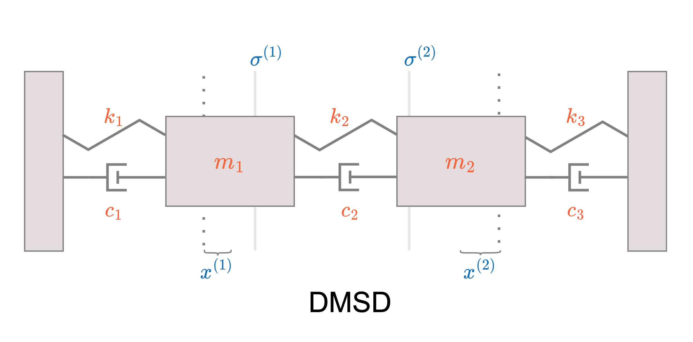

## 任务背景
PID（比例-积分-微分）控制器是一种常见的反馈控制器，广泛应用于工业自动化和过程控制领域。它通过测量反馈信号（通常是被控制变量）与设定值之间的差异，然后调节控制输出以使差异最小化。PID控制器的性能高度依赖于其参数（比例、积分和微分系数）的精确调整。由于不同的系统具有不同的特性，因此这些参数的调整可能会很复杂，并且可能需要在不同工况下进行调整。PID控制器对于非线性系统的控制能力有限。当系统的特性发生变化或处于非线性状态时，PID控制器可能无法提供良好的性能。另外PID控制策略不具有灵活的自适应能力，PID三参数不足以准确的表征当前设备的状态。这些PID所面临困境都要求在工业场景的众多领域中进行人工智能的赋能。但由于以往工业控制系统过度依赖于PID的控制策略，且基于这一策略方法收集了大量数据，这些大量数据非常宝贵，基于PID收集到的数据来进行之后的策略性能提升是目前寻找更好控制策略的最佳途径之一。
双弹簧阻尼系统是一种工程系统，通常用于控制和减缓振动以及提供稳定性。它由两组弹簧和阻尼器组成，通常被设计用来应对特定的振动频率或载荷条件。双弹簧阻尼系统的设计旨在使其在特定的振动频率下具有最佳的阻尼效果，以提供最佳的稳定性和舒适性。调整主弹簧和辅助弹簧的硬度以及阻尼器的设置可以根据特定的应用需求进行。这种系统常见于车辆悬挂、建筑结构减震、机械设备振动控制等领域。在以往的控制策略中，我们强调使用PID来进行两个质量块位置的控制，以达到用最短的时间精确控制质量块的位置。但PID策略是否就是这一控制问题的最优解，是否还有更好的控制策略出现，这些问题都催促着行业专家们不断地进行探索。
## 任务介绍
双弹簧阻尼器如图所示，简称为DMSD，是有将两块质量为m1和m2的滑块用弹簧和阻尼器相连接的系统。在这个系统中我们需要对滑块m1和m2施加一定的左右方向的力，目的是为了将滑块的位置控制并稳定在一个目标的位置处。其中，两个滑块彼此之间也由弹簧和阻尼器链接，所以对任意滑块施加力的大小都同时会对另外一个滑块产生影响。
**观测系统：**
观测系统会实时返回两个质量块的状态信息（每间隔0.2s返回一次），状态信息包含两个滑块的绝对坐标位置（以做“墙壁”作为原点，返回质量块相对左墙壁的的X轴坐标信息），两个质量块的速度信息（X轴线速度）。除了滑块的状态信息之外，质量块的所要被控制到的目标点也进行了返回。
**控制系统：**
质量块受到了力的影响，对于两个值两块，可以分别施加不同的力来进行影响。他们分别可以收到30N的力，且力为矢量，正负号代表对滑块力的影响是分为左右的。

DMSD任务需要通过两个质量块机控制系统控制质量块的位置，以达到他们能在最短的时间内被控制在目标位置处。
## 数据介绍
DMSD任务提供一批历史的DMSD任务数据进行模型训练，值得一提的是这些数据都是在历史的PID控制任务下所积累的数据。数据中包含多次控制任务的历史数据(由于控制时间的局限性，每条数据轨迹仅有100条时间步信息)。每次任务的历史数据以时序的方式记录了质量块的状态信息，目标位置信息和对应的质量块的受力信息。历史数据以CSV文件的形式进行存储，每条轨迹包含在一个CSV文件中。下面是一个CSV文件的截图:
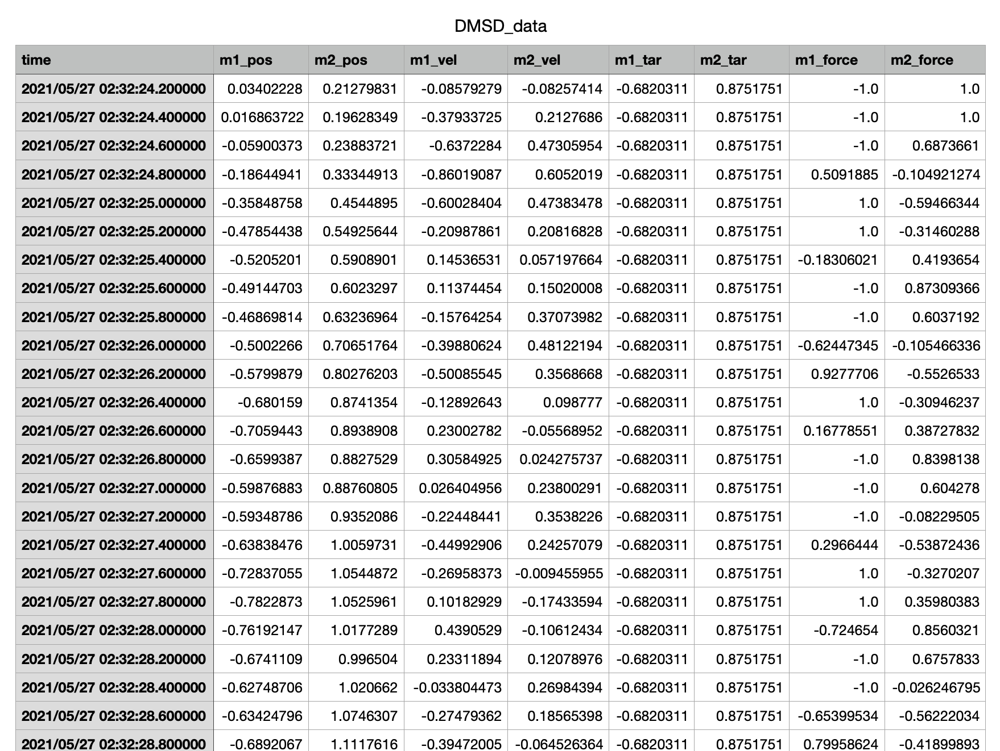

下面是每个CSV文件表头信息的描述：

| **信息名称** | **信息类别** | **信息描述** |
| --- | --- | --- |
| time | 时间信息 | 当前行信息的记录时间 |
| M1-pos (position) | 质量块状态信息 | 1号质量块X轴（水平）方向位置坐标 |
| M2-pos (position) | 质量块状态信息 | 2号质量块X轴（水平）方向位置坐标 |
| M1-vel (velocity) | 质量块状态信息 | 1号质量块X轴（水平）方向的速度大小，正负代表左右方向 |
| M2-vel (velocity) | 质量块状态信息 | 2号质量块X轴（水平）方向的速度大小，正负代表左右方向 |
| M1-tar (target) | 质量块目标信息 | 1号质量块X轴（水平）方向目标位置坐标 |
| M2-tar (target) | 质量块目标信息 | 2号质量块X轴（水平）方向目标位置坐标 |
| M1-force | 质量块受力信息 | 1号质量块X轴（水平）方向的受力情况，正负代表左右方向，力为外部的动作施加 |
| M2-force | 质量块受力信息 | 2号质量块X轴（水平）方向的受力情况，正负代表左右方向，力为外部的动作施加 |


任务数据存储地址: [https://agit.ai/Polixir_AI/revive_case/src/branch/master/cases/DMSD/task_data/DMSD_data.csv](https://agit.ai/Polixir_AI/revive_case/src/branch/master/cases/DMSD/task_data/DMSD_data.csv)

## 任务目标
DMSD任务目标是需要提供一个质量块施加实时左右力的策略，将质量块以最快的速度稳定地移动到目标位置且尽可能地保持在目标位置处。策略模型的输入信息包括当前质量块的位置信息和目标信息，策略模型的输出对两个质量块不同的施力大小。
## 解决方案
DMSD任务目标目标是提供一个质量块施加实时左右力的策略，将质量块以最快的速度稳定地移动到目标位置且尽可能地保持在目标位置处。任务训练数据包含了一批历史实验过程中收集到的任务数据。由于数据量本身就很多，且在真实任务中再次收集数据要耗费实验人员的大量工作时间，我们下面采用离线强化学习工具REVIVE来解决上述任务。REVIVE是一套数据驱动强化学习的工业决策软件，该软件通过利用历史数据来学习最优策略， 而无需与真实环境进行额外交互，从而实现决策过程的自动化并率先实现真实业务的落地。具体来讲，REVIVE通过离线数据尽可能准确的将数据中内涵的环境变化形式进行还原，此步骤也就是建立了虚拟环境，虚拟环境一旦建立后，就可以使用强化学习方法来对策略进行优化，最终获得优化后的策略。
### 任务分析
根据业务知识对任务的数据之间进行因果分析理解每次DMSD任务记录的数据都是时序信息，time列提供了时间戳表示时间信息，可以用于确定信息的顺序和时间序列的变化，用于分析数据之间时序上的因果关系。同时时间信息列在此任务当中也提供了数据的轨迹信息，一旦时间不连续那么意味一条连续的轨迹的截止。在这个任务当中，我们共有1000条轨迹，每条轨迹的时间长度为100steps。
数据中的信息可以分为3大类，第一类是质量块状态信息，包括质量块的位置信息，速度信息和，第二类是质量块的受力情况，第三类是质量块所要达到的目标位置信息。在时序上进行可视化如下：
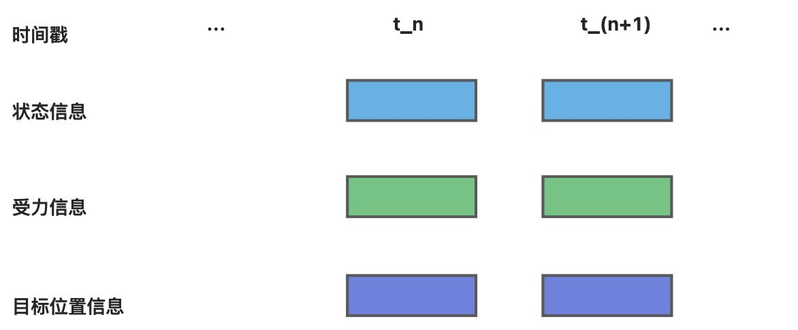

根据业务知识对上述3类信息之间的关系进行分析：

1. 目标位置信息(target)：目标位置是任务在每时每刻进行下发的外部信息，这个外部信息在PID控制当中意味着所要控制到的目标点位置，是计算PID各个参数的基本量，在当前任务中目标位置信息需要给决策模型作为输入。
2. 受力信息(force)：质量块在历史的数据中无时无刻收到PID参数调节后的受力输出量，这个受力信息也就记录了两个滑块各自不同的受力情况。
3. 状态信息(position & velocity)：质量块的位置信息和速度信息都包含在了状态信息当中。

根据上述的分析，我们构建了下面的业务逻辑关系，t_n时刻的状态信息，受力信息会共同影响到t_(n+1)时刻的状态信息。t_n时刻的受力信息应该根据t_n时刻的状态信息和目标位置信息来确定。我们在下图中用箭头表明这些业务关系。
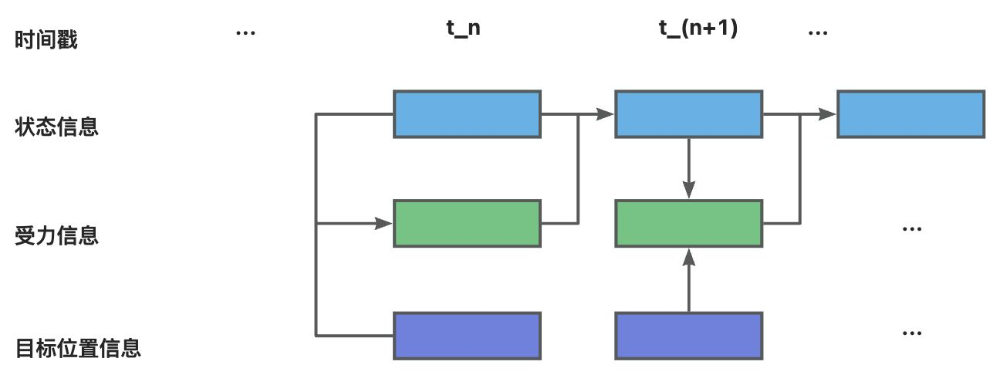

### 构建业务决策流图
#### 定义决策流图
在5.1中我们结合业务知识对DMSD任务进行详细的分析，为了适应REVIVE来解决该任务，我们首先需要将上述的业务逻辑分析转换为决策流图。决策流图是一个有向无环图，用于描述业务数据时序上的交互逻辑。 决策流图中的每个节点代表数据，每条边代表数据之间的映射关系。决策流图可以根据需要来扩展任意多个节点， 节点之间的顺序可以是任意指定的，单个节点可以作为多个节点的输入。
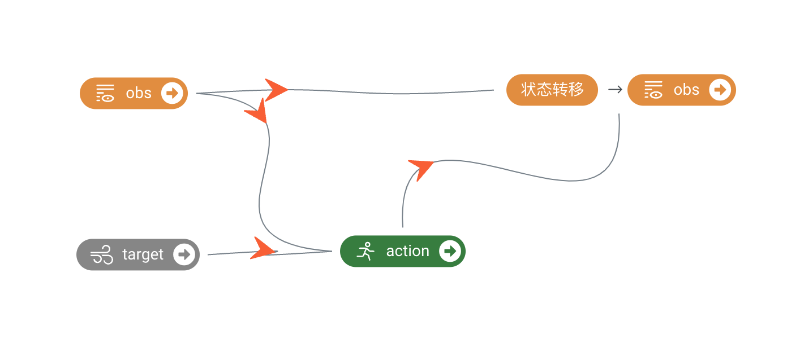

构建完决策流图后,我们通常需要把它组织成yaml文件进行表示,下面就是上述决策流图对应的yaml文件,yaml文件下的graph表示了对应的决策流图:
```yaml
metadata:
  graph:
    action:
    - obs
    - target
    next_obs:
    - action
    - obs
```
完成决策流图的构建之后,我们需要在YAML文件中增加每个节点的特征描述信息,通过columns来定义,下面是将原始数据中特征划分到每个节点中, columns可以定义每一维所属的节点,类似和值范围, 具体的描述可以参考[REVIVE文档](https://revive.cn/help/polixir-revive-sdk-pro/html_cn/tutorial/data_preparation_cn.html)部分的描述。增加columns之后的YAML文件如下:
```yaml
metadata:
  columns:
  - m1_x:
      dim: obs
      type: continuous
  - m2_x:
      dim: obs
      type: continuous
  - m1_vel:
      dim: obs
      type: continuous
  - m2_vel:
      dim: obs
      type: continuous
  - m1_tar:
      dim: target
      type: continuous
  - m2_tar:
      dim: target
      type: continuous
  - m1_force:
      dim: action
      type: continuous
  - m2_force:
      dim: action
      type: continuous
  graph:
    action:
    - obs
    - target
    next_obs:
    - action
    - obs
```
解读一场决策流，在`columns`部分，我们将obs信息包含的四维按照顺序罗列在了一起，这就表明在数据当中obs包含的四维信息也应当分别代表`m1_pos` `m2_pos` `m1_vel` `m2_vel`。action和target也有一样的要求。除此以外obs、action、target的排列顺序是没有要求的，可以任意调换顺序。
#### 优化决策流图
##### 学习变化量
好的决策流图是REVIVE SDK中不可或缺的一部分，定义更好的决策流图可以使得训练模型的过程更高效、预测结果更准确。在动力学系统建模中，常见的方法是预测系统状态的**变化量,**而不是直接预测下一时刻的状态量。预测状态变化量相对于直接预测下一时刻状态的好处包括以下几点：

- 减少参数：预测状态变化量可以减少需要估计或学习的参数数量。直接预测下一时刻状态需要建立一个完整的动力学模型，并估计模型中的所有参数。而预测状态变化量只需要估计或学习状态转移矩阵和输入矩阵，减少了参数的数量和复杂性。
- 稳定性：预测状态变化量可以提高系统的稳定性。在动力学系统中，小的误差或扰动可能会在时间上累积并导致较大的误差。通过预测状态变化量，可以减小误差的累积效应，提高系统的稳定性。
- 鲁棒性：系统中的建模误差、测量噪声或外部干扰可能会对状态预测产生影响，而预测状态变化量可以减少这些影响的累积效应。通过预测状态变化量，系统可以更好地应对不确定性，提高预测的鲁棒性。

在DMSD任务中,我们可以通过引入状态变化节点的方法来优化决策流图,下面是优化后的决策流图:
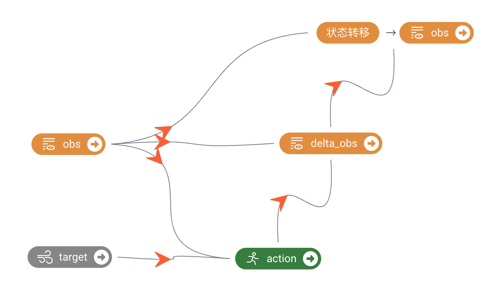

在上述决策流图中，我们不再直接预测下一时刻的质量块的状态（obs）信息,而是质量块的变化量, 包括位置的位移量和速度的变化量，REVIVE支持通过`delta_<node>`自动解析状态变化数据, 并使用函数将状态变化数据和原始节点数据相加得到下一时刻的状态节点.
引入`delta_obs`节点后的YAML文件如下所示，其中columns中的信息无需修改, `delta_obs`节点的输入包括了质量块的状态（`obs`）节点和质量块的施加力（`action`）节点。`next_obs`节点的输入包括`obs`节点和`delta_obs`节点。REVIVE会自动使用加法函数来将`obs`节点输出值和`delta_obs`节点输出值相加来计算`next_obs`节点的输出值。
```yaml
metadata:
  columns:
  - m1_x:
      dim: obs
      type: continuous
  - m2_x:
      dim: obs
      type: continuous
  - m1_vel:
      dim: obs
      type: continuous
  - m2_vel:
      dim: obs
      type: continuous
  - delta_m1_x:
      dim: delta_obs
      type: continuous
  - delta_m2_x:
      dim: delta_obs
      type: continuous
  - delta_m1_vel:
      dim: delta_obs
      type: continuous
  - delta_m2_vel:
      dim: delta_obs
      type: continuous
  - m1_tar:
      dim: target
      type: continuous
  - m2_tar:
      dim: target
      type: continuous
  - m1_force:
      dim: action
      type: continuous
  - m2_force:
      dim: action
      type: continuous
  graph:
    action:
    - obs
    - target
    delta_obs:
    - obs
    - action
    next_obs:
    - delta_obs
    - obs
```
##### 拼帧操作
在DMSD的任务当中，由于牵扯到经典力学的内容，也就意味着施加力的大小并不可能立即在当前步上产生状态的及时变化。在诸如类似的任务当中，将历史的状态信息进行拼接来来辅助环境的学习能够很好的利用更多的信息进行更好的虚拟环境搭建。在REVIVE中，提供了[多时间步节点拼接](https://revive.cn/help/polixir-revive-sdk/html_cn/tutorial/multi-time-step_data_nodes_cn.html)功能，该功能只需要在节点进行一定的简单命名后即可实现拼接历史时刻的信息进行虚拟环境的搭建。
如图所示，当前的决策流变得更加复杂，具体来讲`ts_`所代表的节点就是拼帧节点，对以上决策流进行描述。在当前时间步上，action根据obs和target来进行施加力的输出，delta_obs根据action和拼帧后的ts_obs来进行变化量信息的输出，输出后的变化信息delta_obs联合obs进行加法运算，得到next_obs。得到的next_obs需要和添加到拼帧信息当中，因为ts_obs实际上是拼接了obs的多帧（多时间步）历史信息，那么得到了next_obs后，这个信息也应当添加到ts_obs当中作为next_ts_obs的信息。所以在下一步的运算中obs会来自于当前步的next_obs，而下一步的ts_obs来自于当前步的next_ts_obs。其实在obs变成ts_obs的过程是在revive中自动进行了数据的提前处理。所以只要给想要拼帧的节点进行`ts_`前缀的命名即可。
基于以上决策流过程，我们可以构建如下的YAML文件，
```yaml
metadata:
  columns:
  - m1_x:
      dim: obs
      type: continuous
  - m2_x:
      dim: obs
      type: continuous
  - m1_vel:
      dim: obs
      type: continuous
  - m2_vel:
      dim: obs
      type: continuous
  - delta_m1_x:
      dim: delta_obs
      type: continuous
  - delta_m2_x:
      dim: delta_obs
      type: continuous
  - delta_m1_vel:
      dim: delta_obs
      type: continuous
  - delta_m2_vel:
      dim: delta_obs
      type: continuous
  - m1_tar:
      dim: target
      type: continuous
  - m2_tar:
      dim: target
      type: continuous
  - m1_force:
      dim: action
      type: continuous
  - m2_force:
      dim: action
      type: continuous
 graph:
    action:
    - obs
    - target
    delta_obs:
    - ts_obs
    - action
    next_obs:
    - delta_obs
    - obs
    next_ts_obs:
    - next_obs
    - ts_obs

  nodes:
   obs:
    ts: 3
```
具体来解释以上YAML文件，在`nodes`中我们定义了`obs`需要进行`ts`拼帧操作并且拼`3`帧的历史信息。在以上节点当中，action节点是要进行神经网络化的，delta_obs是要进行神经网络化的。其余节点都是通过REVIVE内置的专家函数即可实现。
### 准备REVIVE的训练数据
通过YAML文件构建完成决策流图之后,我们下一步需要根据决策流图按节点整理提供的训练数据来作为REVIVE的训练数据。数据应该是一个Python字典对象，以节点名字作为键值（key），以Numpy数组的数据作为数值（value）。 所有值应为2D ndarray，样本数 N 为第一维度，特征数 C 为第二维度。键值（key）应该与 .yaml 文件中 graph 描述的节点名称对应。为了区分不同轨迹的数据, 数据中需要使用index来标记数据中每条轨迹的结束索引。例如，如果数据的形状为 （100，F），其中包含两个轨迹，其长度分别为40和60。 index 应该设置为 np.ndarray（[40， 100]） 。数据以字典形式完成构建后，应该将它们存储在单个 .npz 或 .h5 文件中。

下面是数据转换的代码,代码读取原始的csv文件,生成revive需要的npz文件。
```yaml
import os
import numpy as np
import pandas as pd
from datetime import datetime

current_dir = os.getcwd()
parent_dir = os.path.abspath(os.path.join(current_dir, os.pardir))
original_data = pd.read_csv(os.path.join(parent_dir,'task_data/DMSD_data.csv'))
# index = original_data['time'][1:] - original_data['time'][:-1]

data_time =np.array([datetime.strptime(t, '%Y/%m/%d %H:%M:%S.%f') for t in original_data['time'].to_list()])
delta_time = data_time[1:] - data_time[:-1]
delta_time = np.abs([d.total_seconds() for d in delta_time])
index = np.where(delta_time>0.2)[0]+1
index = np.append(index, original_data.shape[0])

output_data_index = index
output_data = {'index': [], 'obs':[] , 'action':[], 'next_obs':[],'target':[]}

start = np.insert(output_data_index,0,0)[:-1]
end = np.insert(output_data_index,0,0)[1:]

for s,e in zip(start,end):
    output_data['obs'].append(original_data[['m1_pos','m2_pos','m1_vel','m2_vel']].to_numpy()[s:e-1])
    output_data['action'].append(original_data[['m1_force', 'm2_force']].to_numpy()[s:e-1])
    output_data['target'].append(original_data[['m1_tar', 'm2_tar']].to_numpy()[s:e-1])
    output_data['next_obs'].append(original_data[['m1_pos','m2_pos','m1_vel','m2_vel']].to_numpy()[s+1:e])
    output_data['index'].append(e-s-1)

for k in ['obs','action', 'next_obs','target']:
    output_data[k] = np.vstack(output_data[k])

output_data['index'] = np.cumsum(output_data['index'])

np.savez_compressed("./data/DMSD_train.npz",**output_data)
```
### 使用REVIVE进行虚拟环境模型训练
当我们准备好训练数据集( .npz  文件)、决策流图描述文件( .yaml )后。 我们可以使用启动revive提供的train.py脚本进行虚拟环境模型。
在虚拟环境模型的训练过程中，我们其实没有必要对`action`节点进行训练，即可以注释了`action`节点。
```yaml
metadata:
  columns:
  - m1_x:
      dim: obs
      type: continuous
  - m2_x:
      dim: obs
      type: continuous
  - m1_vel:
      dim: obs
      type: continuous
  - m2_vel:
      dim: obs
      type: continuous
  - delta_m1_x:
      dim: delta_obs
      type: continuous
  - delta_m2_x:
      dim: delta_obs
      type: continuous
  - delta_m1_vel:
      dim: delta_obs
      type: continuous
  - delta_m2_vel:
      dim: delta_obs
      type: continuous
  - m1_tar:
      dim: target
      type: continuous
  - m2_tar:
      dim: target
      type: continuous
  - m1_force:
      dim: action
      type: continuous
  - m2_force:
      dim: action
      type: continuous
 graph:
    # action:
    # - obs
    # - target
    delta_obs:
    - ts_obs
    - action
    next_obs:
    - delta_obs
    - obs
    next_ts_obs:
    - next_obs
    - ts_obs

  nodes:
   obs:
    ts: 3
```
训练命令:
```yaml
# 通过参数指定之前准备好的npz数据和yaml文件启动虚拟环境训练
python train.py -df ./data/DMSD_train.npz -cf ./data/train_dmsd_env.yaml --venv_algo revive_p --run_id dmsd_train -vm once -pm None

```

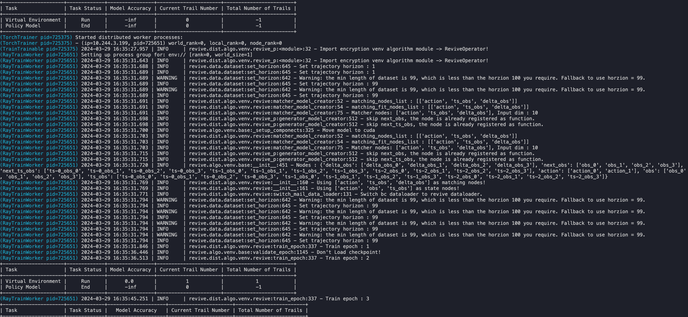

### 进行虚拟环境模型有效性验证
REVIVE提供多种工具用于验证环境模型的有效性,其中最常用的两种方法是通过tensorboard查看loss曲线和通过日志查看rollout图片:

Tensorboard的启动命令如下:
```yaml
tensorboard --logdir .../logs/dmsd_train
```

Tensorboard提供一个web界面可以查看损失函数的曲线,我们可以查看里面的now_metric 和 least_metric指标来分析模型是否收敛,以及收敛的效果如何,默认情况下metric计算的是轨迹rollout的MAE。
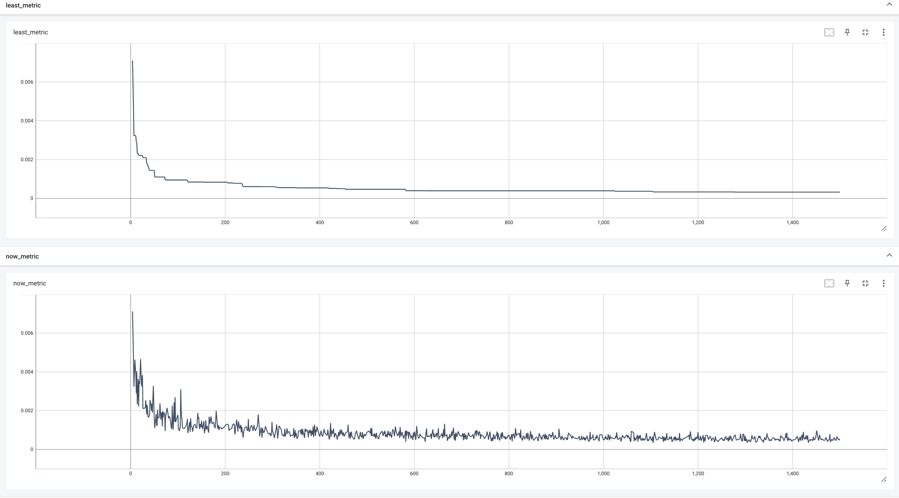

在1500轮的训练过程后，rollout MAE趋于稳定，图中least metric代表党now metric变得更低的时候进行记录，所以least metric成阶梯式下降。
在上图的结果中，REVIVE呈现了在归一化空间（-1到1的空间）下MAE指标已经降到了3.2e-4的量级，是一个非常低的误差。
我们还可以打开日志文件夹下的rollout图片文件夹查看每个节点的rollout情况,REVIVE会从数据集中随机采集10条轨迹，进行虚拟环境模型和真实历史数据的对比, 通过rollout图可以直观的分析虚拟环境模型的时序预测误差。rollout图片文件夹默认存储在logs/dmsd_train/venv_train/rollout_images文件夹下。
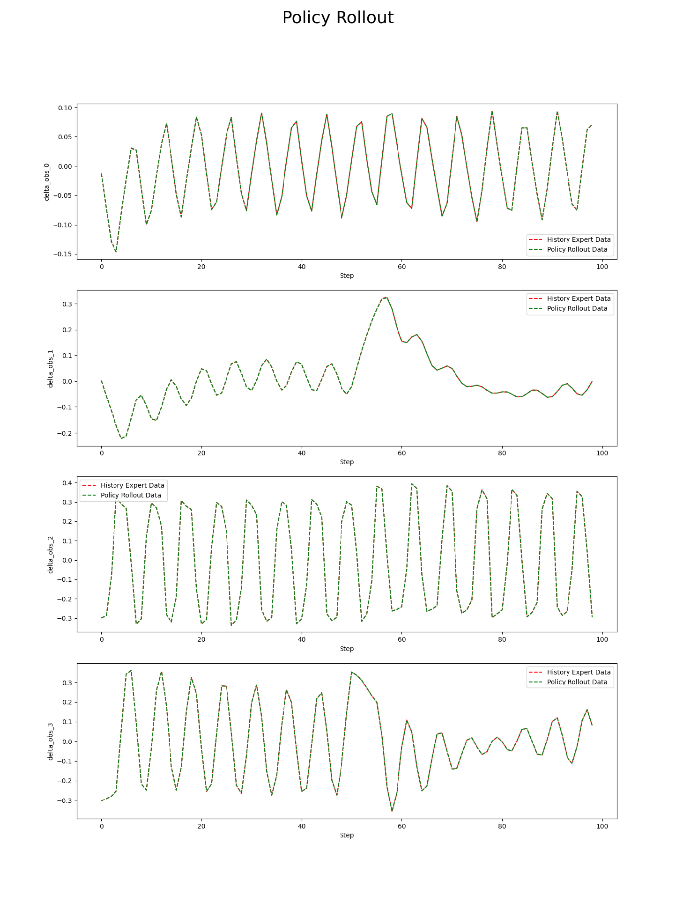

rollout曲线通过自回归的方式来进行环境模型的推演，在推演过后记录下数据并和数据集当中的数据进行对比，从途中我们判断环境模型如果很好的和专家数据的曲线贴得很近，那说明这个虚拟环境构建的非常好并能够自回归地回放数据集当中的曲线。如上图所示绿线代表的环境模型推演结果和红线代表的虚拟环境推演结果相比基本能够贴合上。说明我们的虚拟环境构建得比较准确。
另外我们还能通过响应曲线来进行环境的判断，响应曲线的绘制可以参考REVIVE[响应曲线](https://revive.cn/help/polixir-revive-sdk/html_cn/explainable/Response_curve_cn.html)绘制功能。
环境的响应曲线结果：
在DMSD环境中action作为施加的力，只在当前步影响加速度，即影响obs的后两维度，需要再在下一步加速度才能影响到坐标位置的变化
所以要进行两步的转移后也就是obs->next_obs->next_next_obs来进行曲线的绘制，两步当中所做的动作是一致的。
在以下响应曲线结果当中【蓝线】：revive构建的虚拟环境；【红线】：真实环境
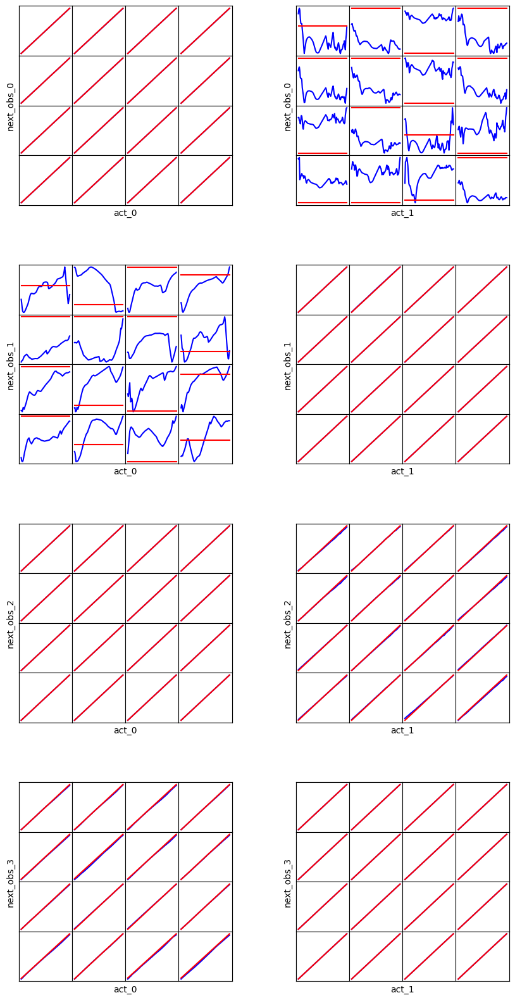

在和真实环境进行比较后，我们能够看到我们的环境能够在很多维度中的变化趋势与真实环境保持一致。在对m1质量块施加力的过程中，其力是不会对m2质量块的坐标产生影响的，所以act0和nextobs0的图中，红线是水平分布的。但是我们的虚拟环境却随机地学了对于m2质量块坐标产生的影响。所以在这样的相关关系当中，虚拟环境与真实环境相比可能表现出不一致。但这并不影响我们进一步进行之后基于虚拟环境的策略学习。
### 分析任务目标，定义控制目标优化函数
REVIVE使用强化学习算法来训练策略模型。在强化学习中，智能体通过不断地与环境交互来寻找最优策略。策略会根据当前状态选择一个行动，并接收相应的奖励以及下一个状态。这样的过程会不断地进行，直到达到终止状态为止。如果策略在一系列动作和状态转换中获得高额的奖励， 那么它就找到了一种较好的策略。因此，奖励函数的设计对于强化学习策略的优化至关重要。一个好的奖励函数应该能够指导策略向着预期的方向进行学习。
DMSD的任务目标是通过控制两个质量块的受力，将质量块分别稳定快速的移动到目标位置。因此奖励函数的设计主要考虑了当前位置和目标位置的差距。
REVIVE SDK支持支持以python源文件的方式定义奖励函数。奖励函数定义了策略的优化目标。奖励函数的输入是单步决策流的数据， 奖励函数的输出当前步策略获得的奖励值。下面是上述降落函数对应的Python源代码：
```yaml
import torch
import numpy as np


def get_reward(data):    

    next_obs = data["next_obs"]
    target = data["target"]

    singel_reward = False
    if len(next_obs.shape) == 1:
        next_obs = next_obs.reshape(1,-1)
        singel_reward = True
    if len(target.shape) == 1:
        target = target.reshape(1,-1)
    
    
    if isinstance(next_obs, np.ndarray):
        array_type = np
    else:
        array_type = torch
        
    position = next_obs[...,:2]
    err = position - target
    reward = array_type.sum(-array_type.log(array_type.abs(err)+0.01), axis=-1)
    
    if singel_reward:
        reward = reward[0].item()
    else:
        reward = reward.reshape(-1,1)
        
    return reward
```
为了进一步激励策略能更加靠近目标位置，我们对`err`进行了`-array_type.log(array_type.abs(err)`非线性函数的设计，这样越贴近目标位置能获得的奖励就越高。
### 使用REVIVE进行策略模型训练
当我们准备好奖励函数之后。 我们就可以使用启动revive提供的train.py脚本进行策略模型训练。
训练命令:
```yaml
python train.py -df ./data/DMSD_train.npz -cf ./data/train_dmsd_pol.yaml -rf data/dmsd_reward.py --policy_algo sac --batch_ratio 1 --num_q_net 4 --w_kl 0 --run_id dmsd_train -vm None -pm once
```

开启训练之后, 命令行会打印如下信息,说明策略正在训练:


### 进行策略模型有效性验证
在使用REVIVE SDK进行任务学习的过程中，默认情况下，REVIVE会将数据集进行切分，并分为训练数据集以及验证数据集（参考数据准备）。 并在这两个数据集上分别构建虚拟环境，并命名为 trainEnv 和 valEnv。 在随后的策略模型学习过程中，REVIVE会在 trainEnv 和 valEnv 两个环境以及对应的数据集 trainData 和 valData 中分别进行策略模型的训练， 训练出各自的策略模型 trainPolicy 和 valPolicy。在训练过程中，REVIVE SDK会在训练结束后，依据用户设定的 奖励函数 ， 对 trainPolicy 在 trainEnv 和 valEnv``上，以及 ``valPolicy 在 trainEnv 和 valEnv 上所获得的平均单步奖励进行记录， 并在训练结束后生成双重环境验证图,默认的存储路径是 logs/<run_id>/policy_train/double_validation.png 。下面双环境验证图片种蓝色虚线是对历史数据使用降落函数计算得到的单步奖励平均值。从图中我们可以看到,红绿两条线都高于蓝色虚线。这意味着在两个环境中，两种策略得到的奖励数值都高于了历史数据集中的奖励数值。
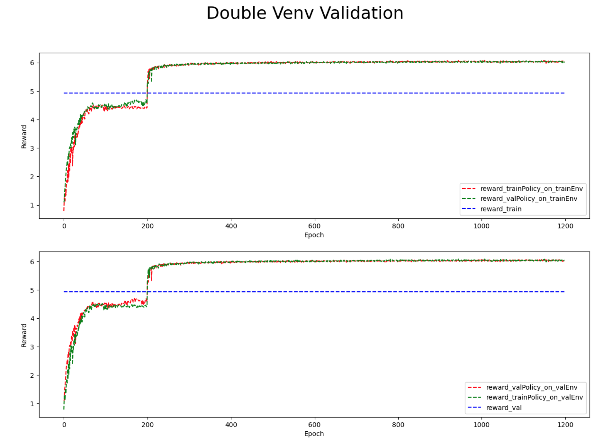

双环境验证是一种用于评估策略模型性能的方法。它涉及将训练和测试环境定义为两个不同的环境。 在训练期间，智能体使用一个环境进行学习；而在测试期间，它必须在另一个环境中进行操作，该环境可能与训练环境略有不同。 通过这种方式，双重环境验证可以检测出策略模型过度拟合特定的环境。 如果训练环境和测试环境非常相似，那么模型可能会在测试环境中表现良好。 但如果测试环境与训练环境有明显区别，则模型可能无法泛化到新环境中。 因此，双环境验证可以帮助用户确定评估策略模型的实际效果，并检查它们是否具有适应不同环境的能力。
在以上结果中我们看到，红绿两个线都在最后超过了数据中的的奖励数值，同时在前200轮的时候达到第一个平衡，这是因为在最开始我们采用了bc算法对数据中的策略进行学习，之后采用其他强化学习的算法再次提升策略模型。
### 策略模型上线测试
策略模型会被序列化为 policy.pkl 和onnx文件。使用策略模型时需要使用 pickle 加载序列化的决策模型， 然后使用 policy.infer() 函数进行策略模型推理。

下面是加载pkl文件进行引擎控制的代码示例:
```yaml
import os
import pickle
import numpy as np

# 获得策略模型的文件路径
policy_path = os.path.join(os.path.dirname(os.path.abspath(__file__)), "logs/dmsd_train/policy_train", "policy.pkl")

# 加载策略模型
policy = pickle.load(open(policy_path, 'rb'), encoding='utf-8')

# 获得当前火箭的状态信息和环境风力信息
state = {
  "obs" :  ...,
  "action" : ...,
  "target" : ...
}

# 使用策略模型进行推理，输出引擎的发动机的控制动作
action = policy.infer(state)
```

| **策略训练算法** | **实际环境测试Reward** |
| --- | --- |
| Data | 494.45 |
| Expert | 849.51 |
| REVIVE | 821.37 |


若有收获，就点个赞吧

