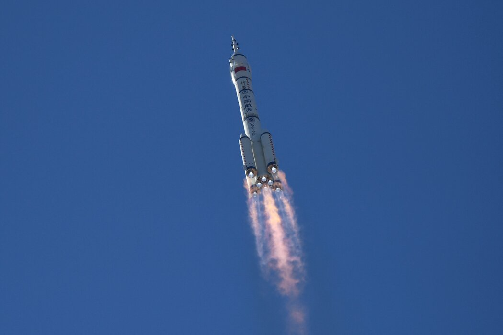

## 任务背景
火箭回收是一种旨在降低航天运输成本和减少太空垃圾的创新技术。传统的航天发射中，火箭的各个部分通常只能使用一次，然后在进入大气层后沦为废弃物，坠入海洋或荒地。而火箭回收方案的目标是实现火箭的部分或全部可回收和重复使用，以达到航天运输的可持续性。其中，垂直着陆回收是目前主流的技术方案之一，广受成功实践和关注，例如SpaceX的猎鹰9号火箭。在这种方案中，火箭的主要阶段在完成任务后重新点火，通过精确的制导和控制技术，实现垂直着陆回到地面或指定的着陆平台上。这一过程要求火箭具备强大的自主导航和稳定性控制能力，以确保安全、准确地返回地面。然后如果火箭回收失败，火箭可能会严重受损或完全失效，会带来巨大的经济损失和安全风险。因此需要进一步提高火箭回收技术的效率和可靠性，以便更多的火箭部分可以被回收和重复使用。
## 任务介绍

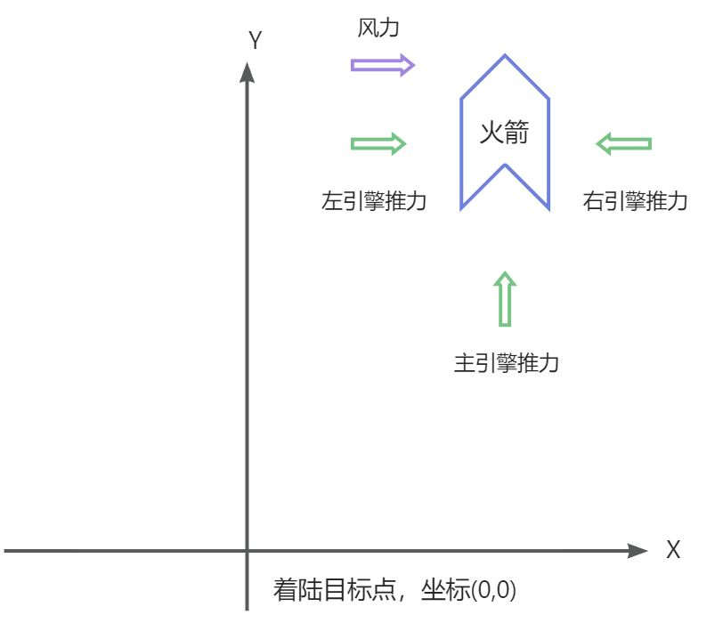

火箭回收任务是对Gym中[lunar_lander](https://www.gymlibrary.dev/environments/box2d/lunar_lander/)任务改造的一个简化模拟火箭回收的任务。任务简化3维坐标系为2维坐标系，其中第二维度纵轴Y轴表示高度。在火箭回收任务中，我们需要控制火箭的发动机来调整火箭的速度和角度，使得火箭能够以安全的姿态降落到目标位置（X轴上规定的范围内，Y轴指定的高度下）。
**观测系统：**
观测系统会实时返回火箭的姿态信息（每间隔一秒返回一次），姿态信息包含火箭的相对坐标位置（以着陆点为坐标原点，返回火箭相对着陆点的X轴坐标信息和Y轴坐标信息），火箭的速度信息（分为X轴线速度和Y轴线速度），火箭的角度和角速度。除了火箭的姿态信息之外，火箭的风速观测设备也会每秒反馈一次当前的风力状况。
**控制系统：**
火箭有3个发动机可以控制，其中主发动机位于火箭正下方，可以提供向上的推力，左右两侧各有一个侧发动机。主发动机可以提供较强的推力进行火箭升空，侧发动机只能提供较弱的动力用于姿态调整。主发动机可以和侧发动机一起开启，但是左右侧发动机只能同时开启一个。

火箭回收任务需要通过发动机控制系统控制发动机的推力来调整火箭的姿态，在风力变化的环境下将火箭安全稳定快速的降落到目标位置。
## 数据介绍
火箭回收任务提供一批历史的火箭回收任务数据进行模型训练。数据中包含多次回收任务的历史数据(即包含回收成功也包含回收失败的任务数据)。每次任务回收的历史数据以时序的方式记录了火箭的姿态信息，风力信息和对应的发动机推力控制信息。历史数据以CSV文件的形式进行存储，每条轨迹包含在一个CSV文件中。下面是一个CSV文件的截图:

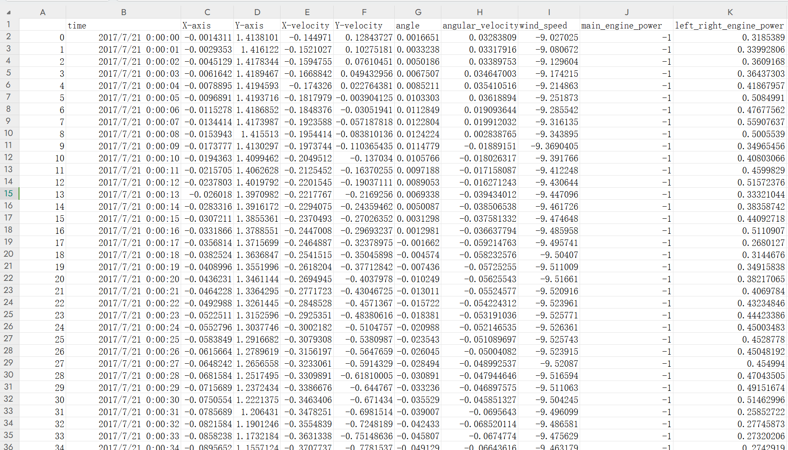

下面是每个CSV文件表头信息的描述：

| **信息名称** | **信息类别** | **信息描述** |
| --- | --- | --- |
| time | 时间信息 | 当前行信息的记录时间 |
| X-axis | 火箭状态信息 | 火箭在X轴（水平）方向上相对于目标着陆区域的位置 |
| Y-axis | 火箭状态信息 | 火箭在Y轴（垂直）方向上相对于目标着陆区域的位置 |
| X-velocity | 火箭状态信息 | 火箭在X轴（水平）方向的线速度 |
| Y-velocity | 火箭状态信息 | 火箭在Y轴（水平）方向的线速度 |
| angle | 火箭状态信息 | 火箭的角度，范围[-π,π] |
| angular_velocity | 火箭状态信息 | 火箭的角速度 |
| wind_speed | 环境风力信息 | 火箭受到的环境风力, 0代表无风，大于0和小于0分别代表左侧风和右侧风，绝对值表示风力的大小 |
| main_engine_power | 控制系统信息 | 火箭主引擎推力，范围为[-1,1], [-1,0]时表示主引擎关闭，[0,0.5]范围内表示主引擎开到50%（引擎最小需开启到50%），[0.5,1]时表示开启50%到100%的推力 |
| left_right_engine_power | 控制系统信息 | 火箭左右引擎推力，范围为[-1,1]，[-1,-0.5]表示开启左引擎推力100%到50%，[-0.5,0.5]表示关闭左右引擎，[0.5,1]表示开启右引擎推力50%到100% |


任务数据存储地址:[https://agit.ai/Polixir_AI/revive_case/src/branch/master/cases/RocketRecovery/task_data/csv](https://agit.ai/Polixir_AI/revive_case/src/branch/master/cases/RocketRecovery/task_data/csv)
## 任务目标
火箭回收任务目标是需要提供一个发动机控制模型实时控制发动机的推力，将火箭安全稳定快速的降落到目标位置。模型的输入信息包括实时的姿态信息和风力信息，模型的输出是发动机的推力控制量。
## 解决方案
火箭回收的任务目标是提供一个发动机控制模型实时控制发动机的推力，将火箭安全稳定快速的降落到目标位置。任务训练数据包含了一批历史的火箭回收任务数据。由于成本巨大，所以不能在业务环境中进行试错学习，我们下面采用离线强化学习工具REVIVE来解决上述任务。REVIVE是一套数据驱动强化学习的工业决策软件，该软件通过利用历史数据来学习最优策略， 而无需与真实环境进行额外交互，从而实现决策过程的自动化并率先实现真实业务的落地。

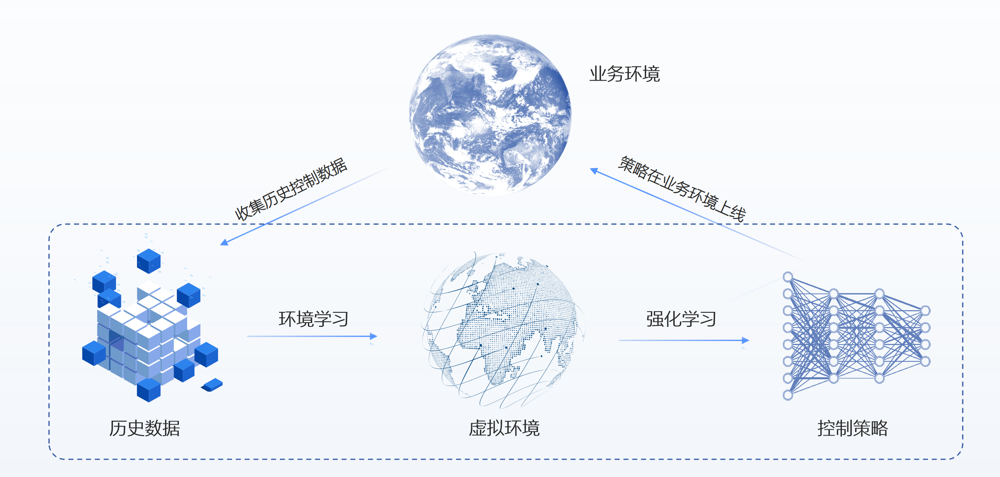

### 任务分析
我们首先结合对火箭系统的理解对任务和数据进行分析，time列提供了时间戳表示时间信息，可以用于确定信息的顺序和时间序列的变化，用于分析数据之间时序上的因果关系。
数据中的信息可以分为3大类，第一类是火箭的状态信息，包括火箭的位置信息，速度信息和姿态信息，第二类是火箭的控制信息，包括主引擎推力和左右引擎的推力，第三类是环境风力信息。在时序上进行可视化如下：

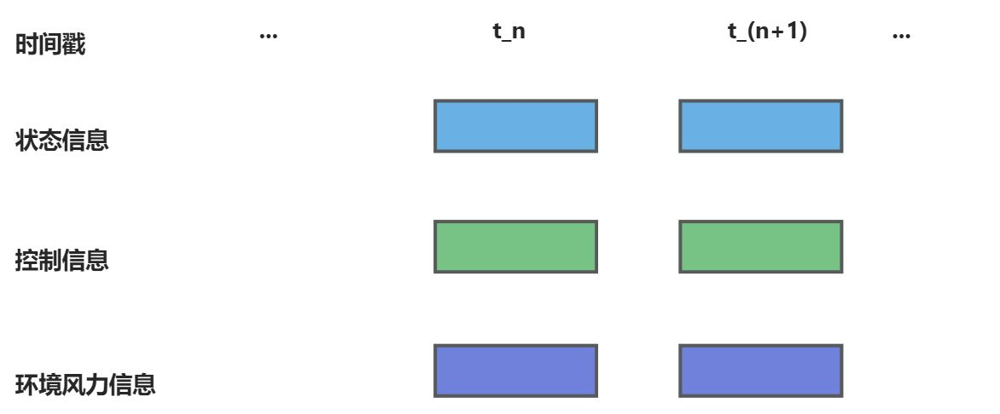

根据业务知识对上述3类信息之间的关系进行分析：

1. 环境风力因素(wind_speed)：风力是外在环境因素，不受火箭本身的影响，但是会影响火箭的稳定性。火箭的控制系统需要考虑环境风力的影响，调整引擎推力来抵消风力的影响，保持火箭飞行的安全稳定。
2. 状态信息(rocket_state)：火箭的状态信息受到多方面因素的影响，火箭的推力和环境风力会共同促使火箭的未来状态发生改变，这种改变在观测信息上具有时滞性，例如t_n时刻的火箭会受到当前时刻的引擎推力和风力的影响，在未来的t_(n+1)时刻产生状态信息变化。
3. 控制信息(engine_power)：火箭的控制系统需要控制火箭的姿态实现平稳降落，火箭的控制系统需要根据火箭当前的状态信息来实时调整发动机推力以达到目标，由于火箭也会受到外界风力的影响，因此火箭推力的调整需要考虑到环境风力信息。

根据上述的分析，我们构建了下面的业务逻辑关系，t_n时刻的状态信息，控制信息和环境风力信息会共同影响到t_(n+1)时刻的状态信息。t_n时刻的控制信息应该根据t_n时刻的状态信息和环境风力信息来确定。我们在下图中用箭头表明这些业务关系。

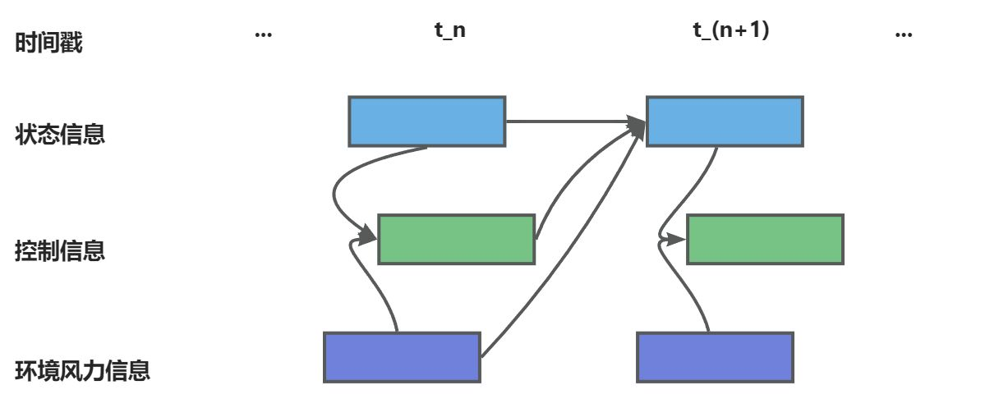

### 构建业务决策流图
#### 定义决策流图
在5.1中我们结合业务知识对火箭回收任务进行详细的分析，为了适应REVIVE来解决该任务，我们首先需要将上述的业务逻辑分析转换为决策流图。决策流图是一个有向无环图，用于描述业务数据时序上的交互逻辑。 决策流图中的每个节点代表数据，每条边代表数据之间的映射关系。决策流图可以根据需要来扩展任意多个节点， 节点之间的顺序可以是任意指定的，单个节点可以作为多个节点的输入。
根据对上述的业务分析，我们构建如下的决策流图。下面的决策流图中,rocket_state(火箭状态)节点和wind_speed(环境风力)节点作为engine_power(控制系统节点)的输入,表示了引擎的推力应该根据当前的火箭状态信息和环境风力来确定。状态转移后的火箭状态表示下一秒的火箭状态,决策流图中的当前时间的rocket_state(火箭状态)节点和wind_speed(环境风力)节点作为engine_power(控制系统节点)都会影响该状态转移,因此全部指向状态转移节点。wind_speed(环境风力)节点不受火箭系统的影响,因此没有节点指向它。

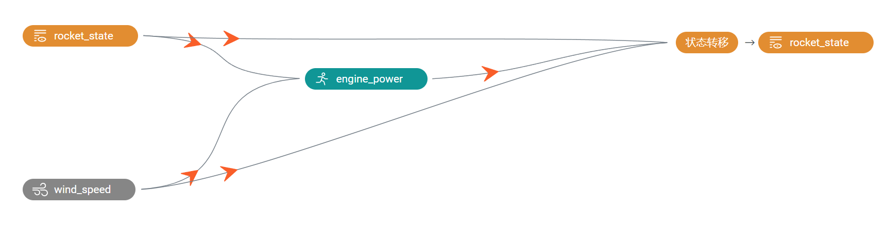

构建完决策流图后,我们通常需要把它组织成yaml文件进行表示,下面就是上述决策流图对应的yaml文件,yaml文件下的graph表示了对应的决策流图:
```yaml
metadata:
  graph:
    engine_power:
    - rocket_state
    - wind_speed
    next_rocket_state:
    - rocket_state
    - wind_speed
    - engine_power
```
完成决策流图的构建之后,我们需要在YAML文件中增加每个节点的特征描述信息,通过columns来定义,下面是将原始数据中特征划分到每个节点中, columns可以定义每一维所属的节点,类似和值范围, 具体的描述可以参考[REVIVE文档](https://revive.cn/help/polixir-revive-sdk-pro/html_cn/tutorial/data_preparation_cn.html)部分的描述。增加columns之后的YAML文件如下:
```yaml
metadata:
  columns:
  - X-axis:
      dim: rocket_state
      type: continuous
  - Y-axis:
      dim: rocket_state
      type: continuous
  - X-velocity:
      dim: rocket_state
      type: continuous
  - Y-velocity:
      dim: rocket_state
      type: continuous
  - angle:
      dim: rocket_state
      type: continuous
  - angular_velocity:
      dim: rocket_state
      type: continuous
  - wind_speed:
      dim: wind_speed
      type: continuous
  - main_engine_power:
      dim: engine_power
      type: continuous
  - left_right_engine_power:
      dim: engine_power
      type: continuous
  graph:
    engine_power:
    - rocket_state
    - wind_speed
    next_rocket_state:
    - rocket_state
    - wind_speed
    - engine_power
```
#### 优化决策流图
好的决策流图是REVIVE SDK中不可或缺的一部分，定义更好的决策流图可以使得训练模型的过程更高效、预测结果更准确。在动力学系统建模中，常见的方法是预测系统状态的变化量,而不是直接预测下一时刻的状态量。预测状态变化量相对于直接预测下一时刻状态的好处包括以下几点：

- 减少参数：预测状态变化量可以减少需要估计或学习的参数数量。直接预测下一时刻状态需要建立一个完整的动力学模型，并估计模型中的所有参数。而预测状态变化量只需要估计或学习状态转移矩阵和输入矩阵，减少了参数的数量和复杂性。
- 稳定性：预测状态变化量可以提高系统的稳定性。在动力学系统中，小的误差或扰动可能会在时间上累积并导致较大的误差。通过预测状态变化量，可以减小误差的累积效应，提高系统的稳定性。
- 鲁棒性：系统中的建模误差、测量噪声或外部干扰可能会对状态预测产生影响，而预测状态变化量可以减少这些影响的累积效应。通过预测状态变化量，系统可以更好地应对不确定性，提高预测的鲁棒性。

在火箭降落任务中,我们可以通过引入状态变化节点的方法来优化决策流图,下面是优化后的决策流图:

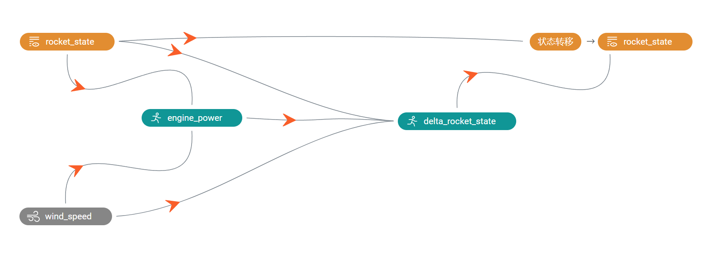

在上述决策流图中,我们不再直接预测下一时刻的火箭状态(rocket_state)信息,而是预测火箭状态的变化量, REVIVE支持通过delta_node自动解析状态变化数据, 并使用函数将状态变化数据和原始节点数据相加得到下一时刻的状态节点.
引入delta_rocket_state节点后的YAML文件如下所示, 其中columns中的信息无需修改, delta_rocket_state节点的输入包括了rocket_state(火箭状态)节点和wind_speed(环境风力)节点和engine_power(控制系统节点)。next_rocket_state节点的输入包括rocket_state节点和delta_rocket_state节点。REVIVE会自动使用加法函数来将rocket_state节点输出值和delta_rocket_state节点输出值相加来计算next_rocket_state节点的输出值。
```yaml
metadata:
  columns:
  - X-axis:
      dim: rocket_state
      type: continuous
  - Y-axis:
      dim: rocket_state
      type: continuous
  - X-velocity:
      dim: rocket_state
      type: continuous
  - Y-velocity:
      dim: rocket_state
      type: continuous
  - angle:
      dim: rocket_state
      type: continuous
  - angular_velocity:
      dim: rocket_state
      type: continuous
  - X-axisdelta_rocket_state:
      dim: delta_rocket_state
      type: continuous
  - Y-axisdelta_rocket_state:
      dim: delta_rocket_state
      type: continuous
  - X-velocitydelta_rocket_state:
      dim: delta_rocket_state
      type: continuous
  - Y-velocitydelta_rocket_state:
      dim: delta_rocket_state
      type: continuous
  - angledelta_rocket_state:
      dim: delta_rocket_state
      type: continuous
  - angular_velocitydelta_rocket_state:
      dim: delta_rocket_state
      type: continuous
  - wind_speed:
      dim: wind_speed
      type: continuous
  - main_engine_power:
      dim: engine_power
      type: continuous
  - left_right_engine_power:
      dim: engine_power
      type: continuous
  graph:
    engine_power:
    - rocket_state
    - wind_speed
    delta_rocket_state:
    - rocket_state
    - wind_speed
    - engine_power
    next_rocket_state:
    - rocket_state
    - delta_rocket_state
```
### 准备REVIVE的训练数据
通过YAML文件构建完成决策流图之后,我们下一步需要根据决策流图按节点整理提供的训练数据来作为REVIVE的训练数据。数据应该是一个Python字典对象，以节点名字作为键值（key），以Numpy数组的数据作为数值（value）。 所有值应为2D ndarray，样本数 N 为第一维度，特征数 C 为第二维度。键值（key）应该与 .yaml 文件中 graph 描述的节点名称对应。为了区分不同轨迹的数据, 数据中需要使用index来标记数据中每条轨迹的结束索引。例如，如果数据的形状为 （100，F），其中包含两个轨迹，其长度分别为40和60。 index 应该设置为 np.ndarray（[40， 100]） 。数据以字典形式完成构建后，应该将它们存储在单个 .npz 或 .h5 文件中。

下面是数据转换的代码,代码读取原始的csv文件,生成revive需要的npz文件。
```yaml
import os
import numpy as np
import pandas as pd

rocket_state_columns = ["X-axis","Y-axis","X-velocity","Y-velocity","angle","angular_velocity"]
wind_speed_columns = ["wind_speed",]
engine_power_columns = ["main_engine_power","left_right_engine_power"]

rocket_state = []
wind_speed = []
engine_power = []
index = []

folder_path = '../task_data/csv/'

# 获取所有CSV文件
file_list = os.listdir(folder_path)
csv_files = [file for file in file_list if file.endswith('.csv')]

pre_index = 0

# 遍历 CSV 文件并使用 Pandas 读取节点数据
for csv_file in csv_files:
    file_path = os.path.join(folder_path, csv_file)
    df = pd.read_csv(file_path)
    
    # 获得各个节点的数据
    rocket_state.append(df[rocket_state_columns].values)
    wind_speed.append(df[wind_speed_columns].values)
    engine_power.append(df[engine_power_columns].values)
    
    index.append(len(df)+pre_index)
    pre_index = index[-1]

# 把节点数据转换为2维数组
rocket_state = np.concatenate(rocket_state)
wind_speed = np.concatenate(wind_speed)
engine_power = np.concatenate(engine_power)
index = np.array(index)

# 保存数据为npz文件
data = {
    "rocket_state" : rocket_state,
    "wind_speed" : wind_speed,
    "engine_power" : engine_power,
    "index" : index,
}
np.savez_compressed("./rocketrecovery.npz",**data)
```
### 使用REVIVE进行虚拟环境模型训练
当我们准备好训练数据集( .npz  文件)、决策流图描述文件( .yaml )后。 我们可以使用启动revive提供的train.py脚本进行虚拟环境模型。
训练命令:
```yaml
# 通过参数指定之前准备好的npz数据和yaml文件启动虚拟环境训练
python train.py -df ./data/rocketrecovery.npz -cf ./data/rocketrecovery.yaml --run_id revive -vm once -pm None
```

开启训练之后, 命令行会打印如下信息,说明虚拟环境正在训练:

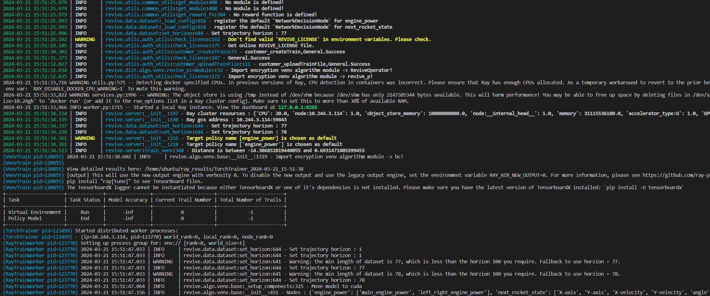

### 进行虚拟环境模型有效性验证
REVIVE提供多种工具用于验证环境模型的有效性,其中最常用的两种方法是通过tensorboard查看loss曲线和通过日志查看rollout图片:

Tensorboard的启动命令如下:
```yaml
tensorboard --logdir .../logs/revive
```
Tensorboard提供一个web界面可以查看损失函数的曲线,我们可以查看里面的now_metric 和 least_metric指标来分析模型是否收敛,以及收敛的效果如何,默认情况下metric计算的是轨迹rollout的MAE。

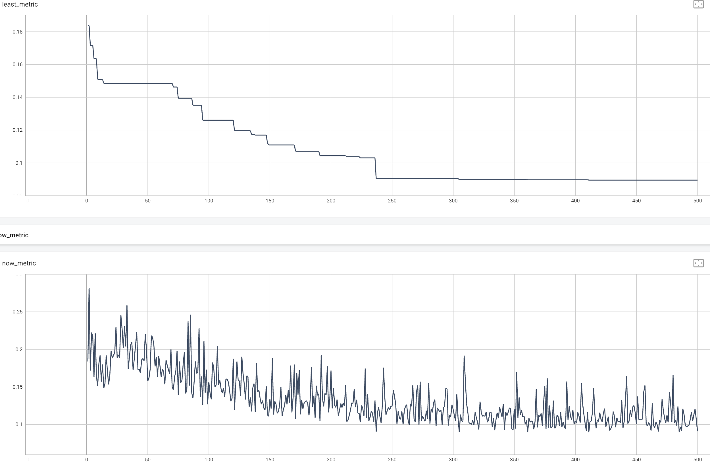


我们还可以打开日志文件夹下的rollout图片文件夹查看每个节点的rollout情况,REVIVE会从数据集中随机采集10条轨迹，进行虚拟环境模型和真实历史数据的对比, 通过rollout图可以直观的分析虚拟环境模型的时序预测误差。rollout图片文件夹默认存储在logs/revive/venv_train/rollout_images文件夹下。

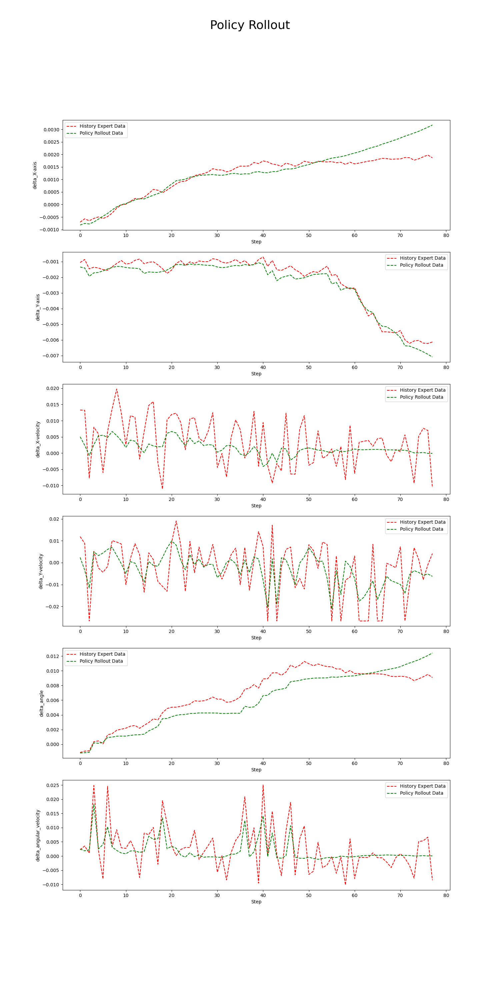

### 分析任务目标，定义控制目标优化函数
REVIVE使用强化学习算法来训练策略模型。在强化学习中，智能体通过不断地与环境交互来寻找最优策略。策略会根据当前状态选择一个行动，并接收相应的奖励以及 下一个状态。这样的过程会不断地进行，直到达到终止状态为止。如果策略在一系列动作和状态转换中获得高额的奖励， 那么它就找到了一种较好的策略。因此，奖励函数的设计对于强化学习策略的优化至关重要。一个好的奖励函数应该能够指导策略向着预期的方向进行学习。
火箭回收的任务目标是通过控制发动机的推力，将火箭安全稳定快速的降落到目标位置。因此奖励函数的设计考虑了火箭与着陆点的距离、发动机喷射次数以及着陆的安全性。下面是对应的奖励函数设计：

- 当着陆器距离着陆平台越近/远时，奖励增加/减少。（鼓励靠近着陆点）
- 根据是否安全着陆而额外获得-100或+100分的奖励。（鼓励安全降落）
- 副发动机喷射一次，奖励减少0.03分；主发动机喷射一次，奖励减少0.3分。（鼓励少用发动机）

REVIVE SDK支持支持以python源文件的方式定义奖励函数。奖励函数定义了策略的优化目标。奖励函数的输入是单步决策流的数据， 奖励函数的输出当前步策略获得的奖励值。下面是上述降落函数对应的Python源代码：
```yaml
import torch
import numpy as np


def get_reward(data):    
    obs = data["rocket_state"]
    action = data["wind_speed"]
    next_obs = data["next_rocket_state"]
    singel_sample = False
    if len(obs.shape) == 1:
        obs = obs.reshape(1,-1)
        singel_sample = True
    if len(action.shape) == 1:
        action = action.reshape(1,-1)
    if len(next_obs.shape) == 1:
        next_obs = next_obs.reshape(1,-1)
    
    
    if isinstance(obs, np.ndarray):
        array_type = np
    else:
        array_type = torch
        
    def get_shaping(state):
        shaping = (
            -100 * array_type.sqrt(state[...,0:1] * state[...,0:1] + state[...,1:2] * state[...,1:2])
            - 100 * array_type.sqrt(state[...,2:3] * state[...,2:3] + state[...,3:4] * state[...,3:4])
            - 100 * abs(state[...,4:5])
        )
        return shaping
    
    # 计算t时刻的位置信息
    prev_shaping = get_shaping(obs)
    # 计算t+1时刻的位置信息
    shaping = get_shaping(next_obs)
    
    # 当着陆器距离着陆平台越近/远时，奖励增加/减少
    reward = shaping - prev_shaping
    
    # 计算主引擎消耗
    m_power = (array_type.clip(action[...,0:1], 0.0, 1.0) + 1.0) * 0.5 
    m_power = array_type.where(action[...,0:1]>0.0, m_power, 0)
    # 计算左右引擎消耗
    s_power = array_type.clip(array_type.abs(action[...,1:2]), 0.5, 1.0)
    s_power = array_type.where(array_type.abs(action[...,1:2]) > 0.5,s_power, 0)
    
    # 副发动机喷射一次，奖励减少0.03分；主发动机喷射一次，奖励减少0.3分
    reward -= m_power * 0.3
    reward -= s_power * 0.03
    
    # 根据y轴坐标判断是否降落
    condition_1 = array_type.abs(next_obs[..., 1:2]) <= 0.05
    # 根据速度和角度信息判断状态是否安全
    condition_2 = (array_type.abs(next_obs[..., 4:5]) < 0.3) & (array_type.abs(next_obs[..., 2:3]) < 0.5) & (array_type.abs(next_obs[..., 3:4]) < 2)
    
    # 根据是否安全着陆而额外获得-100或+100分的奖励
    landing_reward = array_type.where(condition_2, 100, -100)
    reward = array_type.where(condition_1, landing_reward, reward)
    
    
    if singel_sample:
        reward = reward[0]
        if array_type == np:
            reward = reward.item()
            
    return reward
```

### 使用REVIVE进行策略模型训练
当我们准备好降落函数之后。 我们就可以使用启动revive提供的train.py脚本进行策略模型训练。
训练命令:
```yaml
python train.py -df ./data/rocketrecovery.npz -cf ./data/rocketrecovery.yaml -rf ./data/rocketrecovery_reward.py --run_id revive -vm None -pm once
```

开启训练之后, 命令行会打印如下信息,说明策略正在训练:


### 进行策略模型有效性验证
在使用REVIVE SDK进行任务学习的过程中，默认情况下，REVIVE会将数据集进行切分，并分为训练数据集以及验证数据集（参考 数据准备）。 并在这两个数据集上分别构建虚拟环境，并命名为 trainEnv 和 valEnv。 在随后的策略模型学习过程中，REVIVE会在 trainEnv 和 valEnv 两个环境以及对应的数据集 trainData 和 valData 中分别进行策略模型的训练， 训练出各自的策略模型 trainPolicy 和 valPolicy。在训练过程中，REVIVE SDK会在训练结束后，依据用户设定的 奖励函数 ， 对 trainPolicy 在 trainEnv 和 valEnv``上，以及 ``valPolicy 在 trainEnv 和 valEnv 上所获得的平均单步奖励进行记录， 并在训练结束后生成双重环境验证图,默认的存储路径是 logs/<run_id>/policy_train/double_validation.png 。下面双环境验证图片种蓝色虚线是对历史数据使用降落函数计算得到的单步奖励平均值。从图中我们可以看到,红绿两条线都高于蓝色虚线。这意味着在两个环境中，两种策略得到的奖励数值都高于了历史数据集中的奖励数值。

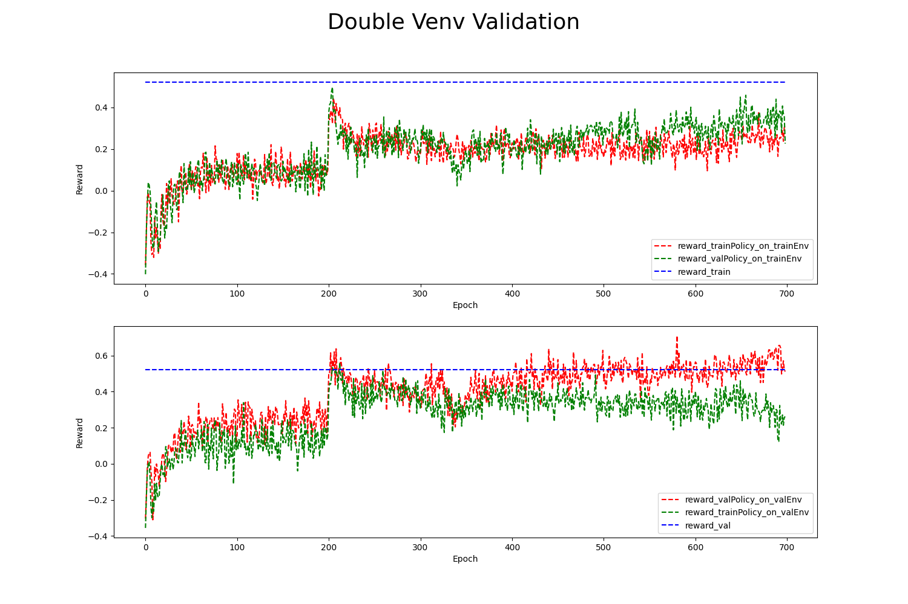

双环境验证是一种用于评估策略模型性能的方法。它涉及将训练和测试环境定义为两个不同的环境。 在训练期间，智能体使用一个环境进行学习；而在测试期间，它必须在另一个环境中进行操作，该环境可能与训练环境略有不同。 通过这种方式，双重环境验证可以检测出策略模型过度拟合特定的环境。 如果训练环境和测试环境非常相似，那么模型可能会在测试环境中表现良好。 但如果测试环境与训练环境有明显区别，则模型可能无法泛化到新环境中。 因此，双环境验证可以帮助用户确定评估策略模型的实际效果，并检查它们是否具有适应不同环境的能力。
### 策略模型上线测试
策略模型会被序列化为 policy.pkl 和onnx文件。使用策略模型时需要使用 pickle 加载序列化的决策模型， 然后使用 policy.infer() 函数进行策略模型推理。

下面是加载pkl文件进行引擎控制的代码示例:
```yaml
import os
import pickle
import numpy as np

# 获得策略模型的文件路径
policy_path = os.path.join(os.path.dirname(os.path.abspath(__file__)), "logs/bc", "policy.pkl")

# 加载策略模型
policy = pickle.load(open(policy_path, 'rb'), encoding='utf-8')

# 获得当前火箭的状态信息和环境风力信息
state = {
  "rocket_state" :  ...,
  "wind_speed" : ...,
}

# 使用策略模型进行推理，输出引擎的发动机的控制动作
action = policy.infer(state)
```

| **策略训练算法** | **实际环境测试Reward** |
| --- | --- |
| Data | 115 |
| Expert | 208 |
| REVIVE | -5 |


