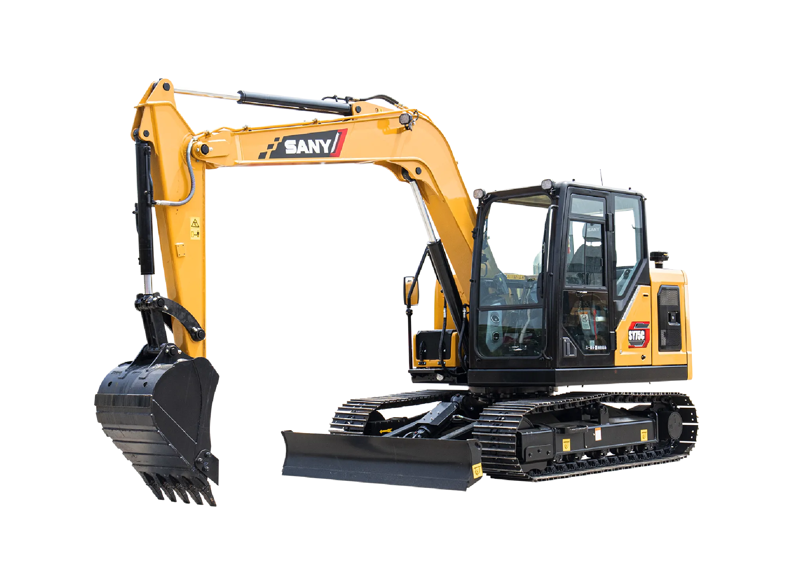
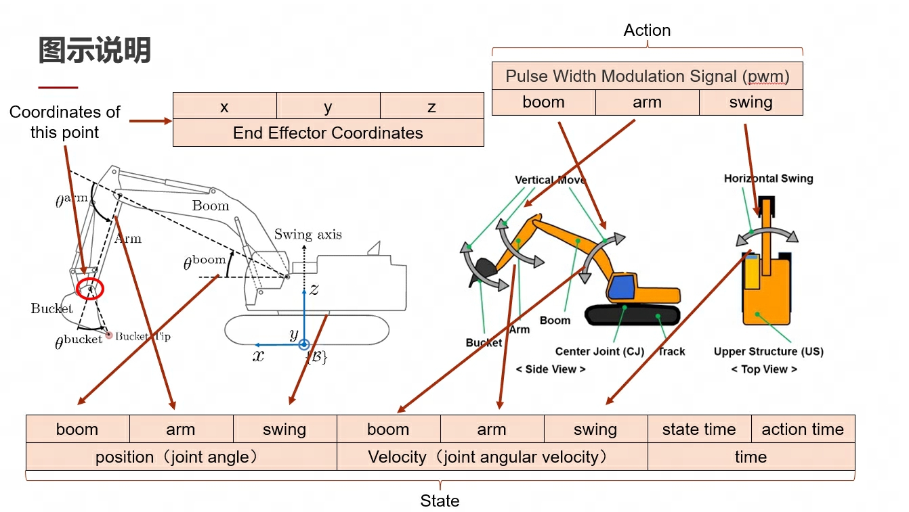
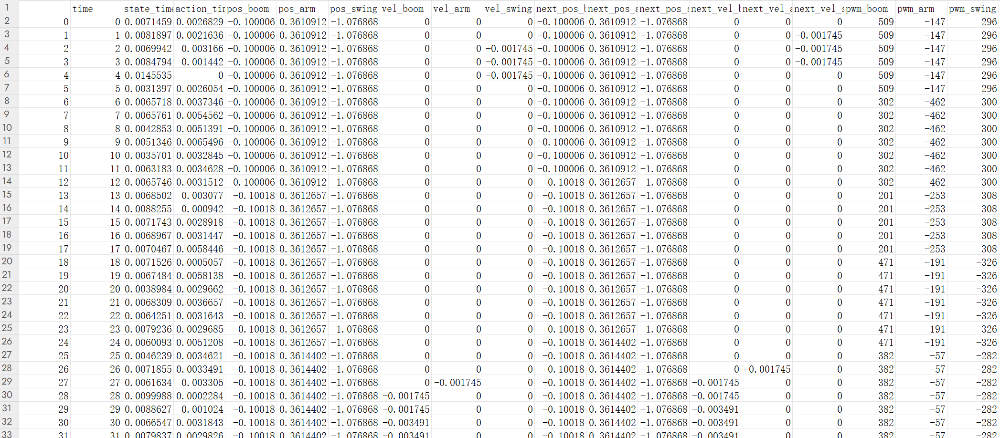

## 任务背景
随着社会的发展和科技的进步，工程机械在建设和基础设施领域扮演着重要的角色。挖掘机作为一种常见的工程机械设备，广泛应用于土地平整、土方开挖、基础建设等工程项目中。然而，传统的挖掘机在操作过程中往往需要依赖人工操作，存在着一些局限性和挑战。随着人工智能技术的发展，挖掘机智能化可以提高施工效率、降低风险、节约资源，并促进人机协同，推动工程机械行业向着更加智能、高效和可持续的方向发展。
## 任务介绍
挖掘机智能化的目标是使挖掘机能够通过自主决策和学习来完成任务，这意味着挖掘机需要具备学习和适应能力。然而，与虚拟游戏场景不同，挖掘机等实际设备存在许多物理限制，这些限制使得无法以低成本进行复制、并行和加速，导致强化学习等算法的训练速度和效果受到极大影响。
为了解决这个问题，一种解决方案是事先收集一定量的挖掘机工作数据，并使用这些数据来训练一个挖掘机的状态转移模型。状态转移模型可以预测挖掘机在不同操作和环境条件下的状态变化。通过使用这个转移模型，算法可以在训练过程中快速地模拟挖掘机在交互环境中的状态变化，实现环境的复制、并行和加速，从而提高训练效率。具体而言，挖掘机的状态转移模型可以接受当前的挖掘机状态作为输入，并预测下一个状态的变化。这个模型可以基于机器学习的方法，如深度神经网络，通过对大量挖掘机工作数据进行训练来学习状态之间的关系。训练完成后，这个模型可以用于算法训练过程中，快速生成虚拟的状态转换序列，模拟挖掘机在不同环境下的行为。通过使用挖掘机状态转移模型，可以克服挖掘机物理限制所带来的问题。这种方法可以降低对实际物理设备的需求，减少训练成本，并且加快算法的训练速度。
## 数据介绍



现在我们收集了一批挖掘机的工作数据，数据集包含挖掘机各个关节（大臂、小臂、挖斗、座舱）的速度、角速度，关节执行的驱动信号大小和驱动时间，以及执行驱动信号后关节的速度和角速度等信息。收集到的日志按时间段以csv文件进行存在，每个连续时间段的数据存储在一个csv文件中，下面是一个csv文件的部分数据：



下面是对CSV文件表头信息的描述：

| **信息名称** | **信息类别** | **信息描述** |
| --- | --- | --- |
| time | 时间信息 | 当前行信息的记录时间索引 |
| state_time | 状态信息 | 挖掘机状态的观测延迟时间 |
| action_time | 动作信息 | 液压驱动信号的响应延迟时间 |
| pos_boom | 状态信息 | 大臂位置（角度） |
| pos_arm | 状态信息 | 小臂位置（角度） |
| pos_swing | 状态信息 | 座舱位置（角度） |
| vel_boom | 状态信息 | 大臂速度（角速度） |
| vel_arm | 状态信息 | 小臂速度（角速度） |
| vel_swing | 状态信息 | 座舱速度（角速度） |
| pwm_boom | 动作信息 | 大臂液压驱动信号 |
| pwm_arm | 动作信息 | 小臂液压驱动信号 |
| pwm_swing | 动作信息 | 座舱液压驱动信号 |
| next_pos_boom | 状态信息 | 下一时刻大臂位置（角度） |
| next_pos_arm | 状态信息 | 下一时刻小臂位置（角度） |
| next_pos_swing | 状态信息 | 下一时刻座舱位置（角度） |
| next_vel_boom | 状态信息 | 下一时刻大臂速度（角速度） |
| next_vel_arm | 状态信息 | 下一时刻小臂速度（角速度） |
| next_vel_swing | 状态信息 | 下一时刻座舱速度（角速度） |

## 任务目标
任务目标是需要用提供的数据来训练一个挖掘机的状态转移模型，准确地预测挖掘机在不同操作和环境条件下的状态变化。
## 解决方案
任务目标是需要用提供的数据来训练一个挖掘机的状态转移模型。我们采用离线强化学习工具REVIVE来解决上述任务。REVIVE是一套数据驱动强化学习的工业决策软件，该软件通过利用历史数据来学习最优策略， 而无需与真实环境进行额外交互，从而实现决策过程的自动化并率先实现真实业务的落地。


### 任务分析
我们首先结合对业务环境的理解对任务和数据进行分析，time列提供了时间戳表示时间信息，可以用于确定信息的顺序和时间序列的变化，用于分析数据之间时序上的因果关系。数据中的信息可以分为3大类，第一类是挖掘机的状态信息，包括挖掘各关节的状态信息和观测延迟时间，第二类是动作信息，包液压驱动信号和信号延时。在时序上进行可视化如下：


### 构建业务决策流图
#### 定义决策流图
在5.1中我们结合业务知识和数据进行了分析，为了使用REVIVE来解决该任务，我们首先需要将上述的业务逻辑分析转换为决策流图。决策流图是一个有向无环图，用于描述业务数据时序上的交互逻辑。 决策流图中的每个节点代表数据，每条边代表数据之间的映射关系。决策流图可以根据需要来扩展任意多个节点， 节点之间的顺序可以是任意指定的，单个节点可以作为多个节点的输入。根据对上述的业务分析，我们构建如下的决策流图。其中,delta_obs节点是下一时刻状态和上一时刻状态的差值，obs节点和action节点作为delta_obs节点的输入预测挖掘机状态的变化，然后将delta_obs和obs节点的数据相加计算下一时刻的obs节点的状态信息。


构建完决策流图后,我们通常需要把它组织成yaml文件进行表示,下面就是上述决策流图对应的yaml文件,yaml文件下的graph表示了对应的决策流图:
```yaml
graph:
  delta_obs:
  - obs
  - action
  - static_obs
  next_obs:
  - obs
  - delta_obs
```
完成决策流图的构建之后,我们需要在YAML文件中增加每个节点的特征描述信息,通过columns来定义,下面是将原始数据中特征划分到每个节点中, columns可以定义每一维所属的节点,类似和值范围, 具体的描述可以参考[REVIVE文档](https://revive.cn/help/polixir-revive-sdk-pro/html_cn/tutorial/data_preparation_cn.html)部分的描述。增加columns之后的YAML文件如下:
```yaml
metadata:
  columns:
  - pos_boom:
      dim: obs
      type: continuous
  - pos_arm:
      dim: obs
      type: continuous
  - pos_swing:
      dim: obs
      type: continuous
  - vel_boom:
      dim: obs
      type: continuous
  - vel_arm:
      dim: obs
      type: continuous
  - vel_swing:
      dim: obs
      type: continuous
  - state_time:
      dim: static_obs
      type: continuous
  - action_time:
      dim: static_obs
      type: continuous
  - pwm_boom:
      dim: action
      type: continuous
  - pwm_arm:
      dim: action
      type: continuous
  - pwm_swing:
      dim: action
      type: continuous
  graph:
    delta_obs:
    - obs
    - action
    - static_obs
    next_obs:
    - obs
    - delta_obs
```
### 准备REVIVE的训练数据
通过YAML文件构建完成决策流图之后,我们下一步需要根据决策流图按节点整理提供的训练数据来作为REVIVE的训练数据。数据应该是一个Python字典对象，以节点名字作为键值（key），以Numpy数组的数据作为数值（value）。 所有值应为2D ndarray，样本数 N 为第一维度，特征数 C 为第二维度。键值（key）应该与 .yaml 文件中 graph 描述的节点名称对应。为了区分不同轨迹的数据, 数据中需要使用index来标记数据中每条轨迹的结束索引。例如，如果数据的形状为 （100，F），其中包含两个轨迹，其长度分别为40和60。 index 应该设置为 np.ndarray（[40， 100]） 。数据以字典形式完成构建后，应该将它们存储在单个 .npz 或 .h5 文件中。
下面是数据转换的代码,代码读取原始的csv文件,生成revive需要的npz文件。
```yaml
import os
import numpy as np
import pandas as pd

static_obs_columns = ['state_time', 'action_time']
obs_columns = ['pos_boom', 'pos_arm', 'pos_swing', 'vel_boom', 'vel_arm', 'vel_swing']
action_columns = ['pwm_boom', 'pwm_arm', 'pwm_swing']
next_obs_columns = ["next_"+c for c in obs_columns]

static_obs = []
obs = []
action = []
next_obs = []
index = []

folder_path = '../task_data/csv/'

# 获取所有CSV文件
file_list = os.listdir(folder_path)
csv_files = [file for file in file_list if file.endswith('.csv')]

pre_index = 0

# 遍历 CSV 文件并使用 Pandas 读取节点数据
for csv_file in csv_files:
    file_path = os.path.join(folder_path, csv_file)
    df = pd.read_csv(file_path)
    
    # 获得各个节点的数据
    static_obs.append(df[static_obs_columns].values)
    obs.append(df[obs_columns].values)
    action.append(df[action_columns].values)
    next_obs.append(df[next_obs_columns].values)

    index.append(len(df)+pre_index)
    pre_index = index[-1]

# 把节点数据转换为2维数组
static_obs = np.concatenate(static_obs)
obs = np.concatenate(obs)
action = np.concatenate(action)
next_obs = np.concatenate(next_obs)
index = np.array(index)

# 保存数据为npz文件
data = {
    "static_obs" : static_obs,
    "obs" : obs,
    "action" : action,
    "next_obs" : next_obs,
    "index" : index,
}

np.savez_compressed("./data/excavator.npz",**data)
```
### 使用REVIVE进行虚拟环境模型训练
当我们准备好训练数据集( .npz  文件)、决策流图描述文件( .yaml )后。 我们可以使用启动revive提供的train.py脚本进行虚拟环境模型。
训练命令:
```yaml
# 通过参数指定之前准备好的npz数据和yaml文件启动虚拟环境训练
python train.py -df ./data/rocketrecovery.npz -cf ./data/rocketrecovery.yaml --run_id revive -vm once -pm None
```

开启训练之后, 命令行会打印如下信息,说明虚拟环境正在训练:


### 进行虚拟环境模型有效性验证
REVIVE提供多种工具用于验证环境模型的有效性,其中最常用的两种方法是通过tensorboard查看loss曲线和通过日志查看rollout图片:

Tensorboard的启动命令如下:
```yaml
tensorboard --logdir .../logs/revive
```
Tensorboard提供一个web界面可以查看损失函数的曲线,我们可以查看里面的now_metric 和 least_metric指标来分析模型是否收敛,以及收敛的效果如何,默认情况下metric计算的是轨迹rollout的MAE。


我们还可以打开日志文件夹下的rollout图片文件夹查看每个节点的rollout情况,REVIVE会从数据集中随机采集10条轨迹，进行虚拟环境模型和真实历史数据的对比, 通过rollout图可以直观的分析虚拟环境模型的时序预测误差。rollout图片文件夹默认存储在logs/revive/venv_train/rollout_images文件夹下。


